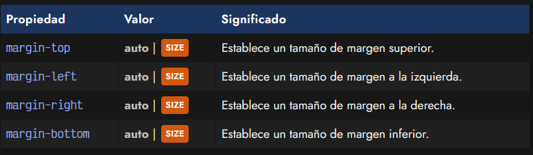
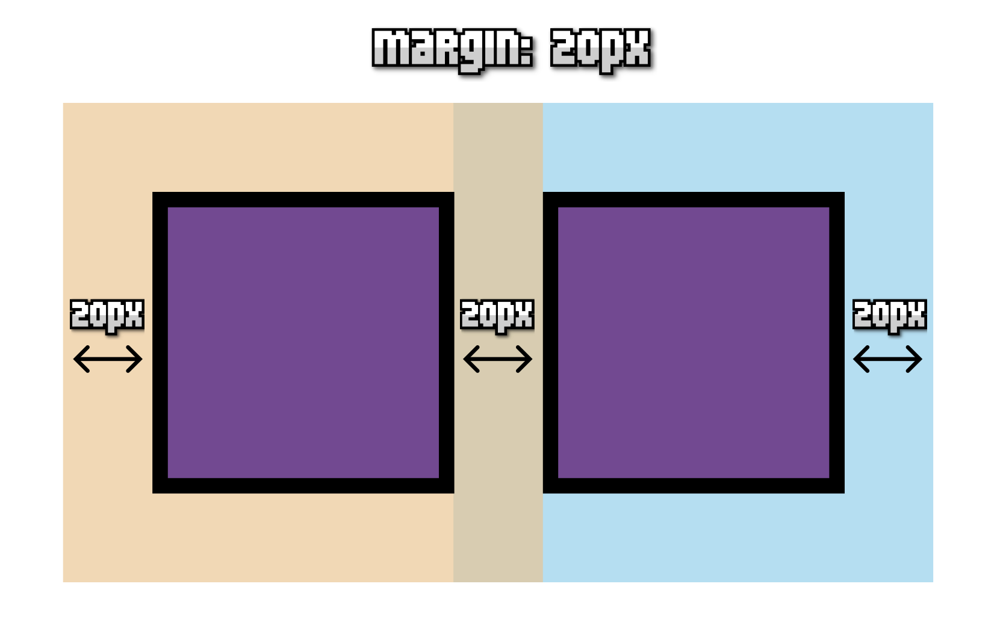
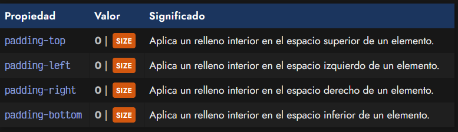
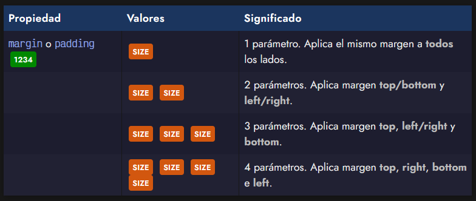
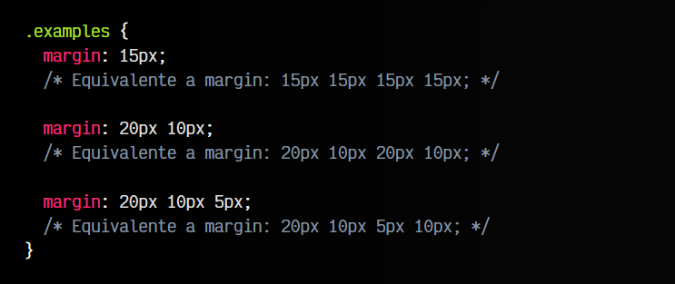

# 
Márgenes y rellenos

En el modelo de cajas, los márgenes (margin) son los espacios exteriores de un elemento. Es decir, el espacio que hay entre el borde de un elemento y su exterior.

## La propiedad margin.
El tamaño de dichos márgenes se puede alterar en conjunto (de forma general) o de forma específica a cada una de las zonas del elemento (izquierda, derecha, arriba o abajo). Veamos primero las propiedades específicas para cada zona:

Podemos aplicar diferentes márgenes a cada zona de un elemento utilizando cada una de estas propiedades, o dejando al nevegador que lo haga de forma automática indicando el valor auto.

Existe un truco muy sencillo y práctico para centrar horizontalmente un elemento en pantalla. Basta con aplicar un ancho fijo al contenedor: width: 500px (por ejemplo) y luego aplicar un margin: auto. De esta forma, el navegador, al conocer el tamaño del elemento (y por omisión, el resto del tamaño de la ventana) se encarga de repartirlo equitativamente entre el margen izquierdo y el margen derecho, quedando centrado el elemento.

Hay que recordar diferenciar bien un margin de un padding, puesto que no son la misma cosa. Los rellenos (padding) son los espacios que hay entre los bordes del elemento en cuestión y el contenido del elemento (por la parte interior). Mientras que los márgenes (margin) son los espacios que hay entre los bordes del elemento en cuestión y los bordes de otros elementos (parte exterior).

Observese también el siguiente ejemplo para ilustrar el solapamiento de márgenes. Por defecto, si tenemos dos elementos adyacentes con, por ejemplo, margin: 20px cada uno, ese espacio de margen se solapará y tendremos 20px en total, y no 40px (la suma de cada uno) como podríamos pensar en un principio:

Márgenes CSS solapados:

La parte exterior (naranja y azul) es la que consideramos margin, mientras que la parte interior (morado) sería el contenido más el padding (si lo hubiera).

## La propiedad padding.
Al igual que con los márgenes, los padding tienen varias propiedades para indicar el relleno de cada zona:

Como se puede ver en la tabla, por defecto no hay relleno (el relleno está a cero), aunque puede modificarse tanto con las propiedades anteriores como la propiedad de atajo que veremos a continuación.

## Atajo: Modelo de cajas.
Al igual que en otras propiedades de CSS, también existe una propiedad de atajo denominada margin y padding. Con estas propiedades evitamos tener que escribir los valores de cada parte (izquierda, derecha, arriba, abajo...), especialmente importante si es el mismo valor en las cuatro.

No obstante, tenemos 4 modalidades, que dependen del número de parámetros de la propiedad:

Con la propiedad border-width pasa exactamente lo mismo que con margin y padding, actuando en este caso en relación al grosor del borde de un elemento. Veamos algunos ejemplos:

Ojo: Aunque al principio puede resultar muy tentador utilizar márgenes negativos (para ajustar posiciones y colocar los elementos visualmente), se aconseja no utilizar dicha estrategia salvo para casos muy particulares. Para colocar elementos, lo mejor es aprender las bases del tema de maquetación, con estrategias como [flexbox](https://lenguajecss.com/css/maquetacion-y-colocacion/flex/) o [grid](https://lenguajecss.com/css/maquetacion-y-colocacion/grid-css/).

