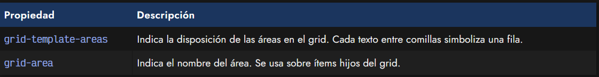
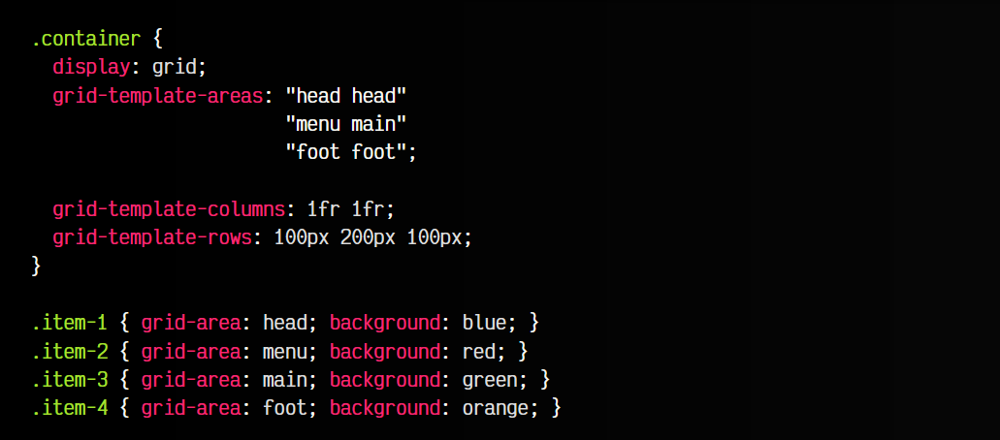
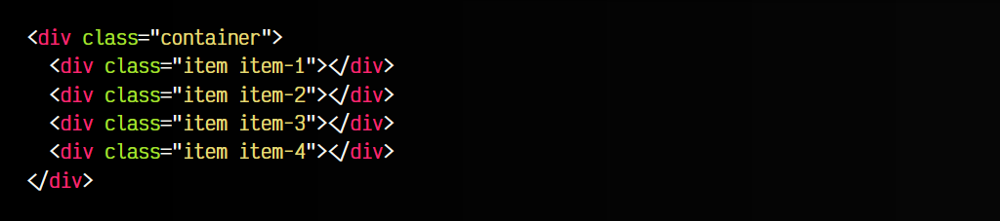
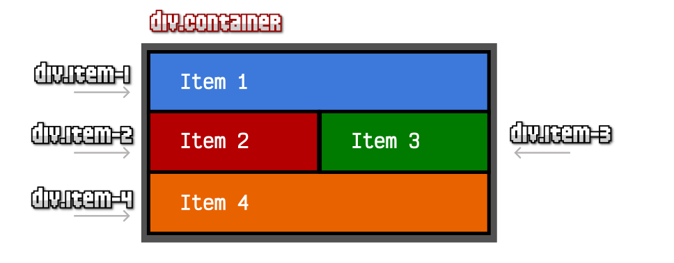
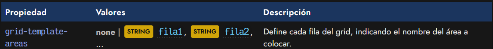
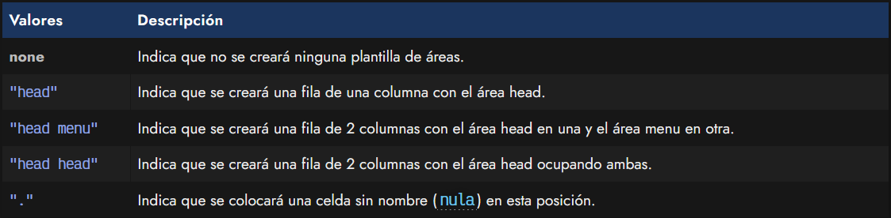
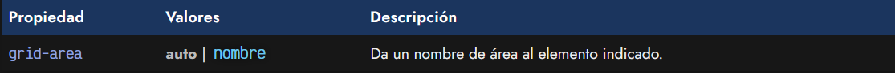
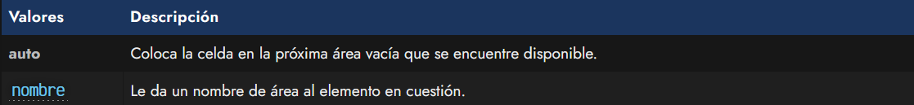

# 
Grid por áreas

Hasta ahora hemos visto como definir cuadrículas Grid CSS donde definimos sus filas y sus columnas a través de propiedades como grid-template-rows y grid-template-columns. Sin embargo, no es la única forma de definir cuadrículas en CSS. Si necesitamos un poco más de flexibilidad a la hora de definir un grid, podemos utilizar una funcionalidad denominada Grid por áreas, que permite de forma casi gráfica y visual, definir mediante texto la ubicación y forma que van a tener las celdas de nuestra cuadrícula.

Recuerda: Los grids por áreas no son una alternativa a los grids explícitos (definidos por filas y columnas). Ambos pueden trabajar conjuntamente o por separado, según interese.

## Grid por áreas
Mediante los Grids por área es posible indicar el nombre y posición concreta de cada área de una cuadrícula. Para ello utilizaremos la propiedad grid-template-areas en nuestro contenedor padre, donde debemos especificar el orden de las áreas en la cuadrícula. Posteriormente, en cada ítem hijo, utilizamos la propiedad grid-area para indicar el nombre del área del que se trata y que el navegador pueda identificarlas:

De esta forma, es muy sencillo crear una cuadrícula altamente personalizada en apenas unas cuantas líneas de CSS, con mucha flexibilidad en la disposición y posición de cada área. Veamos un ejemplo:

css:

html:

vista:

Recuerda que área y nombre de clase son cosas independientes y diferentes. Es muy importante no confundirlas.

Aplicando este código, conseguiríamos una cuadrícula donde:

   - Item 1 es la cabecera (head), que ocupará la primera fila (toda la parte superior).
   - Item 2 es el menú lateral (menu), que ocupará el área izquierda del grid (debajo de la cabecera).
   - Item 3 es el contenido (main), que ocupará el área derecha del grid (debajo de la cabecera).
   - Item 4 es el pie de cuadrícula (foot), que ocupará la última fila (área inferior del grid).

OJO: Ten en cuenta añadir contenido de texto en cada celda del grid, ya que si no existe contenido y no has definido un tamaño de fila/columna, el grid se adaptará a su contenido (que no lo hay) y parecerá que no existe. También ten en cuenta que puedes combinar con propiedades como grid-template-columns y/o grid-template-rows para añadirle tamaño o dimensiones.

## La propiedad grid-template-areas
La propiedad grid-template-areas es la propiedad principal de este sistema, y debe utilizarse en el contenedor padre grid.

Cada una de estas filas se definen como un STRING donde indicaremos el nombre de un área que posteriormente definiremos en nuestro código CSS. Cada fila puede tener ninguna o varias áreas que habría que separar por espacio. A continuación veremos algunos ejemplos de los valores que podemos indicar en esta propiedad y su significado:

Recuerda que las áreas deben existir y estar definidas con la propiedad grid-area, de lo contrario, se anulará la propiedad.

## La propiedad grid-area
Por otro lado, al utilizar la propiedad grid-template-areas y nombrar varias áreas en su valores, es necesario que dichas áreas estén definidas mediante la propiedad grid-area en sus elementos hijos. Recuerda no confundir nombre de área, con nombre de clase, puesto que no es lo mismo.

Esta propiedad permite nombrar un elemento del HTML con un nombre de área. Mucho cuidado, ya que este nombre no es un string, y por lo tanto no debe definirse entre comillas ". Estos nombres se utilizarán en la propiedad grid-template-areas para definir donde irán ubicados.

Los valores que puede tomar la propiedad grid-area son los siguientes:

