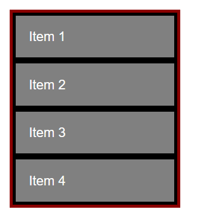
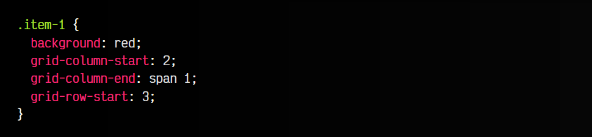

# 
Celdas irregulares en Grid

Mediante propiedades como grid-template-rows, grid-template-columns y/o grid-template-areas podemos definir como será una cuadrícula desde su elemento contenedor padre, creando un grid de forma flexible, sencilla y práctica.

Sin embargo, las cuadrículas que podemos definir tienen ciertos límites, sobre todo cuando queremos que una celda de la cuadrícula tengan una distribución peculiar, y hagan que la cuadrícula sea irregular. En estos casos, las siguientes propiedades, que se utilizan en los elementos hijos de la cuadrícula, probablemente te vendrán bastante bien.

## Crear celdas irregulares
Hasta ahora, salvo algunas excepciones como justify-self, align-self o grid-area, hemos visto propiedades CSS que se aplican solamente al contenedor padre de una cuadrícula. Las siguientes propiedades se aplican a los ítems hijos de una cuadrícula, para alterar o cambiar el comportamiento específico de dicho elemento, que no se comportará como el resto.

Las propiedades para crear esa distribución irregular de una celda del grid son las siguientes:

Observa que tenemos dos pares de propiedades, una con el prefijo grid-column- y otro par con el prefijo grid-row-. Luego, dentro de ambas, tenemos un sufijo -start para indicar donde empieza y otra con un sufijo -end para indicar donde termina. Con dichas propiedades, estableceremos casos particulares donde, a un elemento hijo, le asignaremos la parte de la cuadrícula donde debe empezar y donde terminar, creando un caso particular sobre el resto.

## Valores posibles
En las propiedades anteriores podemos establecer diferentes valores para indicar donde comienza o termina una celda irregular en nuestro grid de CSS:

Observa que mientras que el valor auto (valor por omisión) no cambia en nada nuestra celda, indicando un NUMBER número haremos referencia a la linea que divide las celdas del grid. Por ejemplo, si tenemos una fila con 4 columnas, ten en cuenta que tendríamos 5 líneas.

De esta forma, indicando un valor numérico haríamos referencia a la línea en cuestión, pero si indicamos la palabra clave span antes, haremos referencia a cuántas líneas deberemos alargar la celda.

Los dos ejemplos anteriores son equivalentes. El primero define que se empieza en la línea 2 hasta la 4, por lo que abarca dos celdas: 2-3 y 3-4. En el segundo caso, definimos que se empieza en la línea 2 y la celda se alargará 2 celdas más: hasta la 3 y hasta la 4.

## Ejemplo de grid-column-*
Vamos a plantear el siguiente ejemplo, donde vamos a definir un grid muy sencillo de 4 elementos. Le aplicamos también algo de estilo visual:

css:

html:

vista:

De esta forma, tenemos una cuadrícula de 4 elementos, colocada en vertical. Vamos a colocar unos estilos a la celda 1, modificando el CSS de la clase .item-1. En realidad, visualmente no va a existir ningún cambio, pero veremos mejor el código y nos anticiparemos a los cambios que vamos a hacer a continuación:

Observa que si colocamos este fragmento de CSS en el ejemplo anterior, no cambia absolutamente nada. Esto ocurre porque estamos indicando que el .item-1 ocupe la ubicación en columna del grid desde la línea 1 hasta la línea 2, o sea, la posición que ya posee:

Vamos a hacer unos cambios, y vamos a modificar la propiedad grid-column-end para que apunte a 3 en lugar de 2. De esta forma, la celda ocupará la primera y segunda celda, modificando la estructura de la cuadrícula grid, que pasará de una cuadrícula 1x4 a ser una cuadrícula irregular 2x3:

Vamos a hacer una nueva modificación. Vamos a indicar con la propiedad grid-column-start que comenzaremos en la segunda línea y con grid-column-end que acabaremos en la tercera. De la misma forma, utilizaremos la propiedad grid-row-start para indicar donde comenzaremos respecto a las filas, y le especificaremos la fila 3:

Observa que la celda pasa a moverse a la segunda columna (línea 2 y 3), y a moverse a la tercera fila (línea 3). De esta forma podemos crear fácilmente cuadrículas con celdas irregulares de forma muy flexible y potente:

Por otro lado, recuerda que también es posible utilizar la palabra clave span seguida de un número de línea, que indica la cantidad de líneas que abarcará. Por ejemplo, el último ejemplo es equivalente al siguiente:

Finalmente, quedaría como se puede ver en el siguiente ejemplo:

css:

html:

vista:

## Atajo: grid-column y grid-row
El módulo grid de CSS proporciona las propiedades de atajo grid-column y grid-row donde se nos permite escribir en un formato abreviado las cuatro propiedades anteriores:

Su sintaxis sería la siguiente:

Observa que con las propiedades grid-column y grid-row, separamos con un / cada uno de los valores de cada propiedad individual. Si no necesitamos utilizar ambas, simplemente ponemos el valor del primero, sin utilizar /.

## Atajo: La propiedad grid-area
Por si no nos resulta cómodo aún trabajar con las propiedades de atajo grid-column y grid-row, podemos utilizar la propiedad grid-area que vimos en el tema de Grid por áreas que permite resumir las cuatro propiedades grid-column-start, grid-column-end, grid-row-start y grid-row-end en una sola.

El ejemplo del apartado anterior, sería el siguiente (importante: nota que el orden de los parámetros son primero los pares de -start y luego los pares de -end):

