# 
Líneas con nombre en Grid

Hasta ahora hemos trabajado con Grid CSS hablando de celdas o casillas de una cuadrícula. Sin embargo, también podemos hablar de líneas, e incluso ponerles nombres y luego hacer referencia a ellas en ciertas propiedades.

## ¿Qué es una línea con nombre?
Las líneas en un grid, son aquellas divisiones o líneas separadoras de cada celda, que existen tanto en horizontal (columnas, eje principal) como en vertical (filas, eje secundario) en nuestra cuadrícula. Cuando hablamos de «linenames» (o nombres de línea) hacemos referencia a las líneas separadoras de nuestra cuadrícula grid a las cuales se les ha dado un nombre.

https://youtu.be/s_16bzmnGoY

Para definirlas, se puede hacer extendiendo la sintaxis de las propiedades grid-template-columns y grid-template-rows que vimos en el tema de [Introducción a Grid](https://lenguajecss.com/css/maquetacion-y-colocacion/grid-css/):

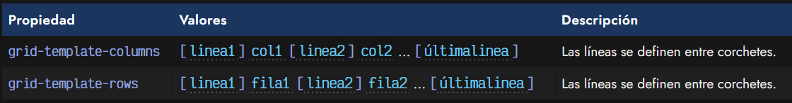

Recuerda que las líneas con nombre en Grid CSS son opcionales y no es necesario utilizarlas si no las necesitas, si no simplifica tu casuística o no es útil en tu caso particular.

Vamos a verlo con un ejemplo, donde se entenderá mucho mejor. Partamos de la siguiente estructura HTML:

css:
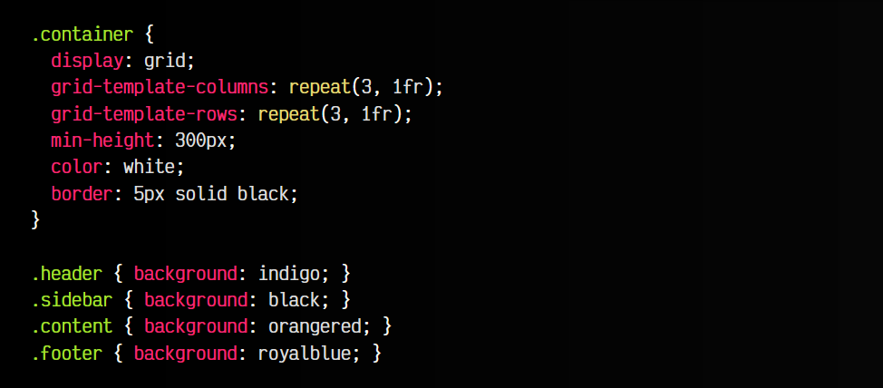

html:
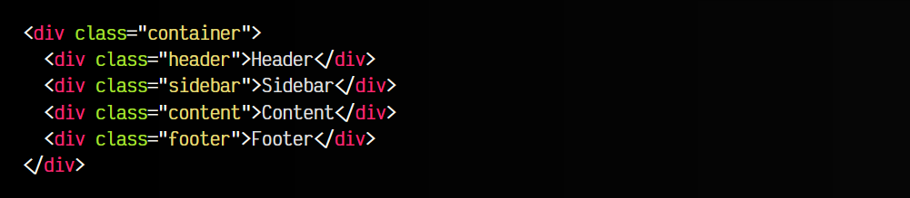

vista:
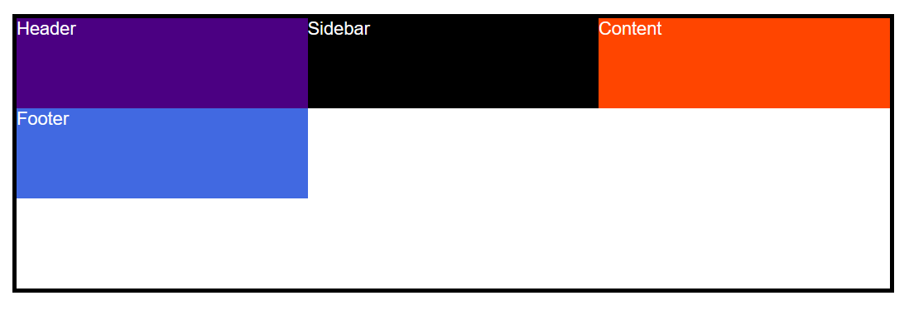

Observa que hemos creado un grid de 3x3 celdas, y las hemos distribuido de forma equitativa con 3 valores 1fr tanto en columnas como en filas. Además, le hemos dado un alto mínimo de 300px para tener un espacio mínimo y un color de texto blanco. Ten en cuenta también que en el HTML sólo tenemos 4 elementos hijos por lo que no rellenaremos completamente el grid. Quedaría algo así:

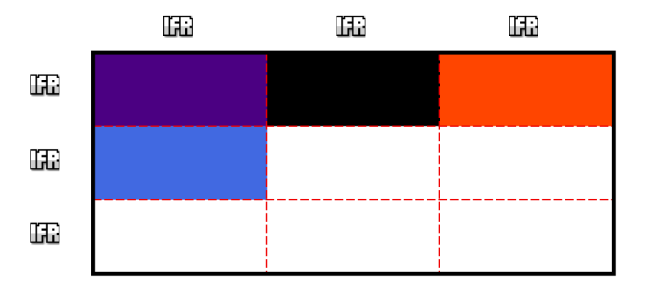

Los nombres de las clases ya dan una idea del contenido que va a tener. Mediante Grid CSS le hemos dado una estructura definida, pero ahora vamos a añadir unos nombres a las líneas divisorias de cada celda. Para ello, vamos a convertir las funciones repeat(3, 1fr) en un 1fr 1fr 1fr equivalente y a añadir los nombres de cada línea entre corchetes, de modo que nos quedaría esto

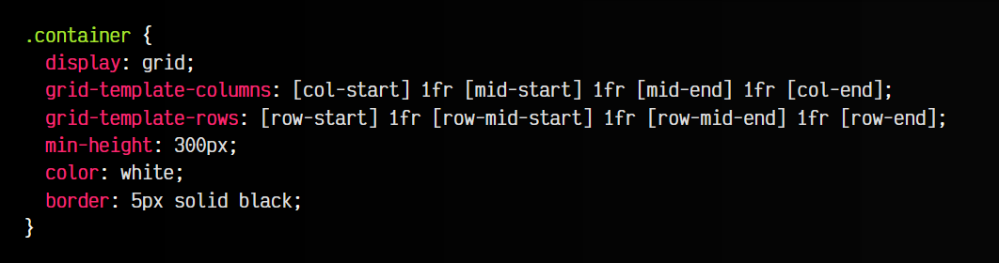

Observa que en horizontal (columnas), tenemos 4 líneas separadoras, ya que tenemos 3 columnas, al igual que en vertical (filas), que también tenemos 4 líneas separadoras. Al hacer estos cambios, nos quedaría lo siguiente:

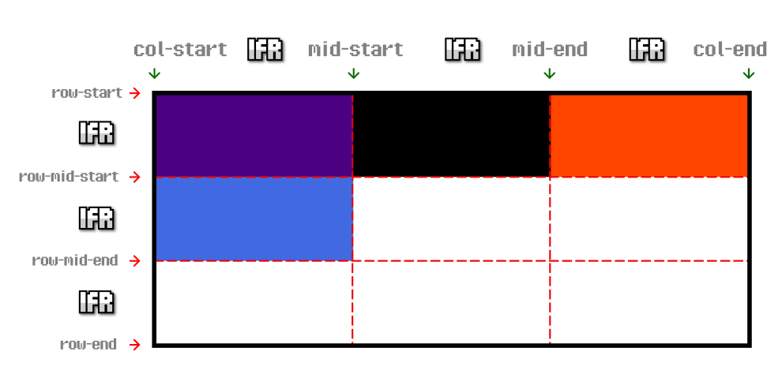

Ahora teniendo líneas con nombres sólo quedaría delimitar que zonas del grid queremos que ocupe cada uno de nuestros elementos 
 del grid. Para ello, vamos a utilizar las propiedades grid-column-start, grid-column-end y grid-row-start, grid-row-end que aprendimos en el tema anterior de [Grids irregulares](https://lenguajecss.com/css/maquetacion-y-colocacion/grid-css-celdas-irregulares/).

Añadimos el siguiente código a los elementos hijos:

css:
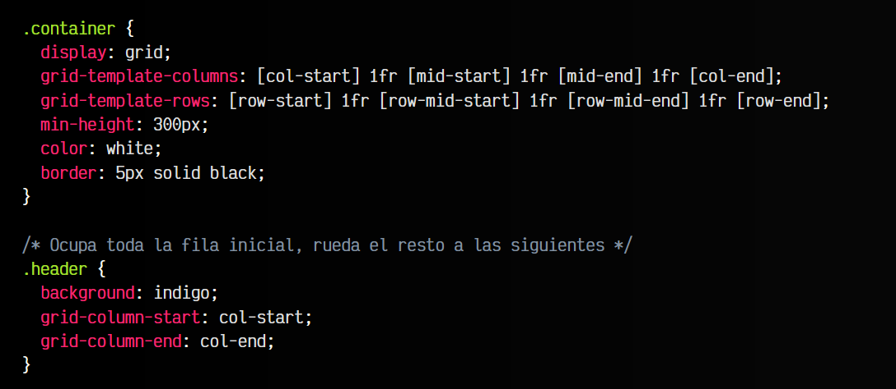
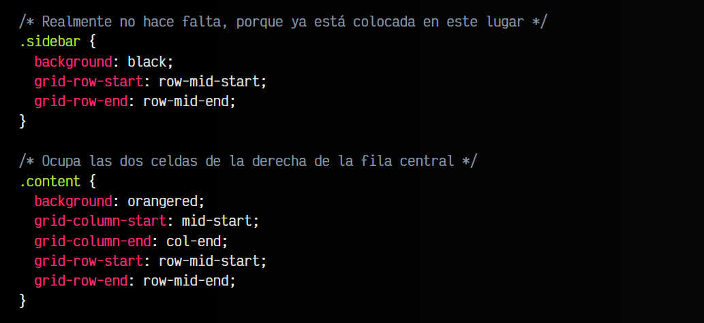
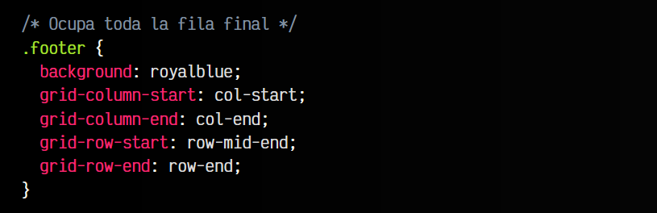

html:
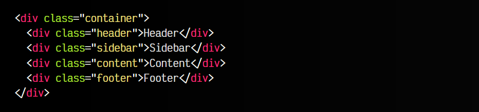

vista:
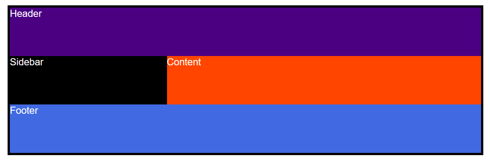

Hemos aplicado la siguiente estructura:

   - Zona .header desde la columna col-start hasta col-end.
   - Zona .sidebar desde la fila row-mid-start hasta row-mid-end.
   - Zona .content desde la columna mid-start hasta col-end y desde la fila row-mid-start hasta row-mid-end.
   - Zona .footer desde la columna col-start hasta col-end y desde la fila row-mid-end hasta row-end.

Por lo que, con estos cambios, nuestra estructura grid quedaría así:

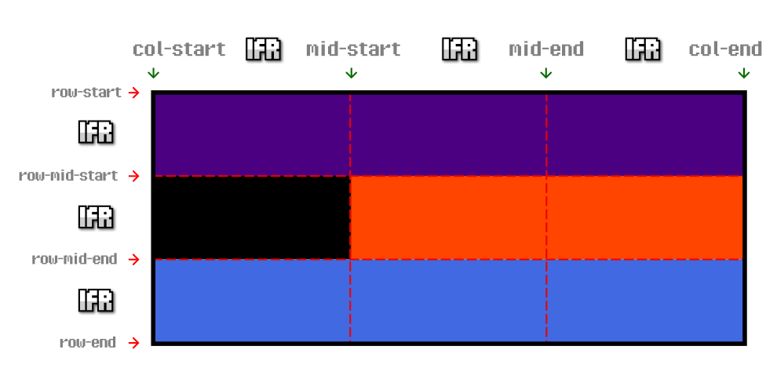

## Atajo: Ejemplo resumido
Vamos ahora a abreviar el ejemplo anterior, utilizando las propiedades de atajo grid-column y grid-row, que nos evitará tener que escribir tanto código, y que sea mucho más cómodo. Recuerda que la sintaxis de resumen de grid-column sería grid-column-start / grid-column-end, y la operación equivalente con grid-row:

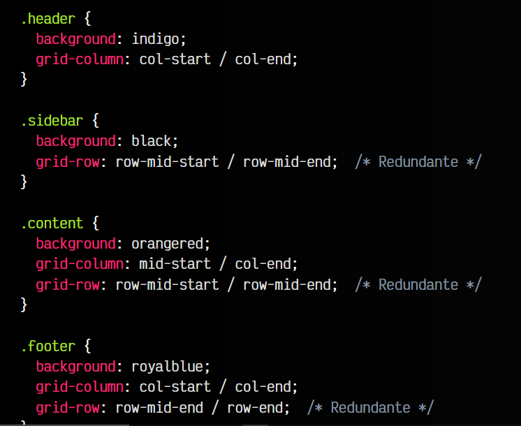

Observa como se resumiría desde el ejemplo anterior. He colocado las propiedades grid-row para que se entienda como se utilizaría, sin embargo, en este ejemplo concreto, las propiedades grid-row son redundantes y no hacen falta, ya que la celda está naturalmente posicionada en esa fila y no hace falta alterarla.

## Atajo: Aprovechar sufijos
El ejemplo anterior todavía se puede resumir un poco más. Cuando los valores de grid-column o de grid-row coinciden de forma que el primero termina con el sufijo -start y el segundo terminada con el sufijo -end, se pueden abreviar de la siguiente forma:

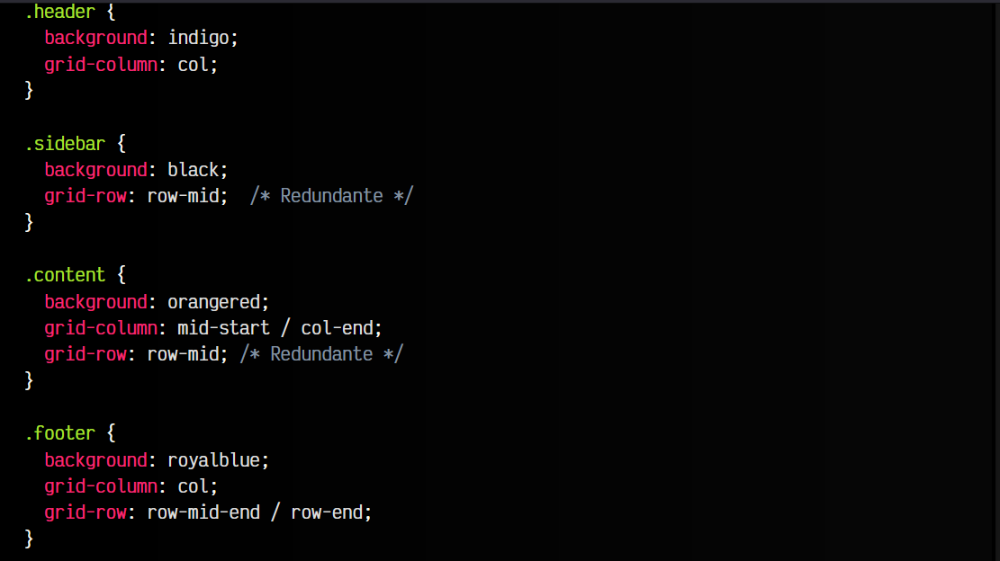

Observa que las propiedades grid-column de .header y .footer, y las propiedades grid-row de .sidebar y .content se pueden resumir utilizando este truco del sufijo.

## Atajo: Utilizar grid-area
Como vimos en temas anteriores, la propiedad grid-area sirve de atajo para las propiedades grid-column y grid-row, por lo que si se considera interesante, se podría utilizar para resumir aún más el resultado anterior, aunque en algunos casos se podría considerar complicar la legibilidad o la lógica del caso.

Si se desea utilizar, vamos a ejemplificarlo desde el ejemplo anterior. Vamos a eliminar los valores redundantes y a traducir el resto a la propiedad grid-area:

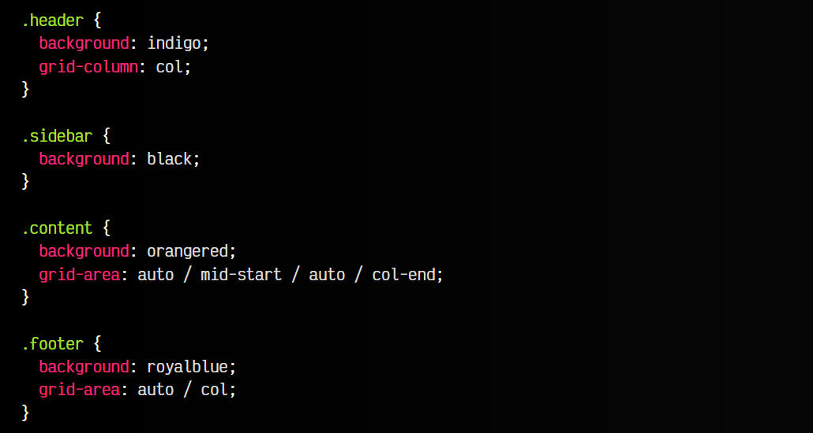

Recuerda que el formato de grid-area es establecer primero los dos valores start y luego los dos valores end, a la vez que primero se indica rows, luego columns. Los valores redundantes que eliminamos, podemos indicar auto para que utilice automáticamente los valores ya establecidos y simplificarlo.