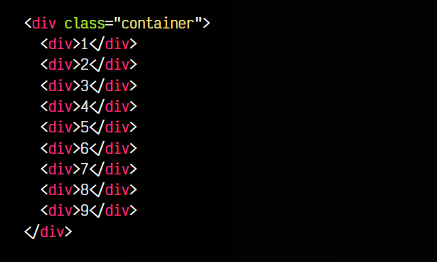

# 
Colocación automática en Grid

Quizás, si has estado creando layouts con Grid, te habrás preguntado como hacer layouts automáticos, es decir, crear un layout donde no quieres unas medidas concretas y específicas, sino que se repitan continuamente hasta que termine el layout.

Para ello, tenemos la familia de propiedades con prefijo grid-auto- de CSS, donde podemos encontrar grid-auto-flow, grid-auto-columns y grid-auto-rows. Veamos cada una y entendamos como funcionan.

## La propiedad grid-auto-flow
La primera de ellas es grid-auto-flow, una propiedad que permite indicar cuál es el flujo del contenido de un Grid, es decir, si queremos que los elementos aparezcan de manera horizontal (row) o de manera vertical (column). También hay un valor dense, pero de él hablaremos más adelante.

Estos son los valores que podemos utilizar en la propiedad grid-auto-flow:

Vamos a centrarnos en un ejemplo, donde podremos cambiar entre los dos primeros: row y column. Observa el siguiente ejemplo. En él, hemos definido un grid de 3x3, donde las columnas tienen un tamaño de 125px y las filas un tamaño de 75px:

css:

js:

html:

vista:

Como puedes ver, al tener row, los elementos «fluyen» en horizontal, de modo que cuando terminamos una fila, pasamos a la siguiente. Si colocamos column ocurre lo mismo, pero en vertical, de modo que cuando terminamos una columna, pasamos a la siguiente.

## El valor dense
Habrás observado que estos valores pueden acompañarse, de forma opcional, por una palabra clave dense. Esto tiene sentido cuando tenemos un grid donde existen huecos. Esto puede ocurrir, por ejemplo, si movemos celdas concretas a otras posiciones.

Veamos este nuevo ejemplo, donde el primer elemento (rojo) lo hemos movido a la segunda columna. El segundo elemento lo hemos movido a la segunda fila. Como resultado, vemos que en el primer elemento queda un hueco. Esto es algo que en Grid puede ocurrir, a veces de forma deseable, a veces de forma no deseada.

Utilizando los valores row o column (observa que la casilla sobrante queda fuera del grid y no tiene tamaño definido, por lo que se adapta a la situación), veremos que el hueco se mantiene:

css:

js:

html:

vista:

Sin embargo, si utilizamos row dense o column dense, el comportamiento es el mismo, sólo que el navegador intenta rellenar los huecos sobrantes siempre que pueda.

## La propiedad grid-auto-rows
Por otro lado, la propiedad grid-auto-rows nos permite indicar el tamaño de las filas que se han añadido de forma automática, ya sea porque no están definidas o porque son las celdas sobrantes fuera del grid-template-rows definido.

Observa el ejemplo, donde creamos un grid de 2 columnas, donde las filas establecemos una repetición automática de 75px y 125px, por lo tanto, el grid resultante tendrá dos columnas definidas, y sus filas irán alternando entre 75px, 125px, 75px, 125px... hasta que se acaben los elementos hijos:

css:

html:

vista:

Aunque he utilizado dos elementos 75px 125px en la propiedad grid-auto-rows, se puede utilizar uno, dos, tres o cuantos necesitemos.

Ten en cuenta que no puedes utilizar la función repeat() en esta propiedad. Si lo deseas, puedes añadir un grid-template-rows utilizando la función repeat() para definir celdas con un tamaño fijo. Luego, los elementos restantes se añadirán automáticamente con los tamaños definidos en grid-auto-rows.

## La propiedad grid-auto-columns
La propiedad grid-auto-columns es exactamente la misma que grid-auto-rows pero respecto a las columnas. Hemos utilizado el mismo ejemplo anterior, donde en este caso tendremos un grid de 2 filas de 125px, y establecemos un patrón de columnas repetibles de 75px 150px:

css:

html:

vista:

Como has visto, es el mismo ejemplo que el anterior, pero en horizontal. Además, hemos utilizado grid-auto-flow para indicar que los elementos se irán añadiendo en columna, es decir, de forma vertical.