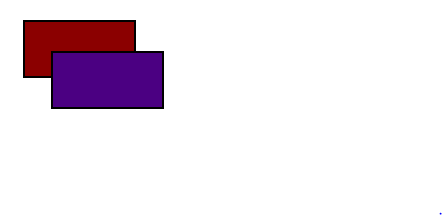

# 
La propiedad position

Como aprendimos en el tema de la propiedad display, si tenemos varios elementos en línea (uno detrás de otro) aparecerán colocados de izquierda hacia derecha, mientras que si son elementos en bloque se verán colocados desde arriba hacia abajo. Estos elementos se pueden ir combinando y anidando (incluyendo unos dentro de otros), construyendo así esquemas más y más complejos, y por consiguiente, más difíciles de controlar.

Sin embargo, existen mecanismos alternativos y complementarios de posicionamiento que se utilizan para realizar acciones y casos muy concretos. Mediante la propiedad position podemos modificar la posición en donde aparecen los diferentes elementos y su contenido, al margen de utilizar sistemas como flex o grid.

Antiguamente, la propiedad position se utilizaba como mecanismo para crear layouts. Hoy en día, es preferible utilizarlo para ciertas modificaciones, pero no utilizarlo como mecanismo primario de creación de layouts. Para eso, ver [Flex](https://lenguajecss.com/css/maquetacion-y-colocacion/flex/) o [Grid](https://lenguajecss.com/css/maquetacion-y-colocacion/grid-css/).

## La propiedad position
La propiedad position es una propiedad CSS que se puede utilizar para modificar la posición donde aparecerá un elemento. Se le pueden indicar los siguientes valores:

Por defecto, si no alteramos la propiedad position, estaremos utilizando sin saberlo lo que se denomina posicionamiento estático, es decir, un position: static. En este modo, todos los elementos aparecen con un orden natural respecto a donde estén colocados en el HTML.

Este es el modo por defecto en que un navegador renderiza una página y el que utilizaremos siempre que no hagamos mención a la propiedad position. Existen diferentes modos de posicionamiento que iremos viendo en esta sección, pero de momento, nos referiremos a posicionamiento estático y posicionamientos no estáticos (el resto).

## Coordenadas de posición
Si utilizamos un modo de posicionamiento diferente al estático (absolute, fixed, sticky o relative), podemos utilizar una serie de propiedades para modificar la posición de un elemento. Es importante tener en cuenta que dichas propiedades solo tendrán efecto si no tenemos la propiedad position establecida a static.

Estas propiedades son las siguientes:

Estas propiedades, lo único que hacen es colocar o fijar el elemento en el punto concreto indicado, de modo que si indicas left: 0 significa que quieres que el elemento esté colocado 0 píxeles desde la izquierda. Puede contener valores negativos, invirtiendo la dirección.

css:

html:

vista:

Observa el ejemplo anterior:

   - Hemos posicionado el elemento .b de forma relativa (ver más adelante).
   - Hemos movido el elemento desde arriba (top) 25px hacia arriba (negativo).
   - Hemos movido el elemento desde la izquierda (left) 25px hacia la derecha (positivo).
   - El elemento .b se posiciona por encima de .a, ya que está colocado después en el HTML.

Para entenderlo mejor, veremos un ejemplo en cada una de las modalidades que explicaremos en los siguientes posts.

NOTA: Ten en cuenta que estas propiedades sólo funcionarán si no estamos en un posicionamiento static. En el caso de estarlo, simplemente se ignorarán.

## Atajo: La propiedad inset
La propiedad inset es una propiedad de atajo para las cuatro anteriores: top, right, bottom, left. Podemos utilizarla indicando diferentes parámetros:

   - 1 parámetro: Se aplica el mismo valor a todos: top, right, bottom y left.
   - 2 parámetros: Primer valor a top y bottom, y el segundo a left y right.
   - 3 parámetros: Primer valor a top, el segundo a right y left y el tercero a bottom.
   - 4 parámetros: Primer valor a top, el segundo a right, el tercero a bottom y el cuarto a left.

## Profundidad (niveles)
Es interesante conocer también la existencia de la propiedad z-index, que es una forma de indicar una distancia en el eje Z, es decir, en el eje de profundidad. CSS establece un nivel de profundidad en el que está un elemento sobre los demás. De esta forma, podemos hacer que un elemento se coloque encima o debajo de otro.

Para ello, utilizaremos la propiedad z-index, asignándole un valor numérico:

Los elementos con un número más alto estarán por encima de otros elementos, y los elementos con un número más bajo permanecerán ocultos detrás de otros elementos. Por defecto, los elementos tienen un z-index de 0.

Recuerda: Los niveles z-index, así como las propiedades top, left, bottom, right e inset no funcionan con elementos que estén utilizando posicionamiento estático. Deben tener un tipo de posicionamiento diferente a static.