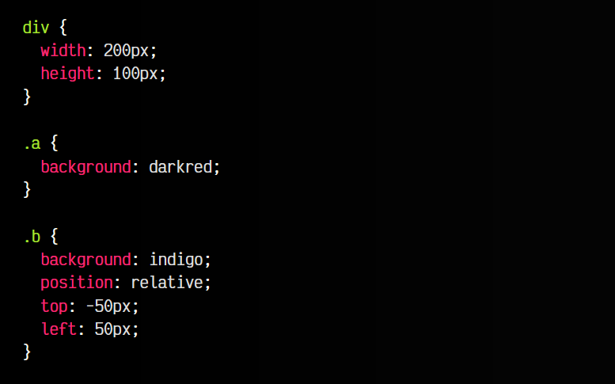
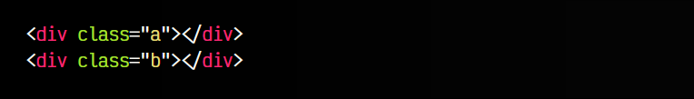
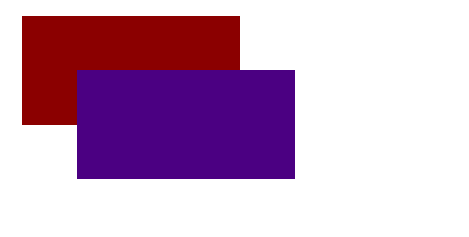
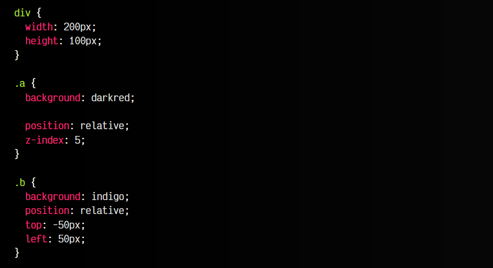
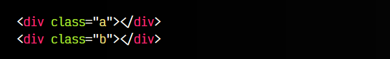
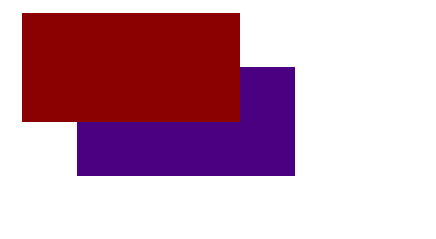

# 
Posicionamiento relativo

Si utilizamos la palabra clave relative en la propiedad position activaremos el llamado posicionamiento relativo, que es el más sencillo de todos. Simplemente, se basa en activar dicho posicionamiento y mover ligeramente el elemento en cuestión, la distancia indicada con las propiedades top, left, right, bottom o inset.

## La propiedad position: relative
Al utilizar la propiedad position: relative, en este modo, los elementos se colocan exactamente igual que en el posicionamiento estático (permanecen en la misma posición), pero dependiendo del valor de las propiedades top, bottom, left, right o inset, variaremos ligeramente la posición del elemento.

Veamos un primer ejemplo sencillo:

css:

html:

vista:

En este ejemplo, el elemento .b (violeta) lo hemos posicionado de forma relativa y variado su posición:

   - Con top: -50px indicamos que debemos subir el elemento 50 píxels (desde arriba).
   - Con left: 50px indicamos que debemos mover el elemento 50 píxels hacia la derecha.

Si invirtieramos el signo de los valores de top y left conseguiríamos el siguiente resultado:

   - Con top: 50px indicamos que debemos bajar el elemento 50 píxels desde su parte superior.
   - Con left: -50px indicamos que debemos mover el elemento 50 píxels hacia la izquierda.
  
## Profundidad del elemento
Imaginemos por un momento que, en el ejemplo anterior, donde tenemos la caja violeta posicionada por encima de la caja roja, queremos que quede al revés, es decir, que la caja roja esté posicionada por encima de la caja violeta.

Tenemos varias formas de hacerlo, pero veamos como podemos utilizar la propiedad z-index para ello:

css:

html:

vista

   - Hemos posicionado relativamente el elemento .a, añadiéndole la propiedad position: relative.
   - Le hemos indicado una profundidad de 5 con z-index.
   - Como la caja .b tiene un z-index por defecto de 0, la caja .a permanece por encima.

Otra forma de realizar esto, podría ser añadirle un z-index negativo (por debajo de 0) a la caja .b, pero habría que tener cuidado, ya que de haber otros elementos posicionados, podría repercutir en ellos.

Recuerda que las propiedades z-index y de coordenadas top, left, right, bottom e inset no tienen efecto sobre un elemento si no está posicionado de forma no estática.

