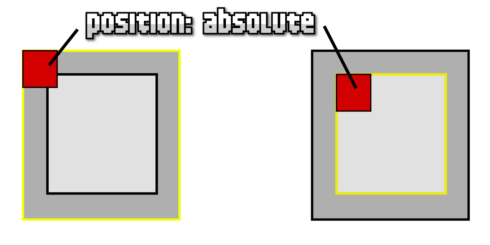
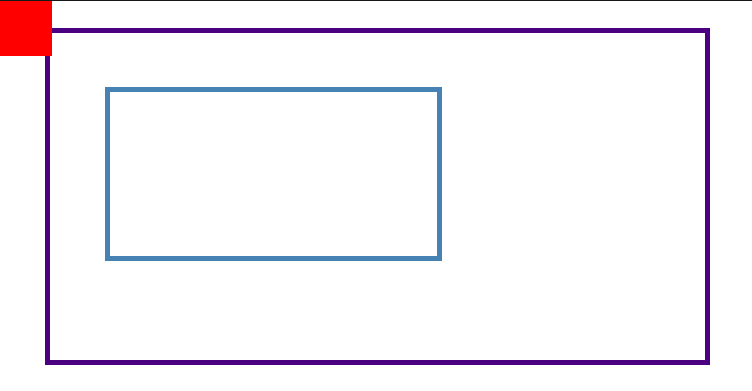

# 
Posicionamiento absoluto

Tras entender como funciona el [posicionamiento relativo](https://lenguajecss.com/css/posicionamiento/position-relative/), otro de los posicionamiento CSS más importantes es el posicionamiento absoluto, que se consigue indicando la palabra clave absolute en la propiedad position.

Este tipo de posicionamiento es algo más complejo, ya que se utiliza para posicionar elementos en base a un elemento padre contenedor. Sin embargo es muy potente, y de comprenderlo bien, podremos hacer cosas muy complejas con muy poco código.

## El marco de referencia
Para entender como funciona el posicionamiento absoluto, hay que entender lo que hace el navegador. Antes de explicarlo, mostremos algunas importantes pautas previas:

   - El elemento rojo es el elemento a posicionar, debe tener position: absolute.
   - Utilizaremos propiedades de coordenadas (top, left, right, bottom o inset) para mover el elemento.
   - El elemento con borde amarillo es el marco de referencia, que no debe tener position: static.

Position: absolute

Con el posicionamiento absoluto tenemos un mecanismo potentísimo para colocar elementos. Para ello, solo tenemos que colocar el position: absolute al elemento que queremos posicionar. Este, lo que hará es buscar su elemento contenedor padre y verificar si tiene un posicionamiento estático o no.

En el caso de que se trate de un posicionamiento no estático, utilizará este contenedor de marco de referencia, posicionando nuestro elemento absolute.

En el caso de que se trate de un posicionamiento estático, continuará buscando, ahora con el siguiente contenedor padre, así hasta llegar a uno que no sea estático o al llegar al elemento "body", que sería el último y el que utilizaría como marco de referencia.

## La propiedad position: absolute
Para ver si hemos comprendido bien el funcionamiento del ejemplo anterior, veamos un ejemplo real muy sencillo:

   - 1️⃣ Aplicamos posicionamiento absoluto a .element.
   - 2️⃣ Lo colocamos en la parte superior del marco de referencia con top: 0.
   - 3️⃣ Lo colocamos en la parte izquierda del marco de referencia con left: 0.

css:

html:

vista:

En este caso, el elemento rojo se ha colocado en la esquina superior izquierda porque al buscar su contenedor padre .middle, este no se encuentra posicionado (es estático), por lo que continua con su siguiente padre, .container, que también es estático, llegando a <body> y utilizándolo como marco de referencia para posicionarlo.

Veamos que ocurre si posicionamos, por ejemplo, de forma relativa, el elemento .middle:

css:

html:

vista:

Ahora, el elemento rojo al buscar su contenedor padre .middle y encontrar que si está posicionado de forma no estática, lo ha tomado como marco de referencia, posicionando de forma absoluta el elemento rojo ahí.

## Contexto de apilamiento
Al añadir un posicionamiento absoluto a un elemento, se dice que el elemento entra en un contexto de apilamiento diferente, ya que este ha sido posicionado en un espacio tridimensional, por lo que no interactua de la misma forma respecto a otros elementos.

En CSS existen múltiples formas de crear contextos de apilamiento, a parte de cuando posicionas de forma absoluta un elemento:

   - A los hijos (directos) de un elemento display: flex o display: grid con z-index especificado.
   - A elementos con un opacity diferente de 1 y sus elementos descendientes.
   - A elementos con un transform, filter, clip-path, mask (o similares) esteblecido.
   - A elementos con un will-change o un contain establecido.
   - A ciertos elementos con un container-type o un contain establecido.
   - A elementos con un mix-blend-mode establecido.
   - A elementos con un isolation establecido a isolate.

En general, no tienes que preocuparte por ello ni aprenderlo de memoria. Simplemente recuerda que hay ciertas ocasiones donde se crean contextos de apilamiento diferentes. En esos casos, puede que necesites ser más cuidadoso con determinados detalles que aprenderemos más adelante.