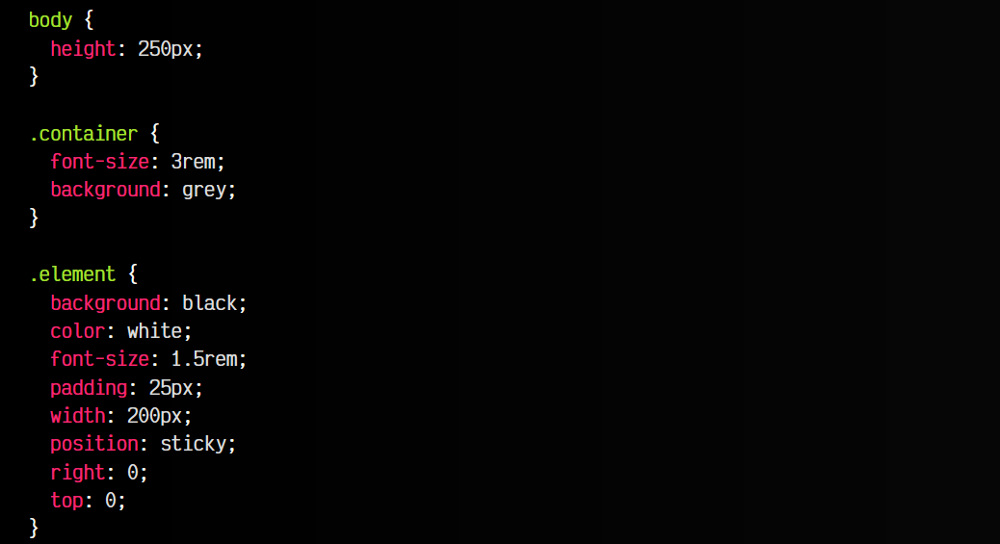
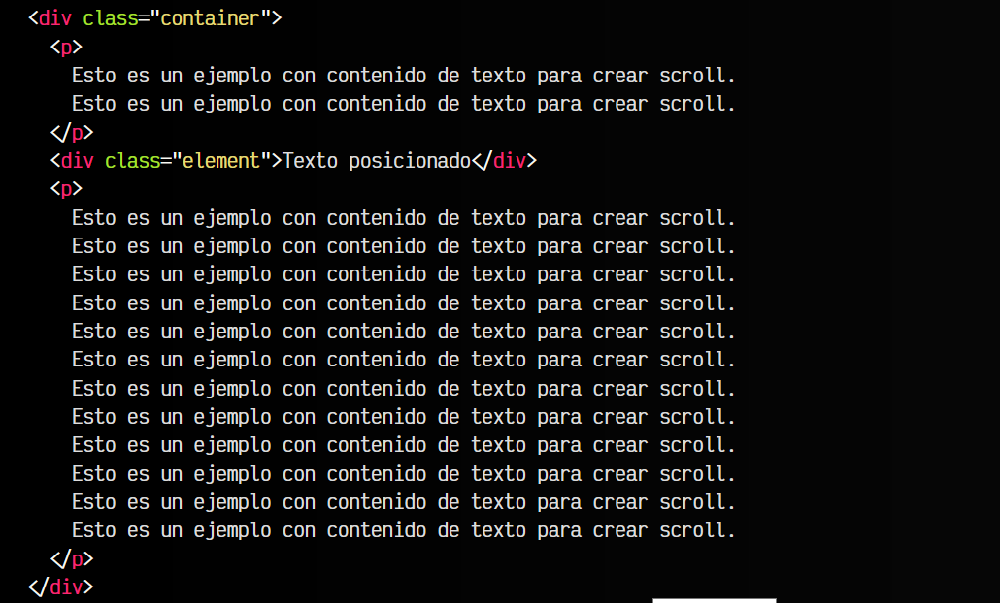
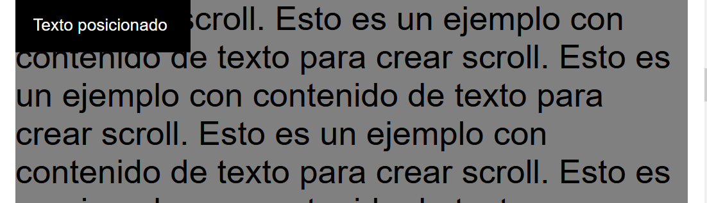
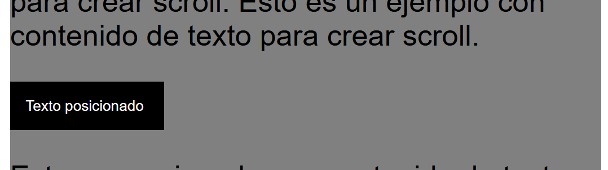

# 
Posicionamiento stick

El posicionamiento sticky se suele utilizar cuando queremos que un elemento se posicione en un lugar específico de forma fija, exactamente como el posicionamiento fijo (fixed), pero sólo en un momento o a una altura determinada.

La forma más sencilla de entender esto, es pensar en el clásico menú superior que al principio está oculto, pero en un momento de nuestro scroll por la página se muestra y nos acompaña durante nuestra navegación para tener los enlaces de navegación a mano (u otra razón).

## La propiedad position: stickyo
Como hemos comentado, este tipo de posicionamiento es muy similar al posicionamiento fixed, sin embargo, tiene una clara diferencia. Observa el siguiente ejemplo, que hemos tomado del tema de position: fixed y hemos modificado ligeramente, estableciendo el position: sticky y cambiando un poco el HTML:

css:

html:

vista:

Observa que en este caso, el elemento no se posiciona desde el principio, sino que mantiene su lugar en el HTML. En nuestro ejemplo, el elemento no se visualiza inicialmente, hasta que haciendo scroll lo encontramos.

En ese momento, desde que el elemento llega a la parte superior y va a desaparecer debido al scroll, el elemento «se pega» a la parte superior y permanece «sticky», acompañándonos hasta el final de la página o que volvamos a subir el umbral donde lo encontramos, donde volvería a su ubicación original y dejaría de seguirnos.

El soporte de position: sticky, aunque en sus primeros años de vida fue bastante accidentado, en la actualidad se puede utilizar de forma segura en todos los navegadores actuales.

Aunque he utilizado los valores 0 para la propiedad top y left, se pueden utilizar otros valores, tal y como explicamos en secciones anteriores, como la sección de position: absolute o la de position: relative.
