# 
CSS Anchor Position

Desde hace mucho tiempo existen métodos de posicionamiento CSS, como posición relativa, posición absoluta y otros. Sin embargo, pueden resultar relativamente limitados en cuanto necesitamos un sistema de posicionamiento complejo. Recientemente se ha incorporado un mecanismo muy potente e interesante llamado Anchor Positioning (posicionamiento mediante anclajes), que es el que vamos a explicar en este artículo.

Este sistema se basa en que puedes «anclar elementos» respecto a otros. Para ello, tenemos que identificar dos elementos principales:

   - El elemento referencia (gris en el ejemplo), será nuestra ancla de referencia.
   - El elemento posicionado (rosa en el ejemplo) respecto al elemento anterior.

La compatibilidad de Anchor Position en navegadores es la siguiente:

## Posicionar elementos con anclajeso
Para posicionar utilizando Anchor Position debemos conocer la propiedad anchor-name. Con ella, definimos el nombre del ancla utilizada para definir un elemento de referencia. Pero antes, examinemos el siguiente ejemplo, donde aún no utilizamos Anchor Position, pero preparamos un ejemplo para comenzar a utilizarlo:

css:
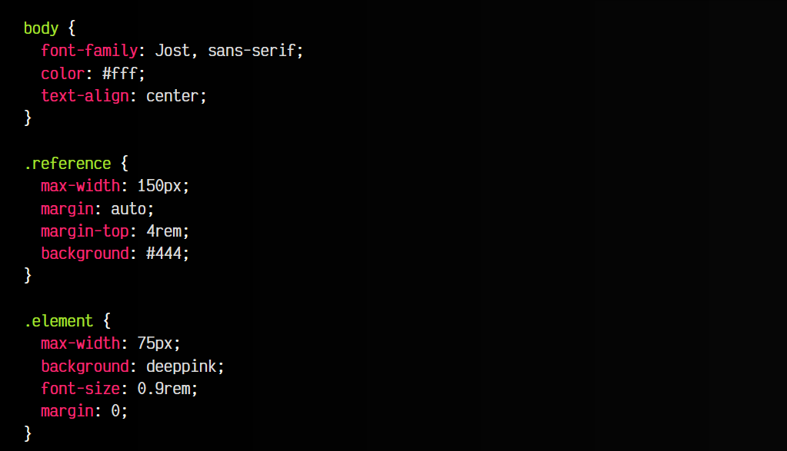

html:

vista:
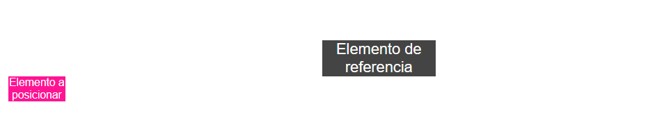

Como ves, por defecto, los elemento se colocan según aparecen en el HTML. Como he indicado unos márgenes para el elemento gris, se ve centrado en pantalla, sin embargo el elemento rosa aparece a continuación porque es la parte donde sigue el orden del HTML.

La propiedad anchor-name nos permitirá definir un elemento de referencia, dándole un nombre (en mi caso he usado --first-box). Este nombre debe prefijarse de --, como las variables CSS, sin embargo no usaremos la función var().

Por otro lado, la propiedad position-anchor permite posicionar otro elemento respecto a este primer elemento de referencia, indicándole el nombre de ancla que se define mediante anchor-name.

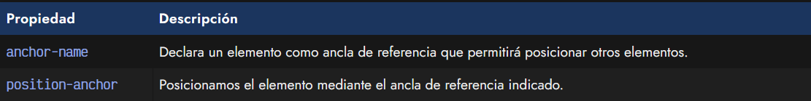

Ahora sí, al código CSS mostrado en el ejemplo anterior, vamos a añadir el siguiente código donde utilizaremos estas dos propiedades y la función anchor():

css:
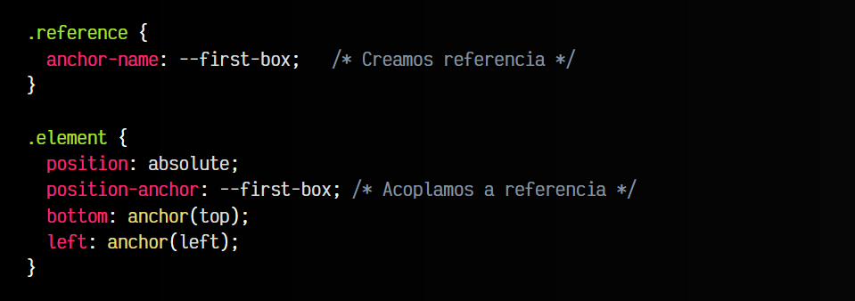

html:
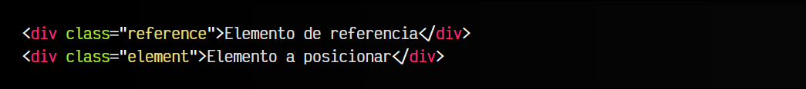

vista:

¿Qué es lo que hemos hecho? Analicemos paso a paso:

   - 1️⃣ Antes de nada, hemos creado un elemento de referencia con anchor-name. Se llama --first-box.
   - 2️⃣ Luego, hemos posicionado otro elemento, que debe estar posicionado con absolute.
   - 3️⃣ Por último, hemos indicado a que elemento lo anclamos. Eso lo haremos con position-anchor.

Con estos sencillos pasos, ya tenemos esos dos elementos «anclados». Ahora sólo nos falta establecer la colocación de uno respecto al otro, que es lo que hacemos mediante la función anchor() en las dos últimas líneas. Lo explicaremos en el siguiente apartado.

## La función anchor()
La función anchor() nos permite indicar como se posiciona un elemento respecto a su elemento de referencia. En el ejemplo anterior lo hemos hecho de forma implícita, mediante las propiedades bottom, left, right o top.

   - 1️⃣ Las propiedades bottom, left, right o top indican la parte del elemento posicionado (rosa).
   - 2️⃣ El parámetro de la función anchor() indica la parte del elemento de referencia (gris) a usar.

En nuestro ejemplo, hemos utilizado las propiedades bottom: anchor(top) y left: anchor(left), es decir, queremos que el elemento a posicionar (rosa) se conecte desde su bottom a la parte superior de la referencia (gris) y desde su izquierda (rosa) a la parte izquierda de la referencia (gris).

Si no te queda claro, puedes jugar un poco con estos valores:

css:
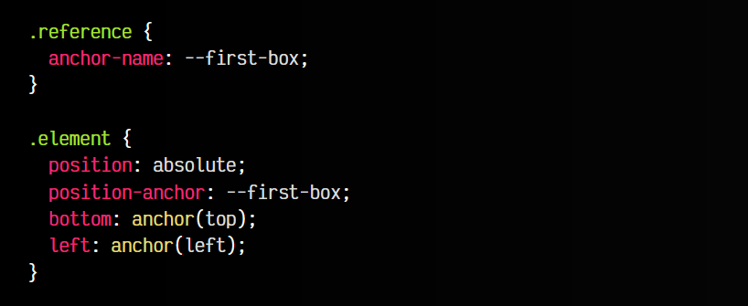

html:
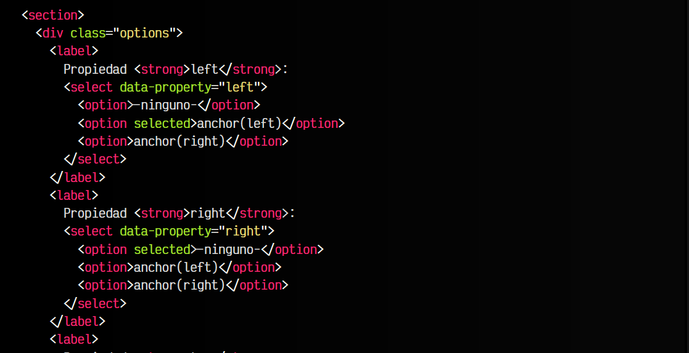
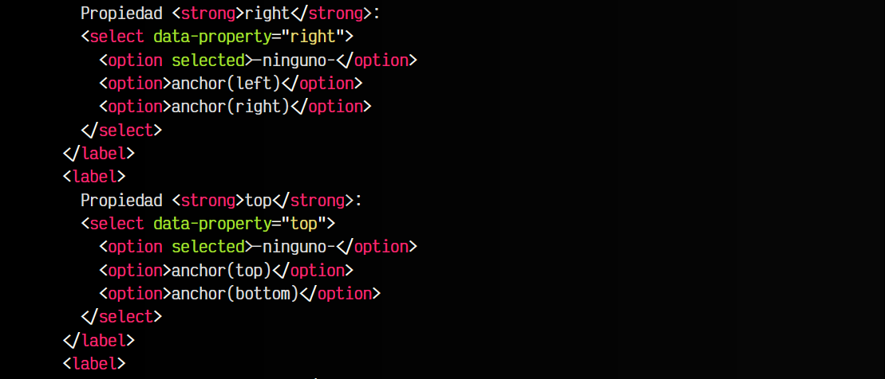
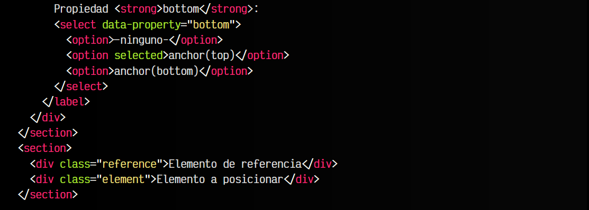

js:
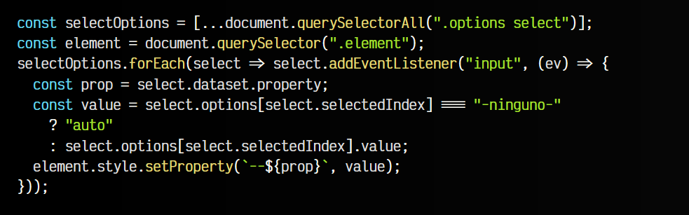

vista:
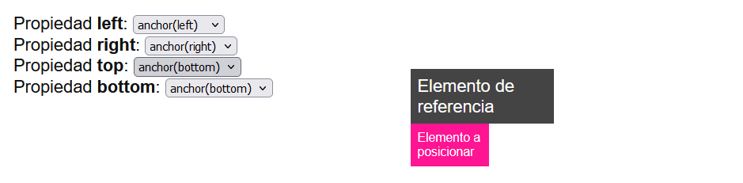

Jugando un poco con los valores de cada propiedad left, right, top y bottom podrás comprobar como funciona la función anchor().

## Referencias explícitas
La función anchor() también se puede utilizar de una forma un poco más directa, indicando dos parámetros: el elemento de referencia (siempre prefijado por --) y el lugar a posicionar:

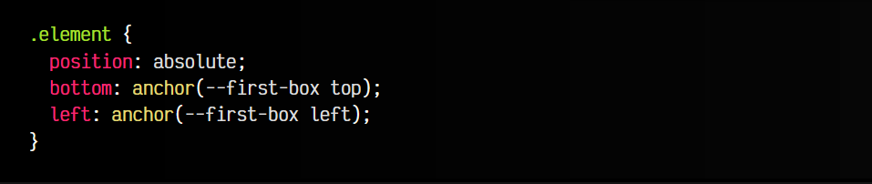

De esta forma, esa relación queda más clara, y es bastante útil si vamos a realizar referencias desde distintas anclas, de modo que queda mucho más legible.

## La función anchor-size()
Además de la función anchor(), también disponemos de la función anchor-size(). Con esta función podemos indicar a nuestro elemento posicionado (rosa) el tamaño que tenemos en nuestro elemento de referencia (gris) o valores relacionados.

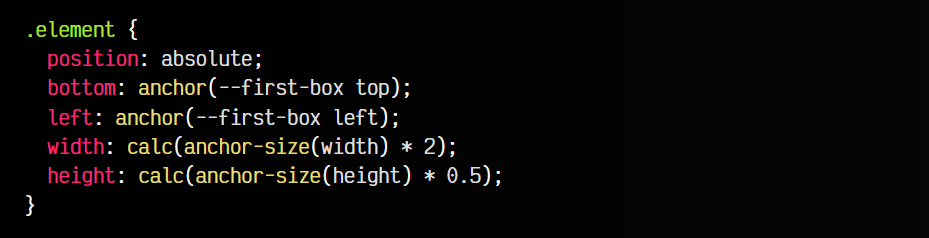

El ejemplo de código, hemos establecido para el elemento .element un tamaño de ancho con la propiedad width. En su valor, hemos calculado el ancho del elemento de referencia con anchor-size(width) y lo hemos duplicado con calc(... * 2).

De la misma forma, hemos utilizado la propiedad height para utilizar la mitad del tamaño de alto del elemento de referencia.

La función anchor-size() nos permite utilizar varias palabras clave por parámetro:

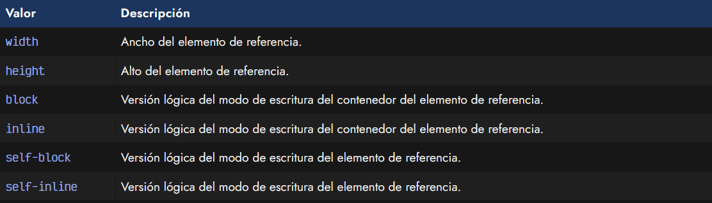

## Áreas de inserción
Además de la forma anterior de posicionar elementos, tenemos la propiedad inset-area que nos proporciona una forma quizás más clara y directa de posicionar elementos, donde no necesitamos preocuparnos más que de la parte desde donde se va a conectar un elemento con otro.

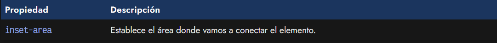

La propiedad inset-area permite utilizar una gran cantidad de valores clave como los de la tabla siguiente:

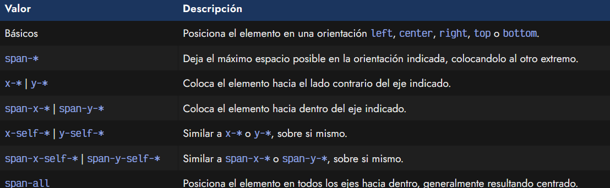

Puedes observar un ejemplo del funcionamiento de estos valores en el siguiente ejemplo interactivo:

css:
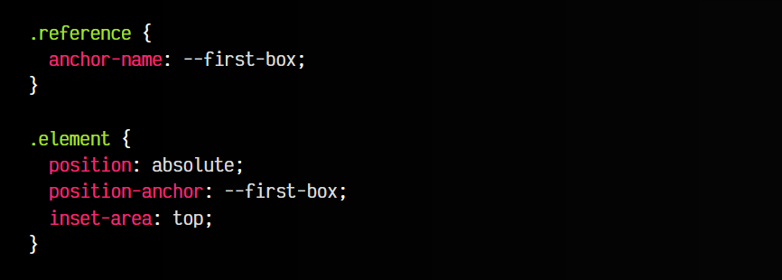

js:
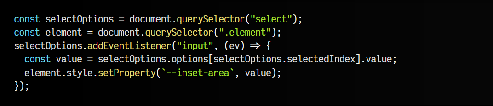

html:
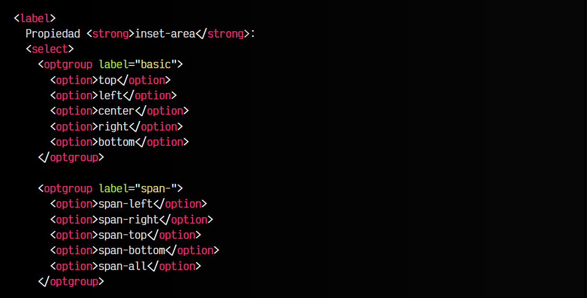
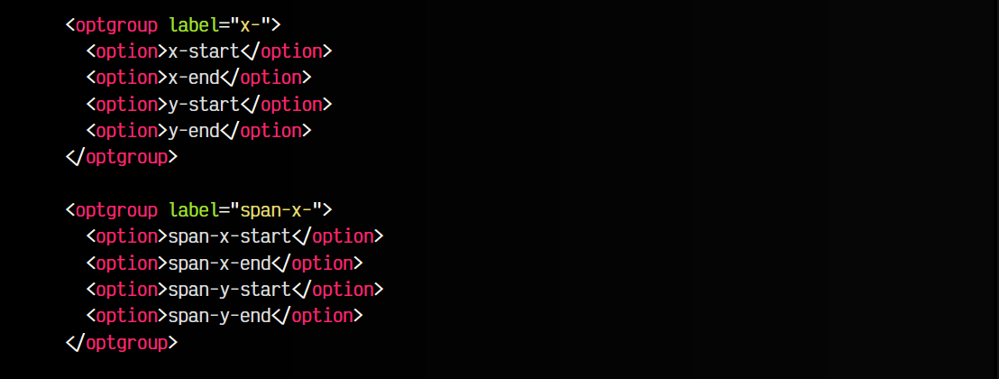
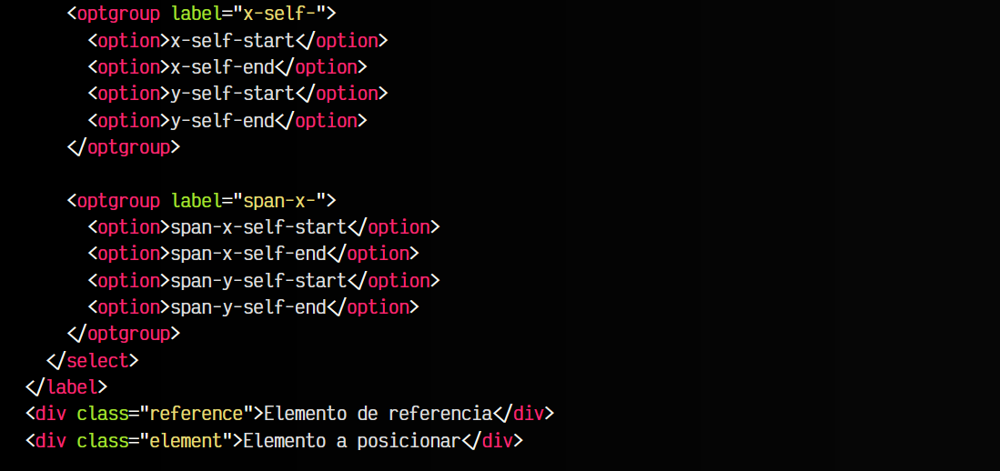

vista:
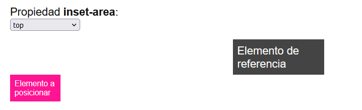

Además, la propiedad inset-area también permite combinarlos en algunas situaciones, o hacer uso de propiedades lógicas como block-start, span-block-end, inline-start o span-inline-end entre muchas otras.

## El valor anchor-center
Es posible que en algunas situaciones, necesitemos centrar el elemento respecto al elemento de referencia. Para ello, podemos utilizar el valor anchor-center en propiedades como justify-self, align-self, justify-items o align-items.

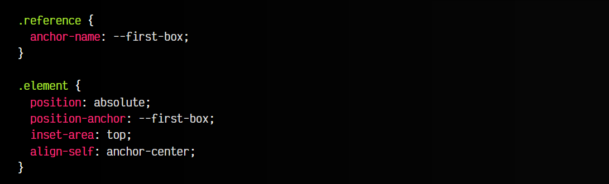

En ciertas situaciones nos puede venir bastante bien poder apoyarnos en este tipo de centrado adicional. Obviamente, es necesario tener el elemento posicionado respecto a un ancla de referencia.