# 
Contornos

Mediante CSS se pueden modificar ciertos detalles relacionados con el modo en que interactua el usuario con un alguno de los componentes del interfaz de la página.

## Las propiedades para contornos
La familia de propiedades outline-* nos permiten modificar el comportamiento del contorno de los elementos: una línea divisoria que rodea el contenido externo del propio elemento. A diferencia de los bordes, esta línea divisoria, por defecto no ocupa espacio y no tiene porque tener una forma rectangular.

Es fácil de observar esta línea divisoria en los navegadores, pulsando
TAB y moviéndonos por los diferentes enlaces de la página. Generalmente, aparece como una línea punteada y es muy similar al funcionamiento de los bordes.

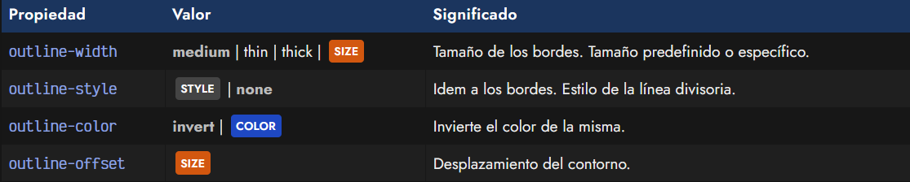

La propiedad outline-color permite modificar el color de la línea divisoria, en el caso de que el tamaño outline-width sea mayor que cero o tenga un valor definido de las palabras clave mencionadas anteriormente.

Además, al igual que con los bordes, también se puede cambiar el estilo de la línea con outline-style. Veamos un ejemplo, comparándolo con los bordes:

css:
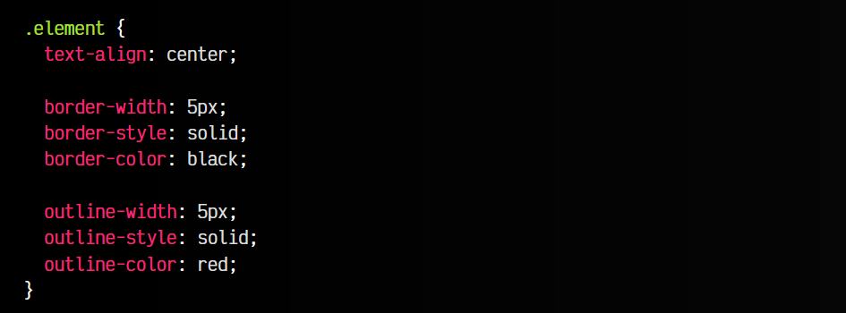

html:
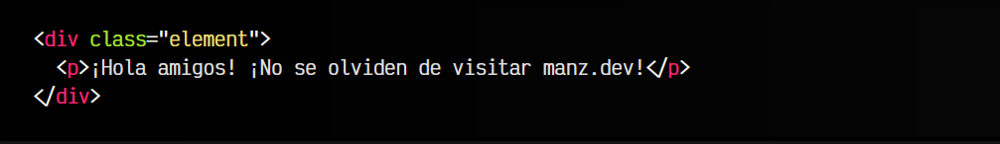

vista:
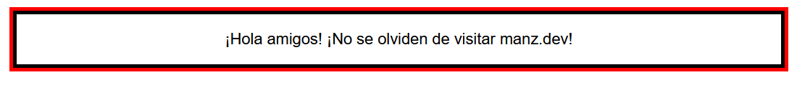

Como puedes ver, es muy similar a los bordes de CSS, pero los contornos outline son como una especie de borde exterior.

## La propiedad outline-offset
Sin embargo, en los bordes de CSS no existe la propiedad border-offset. La propiedad outline-offset nos permite ampliar el desplazamiento o espacio interior de la línea de contorno.

Observa el mismo ejemplo anterior, pero estableciendo un outline-offset de 10px:

css:
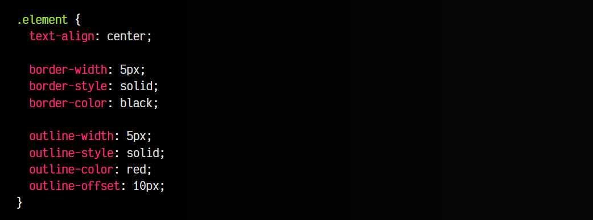

html:
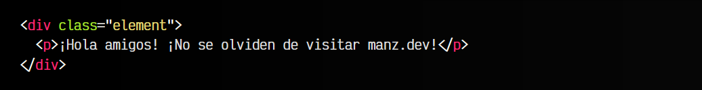

vista:
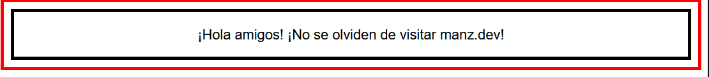

## Atajo: La propiedad outlinet
Es posible, al igual que con muchas otras propiedades, resumir en una sola propiedad para ahorrar espacio. El orden recomendado es el siguiente:

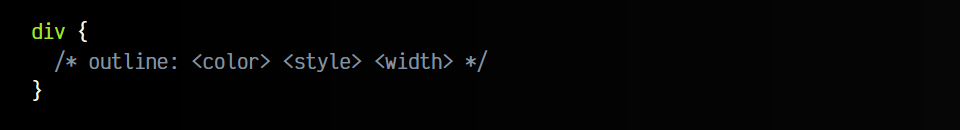

Veamos el mismo ejemplo anterior, pero utilizando la propiedad de atajo outline, y nuevamente, comparándola con la propiedad de atajo border:

css:
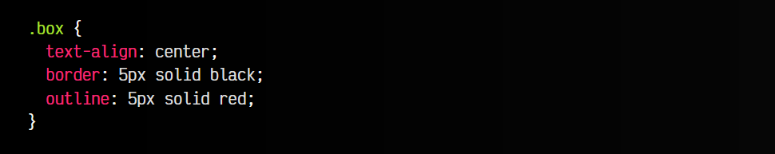

html:
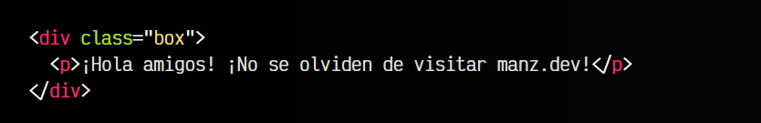

vista:
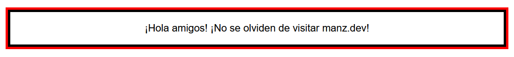

Nota: En muchas ocasiones, estas propiedades son usadas por el desarrollador para indicar un outline: 0 y desactivar esta característica de contorno. Hay que tener mucho cuidado con esto, ya que este contorno visual es muy importante en el ámbito de la accesibilidad, y desactivarlo puede ser contraproducente.
