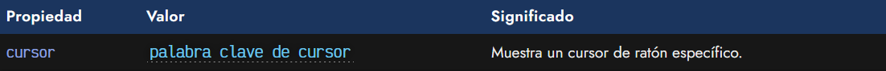
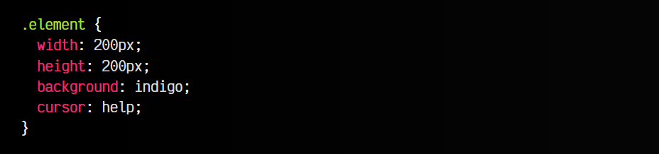
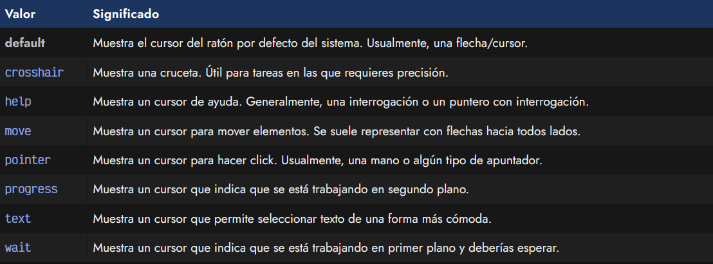
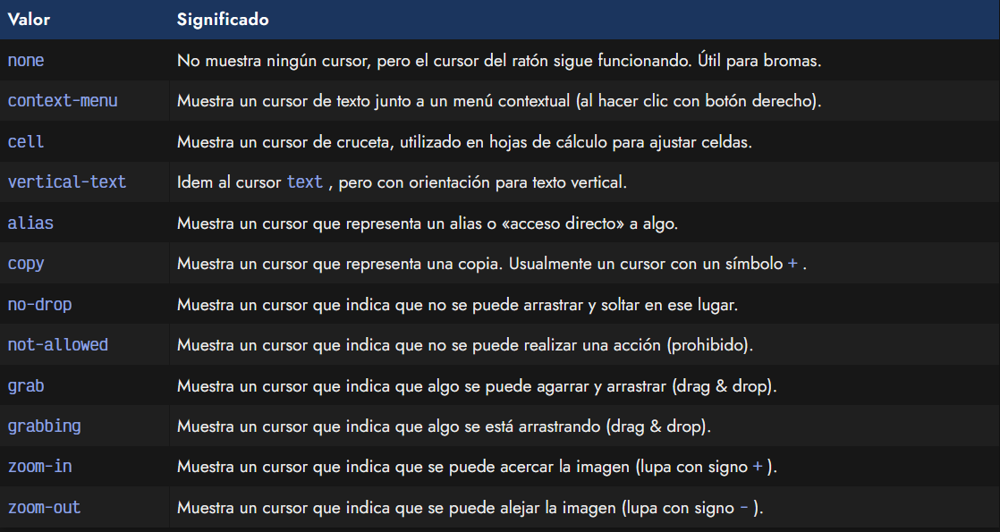
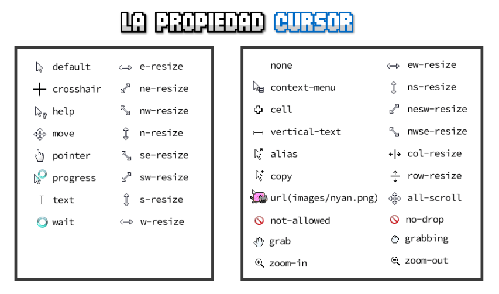
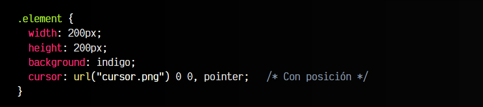
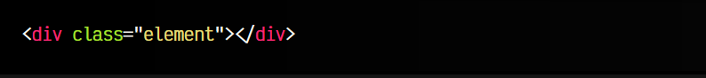
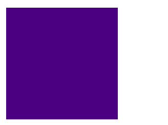

# 
Cursor del ratón

Sería fantástico si CSS permitiera modificar la apariencia del ratón, a gusto del desarrollador web, dependiendo de la zona del documento HTML donde nos encontremos. Y de hecho, es algo que aunque es posible hacer con CSS, hay que ser cuidadosos al hacerlo.

El navegador puede cambiar el aspecto visual del ratón mediante CSS, pero no hay que hacerlo a la ligera. Los usuarios están acostumbrados al cursor del ratón que utilizan normalmente, y cambiarlo, puede ser una experiencia de usuario negativa. Es por ello que lo aconsejable es cambiarlo por uno de los cursores predefinidos que tiene el sistema y sólo en situaciones especiales para aportar más información al usuario.

## La propiedad cursor
Para modificar el cursor del ratón solo tenemos que especificar la propiedad cursor dentro del elemento que busquemos, junto al valor del cursor deseado:

Veamos un ejemplo:

css:

html:

vista:

En este caso hemos utilizado la palabra clave help, pero existe una amplia gama valores predefinidos para diversas situaciones, que separaremos en dos grupos a continuación.

## Cursores básicos
Son los más extendidos y compatibles con todos los navegadores. Funcionan sin problema en cualquier sistema y pueden utilizarse sin preocuparse por el soporte. Las palabras clave son las siguientes:

Por último, tenemos valores como e-resize , ne-resize , nw-resize , n-resize , se-resize , sw-resize , s-resize o w-resize , que representan la redimensión de ventanas en puntos cardinales como norte, sur, este, oeste y derivados.

## Cursores adicionales
A partir de CSS3, se añadieron una serie de valores propios para cubrir ciertas carencias en la lista de cursores anterior. Actualmente, los navegadores de escritorio los soportan correctamente:

Se añaden otros cursores de orientación a puntos cardinales como ew-resize , ns-resize , nesw-resize , nwse-resize , otros para redimensionar filas o columnas de una tabla row-resize y col-resize o all-scroll que indica que se puede hacer scroll en cualquier dirección.

A continuación podemos ver algunos ejemplos de los cursores mencionados en las listas anteriores:

## Cursores personalizados
Uno de los valores anteriores de la lista es cursor: url("images/nyan.png"), que es el mismo formato que se utiliza (por ejemplo) para indicar imágenes externas con la propiedad background. De esta forma, podemos usar imágenes como cursores personalizados.

Sin embargo, esta funcionalidad tiene varias particularidades que conviene aclarar. Su utilización sería la que puedes ver en el siguiente ejemplo:

css:

html:

vista:

Observa que indicamos una URL con la imagen a utilizar como cursor, y el segundo valor es el cursor fallback (por si falla la carga de la primera imagen). La imagen del cursor personalizado debe especificarse en el interior de url(). De forma opcional, como se ve en el segundo ejemplo, se pueden utilizar dos valores numéricos que indican la posición (x, y) sobre la imagen del hotspot, es decir, del punto que actuará de puntero para hacer clic.

