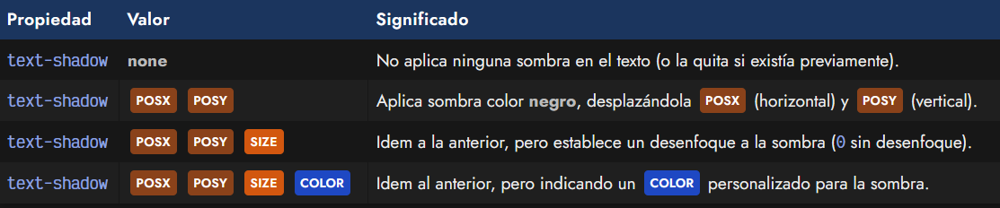
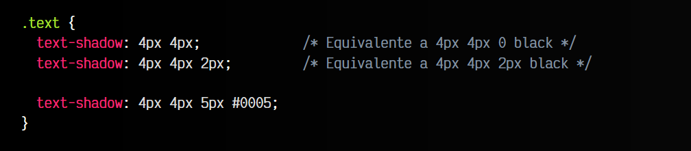
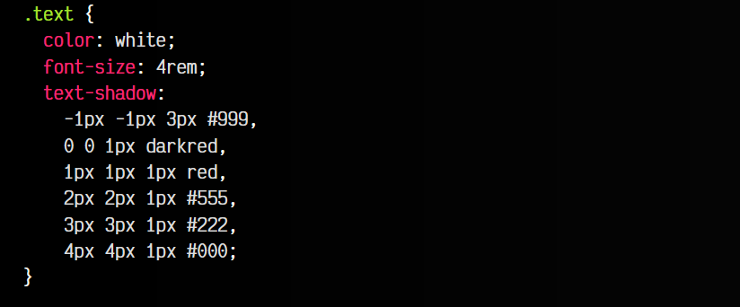
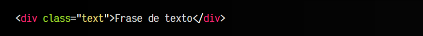

# 
Sombras CSS en textos

Las sombras son un recurso muy importante en el mundo del desarrollo web. En el contexto de este artículo, contemplaremos sólo las sombras en textos. Sin embargo, también existen otras propiedades con las que podremos dar sombras a otro tipo de elementos, como etiquetas HTML.

## Sombras de texto
Crear sombras en textos mediante CSS es muy útil, puesto que es una forma interesante de suavizar y hacer más legibles los textos, o simplemente hacerlos más atractivos para el usuario que está viendo la página. Para ello, utilizaremos la propiedad text-shadow. Esta propiedad permite los siguientes parámetros:

Por defecto, los textos no tienen sombra, o lo que es lo mismo, como la propiedad text-shadow tuviera el valor none. Sin embargo, cambiando sus parámetros podemos establecer sombras.

## Desplazamiento de la sombra
Para crear una sombra, los parámetros mínimos que hay que especificar son POSX, el desplazamiento horizontal, y , POSY el desplazamiento vertical. Podemos aplicar cantidades negativas (en cuyo caso la sombra se desplazaría hacia la izquierda o hacia arriba), o cantidades positivas (en cuyo caso la sombra se desplazaría hacia la derecha o hacia abajo). Estos valores no pueden ser porcentajes.

Si solo aplicamos estos dos parámetros, aparecerá una sombra de color negro (concretamente, el color al que apunta currentColor) e idéntica en tamaño al texto original, lo que nos lleva al siguiente parámetro.

## Desenfoque de la sombra
El tercer parámetro de las sombras en text-shadow hace referencia al desenfoque que queremos sobre dicha sombra. Funciona dandole un tamaño SIZE, que por defecto es 0, manteniendo la sombra de una forma idéntica al texto original. Sin embargo, a medida que vamos elevando ese tamaño, la sombra estará más desenfocada o difuminada, de forma que la sombra es más borrosa.

Si elevamos mucho este valor, llegará un punto en el que la sombra se difuminará tanto, que desaparecerá.

## Color de la sombra
Por último, podemos establecer el color de la sombra. Por defecto, su valor es currentColor, que generalmente suele ser black. Sin embargo, nosotros podemos indicar cualquier color en cualquiera de los formatos disponibles: hexadecimal, mediante la función rgb(), hsl() o incluso con palabras clave.

Veamos algunos ejemplos:

Lo habitual es utilizar el formato del último ejemplo, donde se indican los 4 valores de forma explícita.

## Sombras de texto múltiples
Al igual que al utilizar imágenes de fondo, es posible utilizar múltiples sombras de texto. Esto nos dará suficiente flexibilidad para crear textos con efectos, bordes o sombras que resultan de aplicar múltiples sombras de fondo con diferentes parámetros. Para ello, simplemente separamos el conjunto de valor con comas:

css:

html:

vista:

Como puedes observar, para cumplir unos criterios de buena legibilidad, se suele escribir el conjunto de valores en la linea siguiente, indentada unos espacios. Con cada coma, escribimos en línea siguiente.