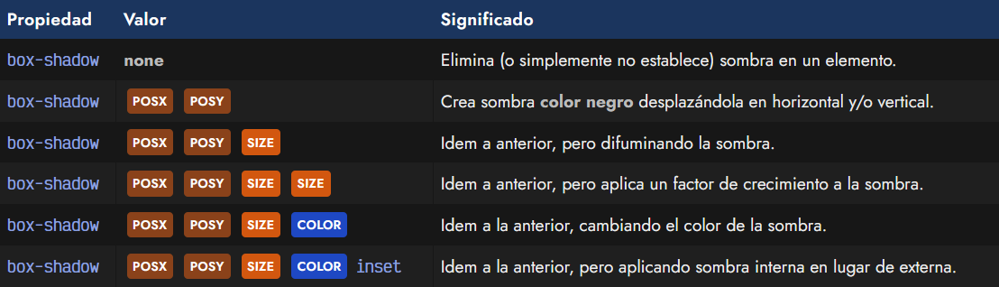
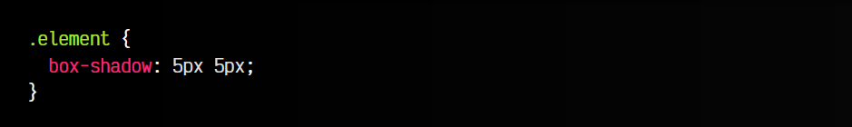
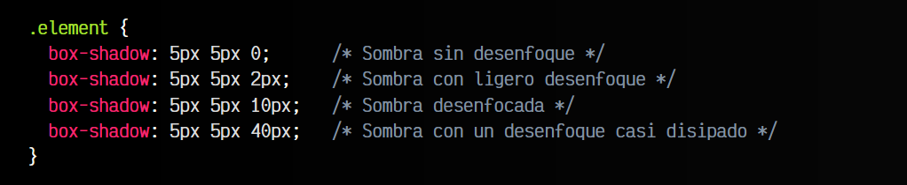
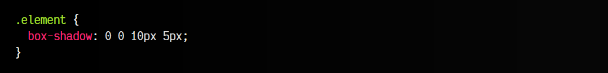
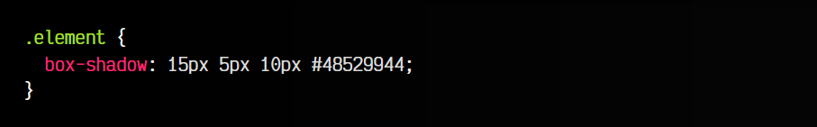
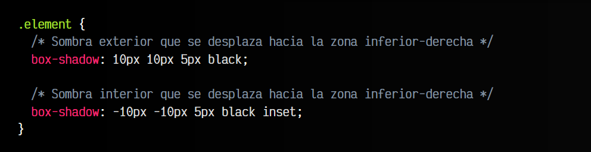
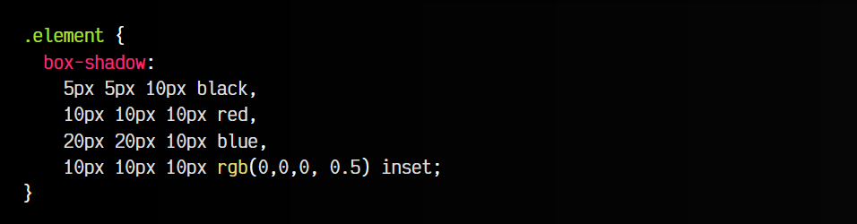

# 
Sombras CSS en cajas

Se denominan sombras sobre cajas a las sombras en CSS que se pueden crear en una etiqueta o elemento HTML. Para ello, se utiliza la propiedad box-shadow, que funciona de forma muy similar a la que vimos en las sombras de texto, sólo que con algunos añadidos interesantes.

## La propiedad box-shadow
En primer lugar, las sombras box-shadow están desactivadas sobre cualquier elemento, lo mismo que ocurriría si aplicamos el valor none a dicha propiedad. Veamos un resumen de valores que podemos indicar a esta propiedad de sombras:

La palabra clave inset se puede escribir en cualquier otro orden, pero se suele indicar al final. Veamos cada uno de estos parámetros, uno por uno, junto a sus peculiaridades.

## Desplazamiento de la sombra
Los dos primeros parámetros, POSX y POSY , son los parámetros obligatorios mínimos para hacer funcionar la propiedad box-shadow, donde indicamos el desplazamiento que tendrá la sombra en el eje x (horizontal) y en el eje y (vertical).

Así pues, si queremos desplazar una sombra ligeramente a la derecha (eje x, primer parámetro) y hacia abajo (eje y, segundo parámetro), tendríamos que escribir, como mínimo, algo similar a lo siguiente:

En este caso, la sombra se crea de color currentColor (habitualmente black) y sin difuminar, como veremos en los siguientes apartados. Ten en cuenta que valores negativos invierten la dirección de la sombra. Si 5px 5px mueve la sombra 5 píxels a la derecha y hacia abajo, -5px -5px movería la sombra 5 píxels a la izquierda, y 5 píxels hacia arriba.

## Desenfoque de la sombra
El tercer parámetro de la propiedad box-shadow indica la cantidad de desenfoque o difuminado que queremos utilizar en nuestra sombra. Por defecto, tiene un valor de 0, o lo que es lo mismo, la sombra será igual a la caja original, por lo que será completamente lisa, sin difuminar. Este valor puede irse ampliando y de esta forma conseguiremos una sombra más desenfocada:

Ten en cuenta que las sombras con box-shadow siempre serán rectangulares. Si quisieramos una sombra idéntica, por ejemplo, a una imagen con transparencia, donde se respeten los espacios transparentes, deberías ver la función drop-shadow() de la propiedad filter, que explicamos más adelante.

## Factor de crecimiento
Un cuarto parámetro opcional permite indicar un factor de crecimiento para la sombra. Este valor no es obligatorio escribirlo, y muchas veces comprobarás que el cuarto parámetro de la propiedad box-shadow es el color, es decir, el siguiente apartado, omitiendo este parámetro. Esto es absolutamente normal, ya que este parámetro es opcional y se indica sólo cuando es necesario. En caso contrario, este parámetro valdrá 0 y será omitido.

El parámetro de factor de crecimiento es un parámetro donde podemos indicar una unidad que hará crecer la sombra en todos sus lados el tamaño indicado, de forma que crezca un poco más de lo que ocupa. Algo que puede ser realmente útil, por ejemplo, en el caso de que el desplazamiento sea 0 (la sombra está justo detrás del elemento) y queremos que se muestre ligeramente alrededor de la etiqueta a la que le aplicamos box-shadow. Veamos un ejemplo:

Esto hará que la sombra esté posicionada justo detrás del elemento, tenga un nivel de desenfoque de 10px y, además, la hagamos crecer unos 5px por cada lado.

## Color de la sombra
Aunque en los ejemplos anteriores lo hemos omitido por el momento, lo habitual es que las sombras creadas con box-shadow incluyan siempre cuatro valores: desplazamiento de x, desplazamiento de y, nivel de desenfoque y color de la sombra. Luego, el factor de crecimiento y la palabra clave inset que veremos posteriormente, son opcionales y se usan sólo cuando son necesarias.

Con el parámetro del color podemos cambiar el color de la sombra a nuestro antojo, no sólo utilizando palabras clave, valores hexadecimales y/o las funciones rgb() o hsl(), sino utilizando canales alfa para conseguir cierta transparencia, si así lo deseamos. En el ejemplo anterior utilizamos el color #485299 con una transparencia en hexadecimal de 44, teniendo en cuenta que los valores de canal alfa en hexadecimal van desde 00 (totalmente transparente) hasta ff (totalmente opaco).

## Sombra interior
Nuestras sombras creadas con box-shadow permiten indicar la palabra clave inset, lo que hará que la sombra en lugar de colocarse por fuera de nuestro elemento y ser una sombra exterior (por defecto), pasará a ser una sombra interior y colocarse por dentro del elemento. Ten en cuenta que en este caso, los desplazamientos indicados se invierten, de modo que si teníamos una sombra por la zona inferior-derecha, tendríamos que invertir los valores para que la sombra interior también esté en la zona inferior-derecha:

Observa que hemos invertido los valores de los desplazamientos de POSX  y POSY. 

## Sombras de texto múltiples
Como hemos visto en otros casos como en propiedades como background-image o text-shadow, la propiedad box-shadow permite indicar valores múltiples separados por coma, permitiendo en este caso, crear sombras múltiples e independientes.

La sintaxis es muy sencilla y se suele escribir así para hacerlo más legible:

En este caso hemos creado múltiples sombras de diferentes colores y con diferentes desplazamientos, incluso una de ellas una sombra interior.

