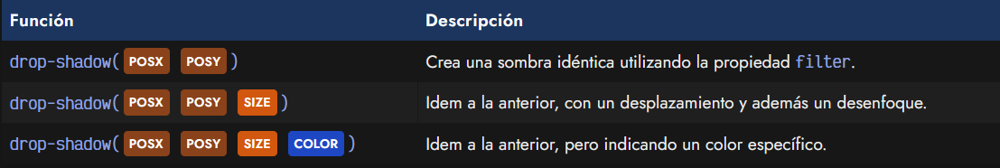
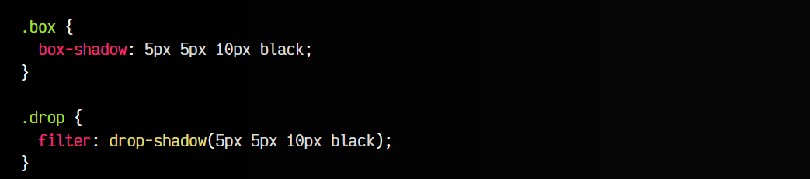
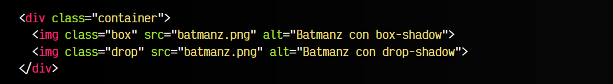
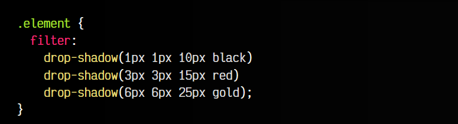
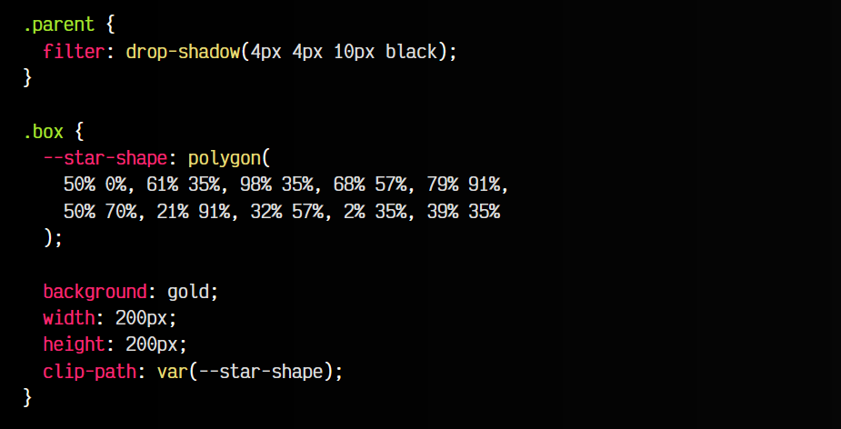
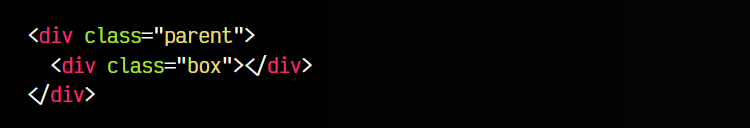

# 
Sombras idénticas CSS

A parte de las sombras de texto con la propiedad text-shadow y las sombras de cajas con la propiedad box-shadow, existe una función menos conocida denominada drop-shadow() que puede utilizarse mediante la propiedad filter y que permite crear las llamadas sombras idénticas.

Las sombras idénticas son muy similares a las sombras generadas con la propiedad box-shadow, en algunos casos, incluso puede que no observes la diferencia, porque las crea exactamente iguales. Sin embargo, hay algunos casos donde es especialmente útil.

## La función drop-shadow()
Como hemos comentado, para crear sombras idénticas se debe utilizar la función drop-shadow() que es una función que puede utilizarse en la propiedad filter (no es una propiedad independiente) y que tiene la misma sintaxis exacta de text-shadow (y no la de box-shadow):

Así pues, podemos utilizar exactamente la misma sintaxis de text-shadow y aplicarla en el interior de la funcion drop-shadow(). La diferencia entre drop-shadow() y box-shadow es que, mientras la última realiza una sombra de la caja, la primera realizará una sombra idéntica «como una gota de agua» (drop).

Esto puede ser especialmente útil en algunas situaciones, como por ejemplo, si el elemento al que le vamos a aplicar la sombra es una imagen .png que contiene transparencias. En ese caso, se verá claramente la diferencia entre una sombra y otra.

En el primer caso estamos utilizando una sombra box-shadow, donde a pesar de las transparencias, la sombra mantiene la forma de la caja. Sin embargo, en la segunda sombra, realizada con la función drop-shadow() mediante la propiedad filter, conseguimos que se respeten las transparencias y sea una sombra idéntica.

El código sería el siguiente:

css:

html:

vista:

Recuerda que en este momento, la función drop-shadow() no tiene parámetro de factor de crecimiento ni palabra clave inset para hacer sombras interiores, como si que lo tiene la propiedad box-shadow.

## Sombras múltiples
La función drop-shadow() permite crear múltiples sombras, pero no funciona exactamente como lo hacen las propiedades box-shadow o text-shadow. En este caso, al estar utilizando la propiedad filter, lo que haremos es crear varias funciones drop-shadow() separadas por espacio:

Observa que en este ejemplo, estamos aplicando 3 sombras idénticas diferentes. En el caso de estar utilizando otros filters con la propiedad filter, simplemente los acumulamos como hemos hecho con la función drop-shadow(). Ten en cuenta que de existir otra propiedad filter en el mismo elemento estaríamos sobreescribiéndola y la anterior dejaría de funcionar.

## Recortes con sombra
Recuerda que si tienes un elemento recortado con la propiedad clip-path, si le aplicas un filter con drop-shadow, no se verá la sombra. Esto ocurre porque realmente pone la sombra y luego recorta. Para solucionarlo, puedes añadir un div> contenedor, y aplicar ahí el filter con drop-shadow.

css:

html:

vista:

De lo contrario, si aplicamos el filter con drop-shadow y el clip-path en el mismo elemento, no se observará sombra salvo en los bordes reales.
