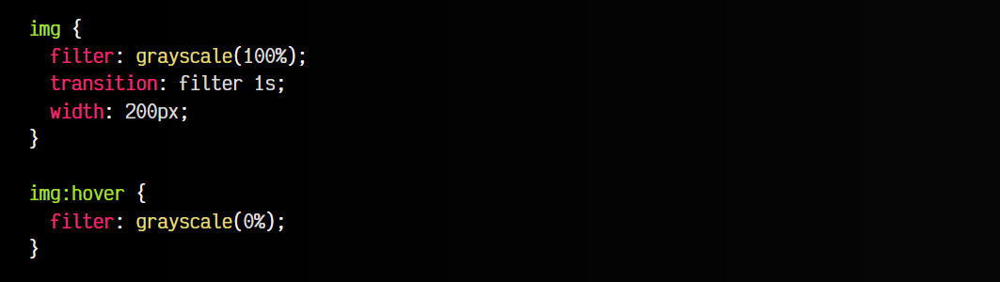
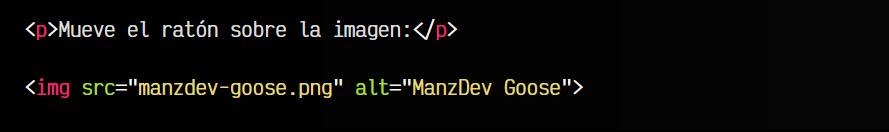
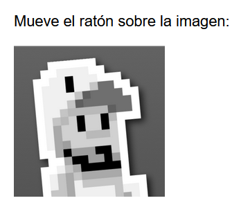
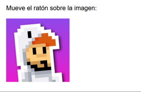
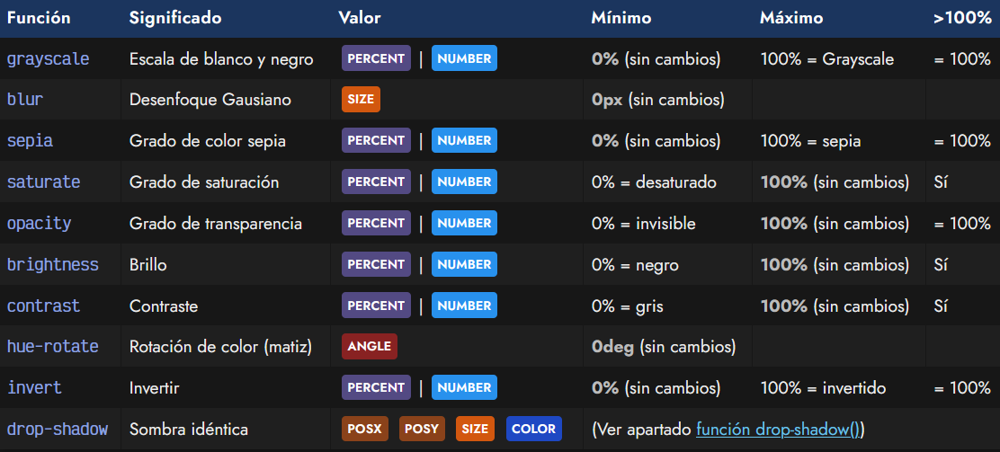
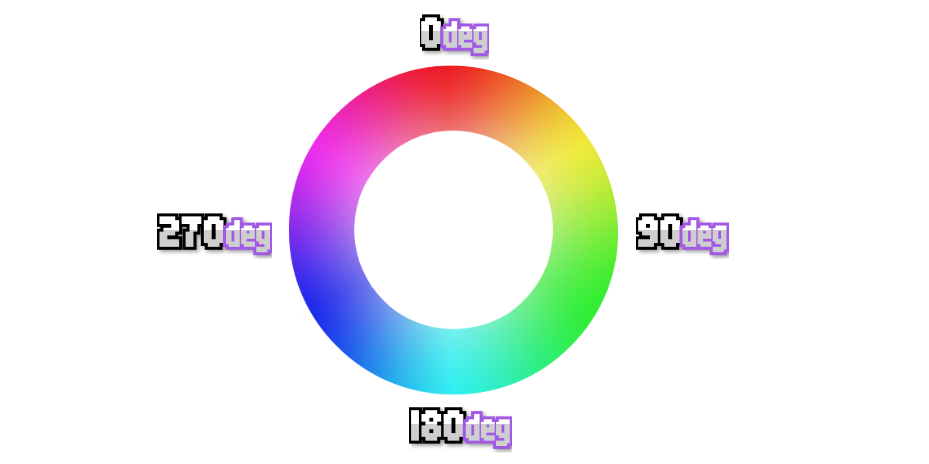
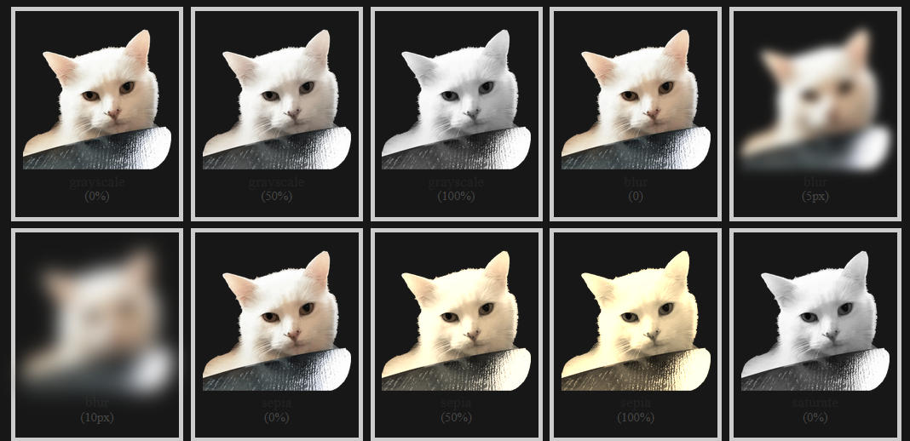
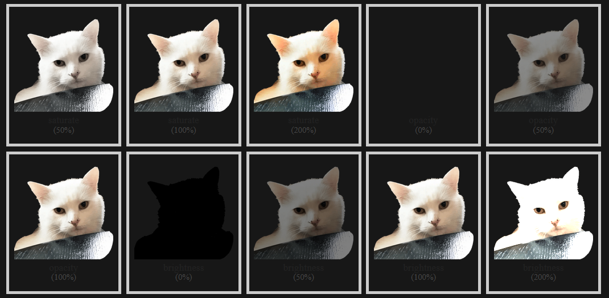
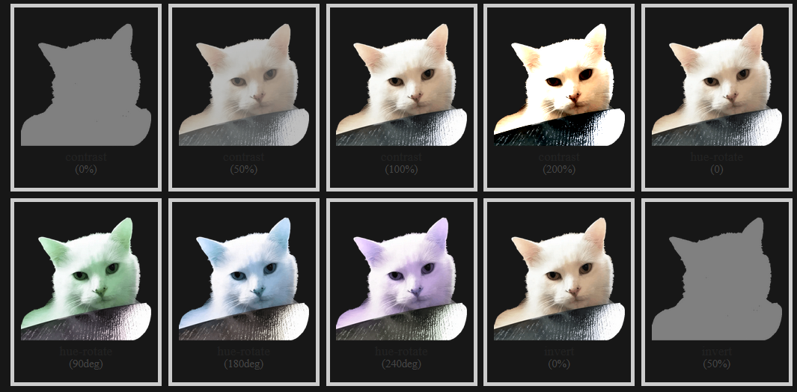
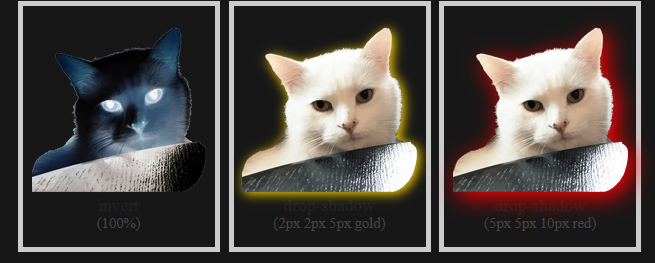

# 
Filtros CSS

Los filtros CSS son una característica muy atractiva de CSS que permite aplicar ciertos efectos de imagen, propios de aplicaciones de retoque fotográfico, como sepia, variaciones de brillo o contraste (u otros) al vuelo en el propio navegador, sin hacer cambios permanentes sobre una imagen.

Dichos filtros funcionan a través de la propiedad filter, a la cuál hay que especificarle una función concreta de las existentes, como por ejemplo la función de blanco y negro (grayscale):

css:

html:

vista:

Este código muestra visualmente las imágenes de la página en escala de grises (al 75%, no completamente). Tenemos más filtros a nuestra disposición, no sólo el de escala de grises, y los veremos a continuación.

Nota: Aunque esta propiedad se ha utilizado en el ejemplo sobre una imagen, no tiene que ser necesariamente así, es decir, funciona con otros elementos HTML.

## Funciones de filtros
Los filtros de CSS nos proporcionan un amplio abanico de funciones, listas para utilizar mediante la propiedad filter y aplicarlas a los elementos que queramos de nuestra página. Estos filtros permiten alterar los colores, tonalidades o diferentes aspectos visuales, tal como se harían desde un programa de diseño gráfico:

En negrita el considerado valor por defecto.

## Porcentajes o numéros
Observa que las funciones de filtros grayscale(), sepia(), saturate(), opacity(), brightness(), contrast() e invert() toman un PERCENT ó un  NUMBER como valor, esto ocurre porque es posible proporcionar dicho valor de dos formas diferentes:

   - Como valor porcentual: 0%, 50%, 100%, 150%...
   - Como valor numérico: 0, 0.5, 1, 1.5...

Así pues, indicar filter: contrast(0.5) sería lo mismo que indicar filter: contrast(50%).

## Rotación de colores
Cuando utilizamos la función hue-rotate(), proporcionaremos como parámetro una cantidad de ángulos. Esa cantidad realiza una rotación de colores (hue-rotate) que se puede ver facilmente si observamos una rueda de colores. El número de grados definido por parámetro especifica la rotación aplicada a los colores:

## La función opacity
La propiedad opacity ya existe en CSS fuera de los filtros CSS como una propiedad independiente. Sin embargo, también existe como función de filtro de CSS. Ten en cuenta que si se utilizan ambas no se sobreescriben, sino que puedes obtener una opacidad superior (ambas sumadas).

## Ejemplos en vivo de filtros
Veamos en vivo como funcionarían los filtros con esta imagen:

