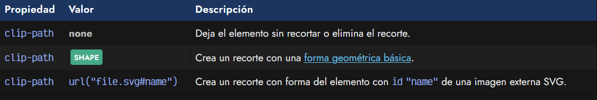
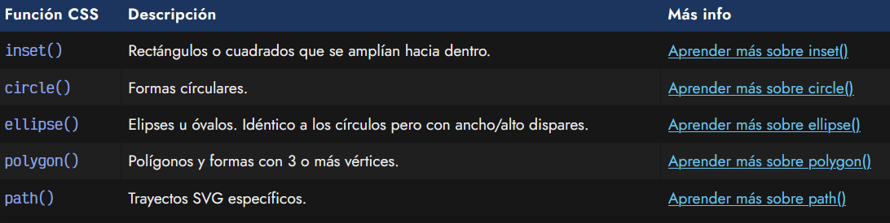
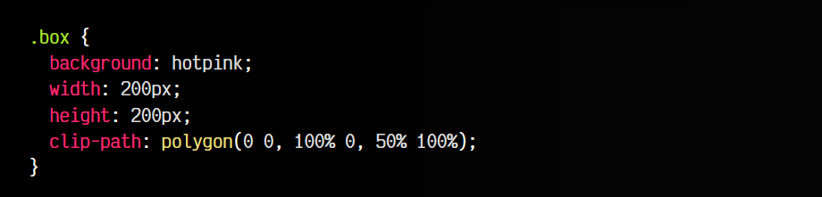
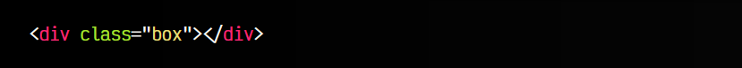
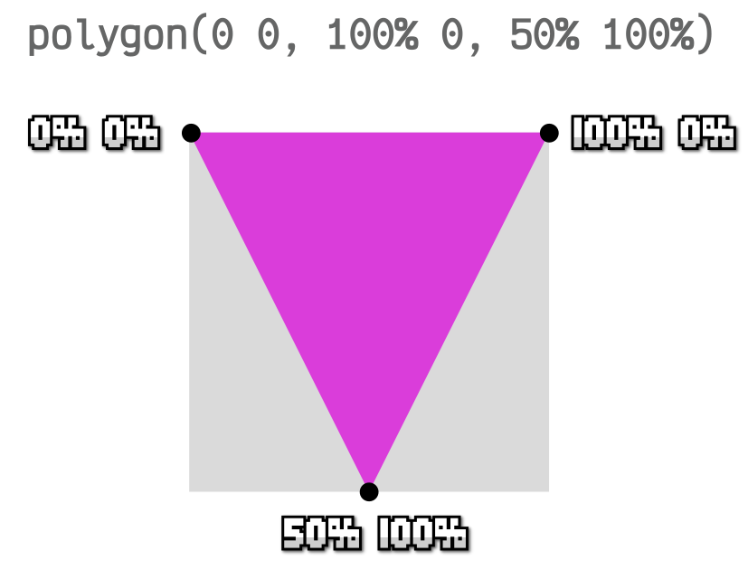
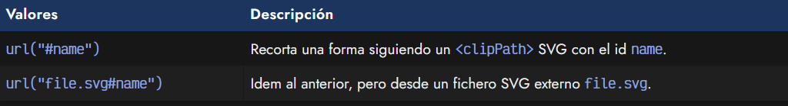

# 
La propiedad clip-path

Hace algún tiempo, existió una propiedad CSS llamada clip, cuya intención era permitir recortes con ciertas formas como rectángulos. Sin embargo, hoy en día ha sido marcada como obsoleta, en favor de una nueva propiedad llamada clip-path.

## La propiedad clip-path
Esta propiedad permite realizar un recorte con una forma concreta, ocultando toda la región externa del recorte. Su utilización es muy sencilla y permite realizar formas muy flexibles y versátiles.

La sintaxis de la propiedad es la siguiente:

La propiedad clip-path en general puede tomar estos tres tipos de valores:

   - none, el valor por defecto, donde no utilizamos ningún tipo de recorte (o lo desactivamos si lo había).
   - SHAPE, es decir, una forma básica específica
   - url(), donde indicamos una imagen SVG para utilizar un recorte personalizado usado en su interior mediante <clipPath>.

## Formas básicas de recorte
Con la propiedad clip-path podemos crear recortes con formas geométricas básicas, utilizando las siguientes funciones:

Estas formas básicas de recorte nos permiten establecer unos parámetros para definir así la forma geométrica detalladamente. Por ejemplo, observa como utilizamos la propiedad polygon():

css:

html:

vista:

Observa que indicamos 3 puntos de corte:

   - 0 0: El punto inicial
   - 100% 0: El segundo punto, arriba a la derecha
   - 50% 100%: El punto final, abajo al medio

El recorte sería el siguiente:

Si quieres saber más sobre estos recortes, en este artículo explicamos esta y otras formas geométricas básicas diferentes que pueden ser utilizadas mediante la propiedad de clip-path.

## Usando un SVG de recorte
Además de las formas básicas, también podemos utilizar código SVG (o una imagen SVG externa) que contengan una definición de un elemento clipPath>. De esta forma, desde CSS le indicamos que utilice dicho recorte en una zona de nuestra página, pudiendo ayudarnos de SVG para hacer formas mucho más específicas.

La sintaxis es la siguiente, donde se hace referencia a un fichero externo mediante url():

