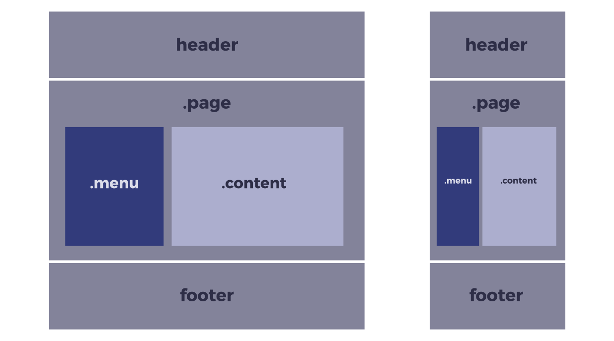
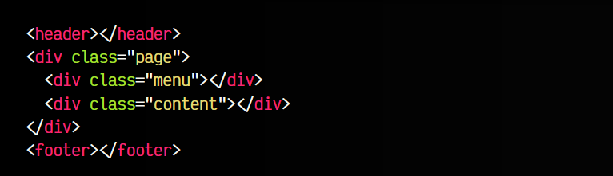
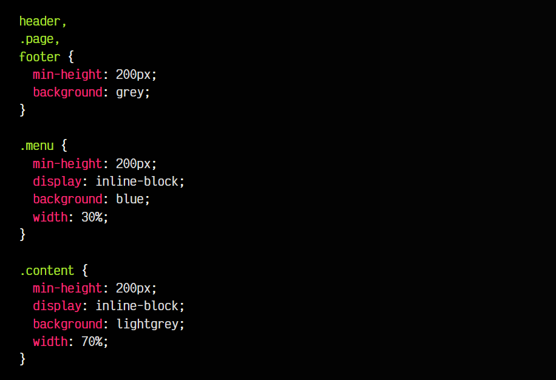
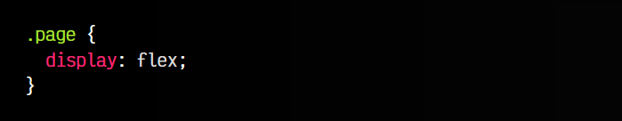
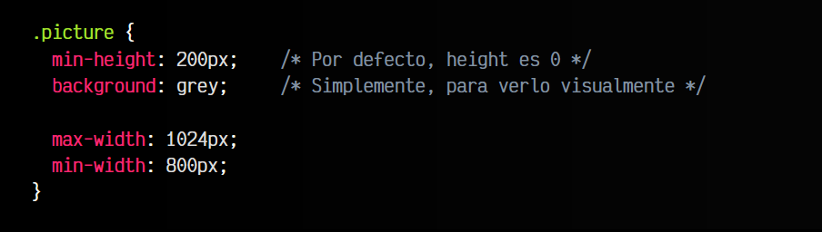
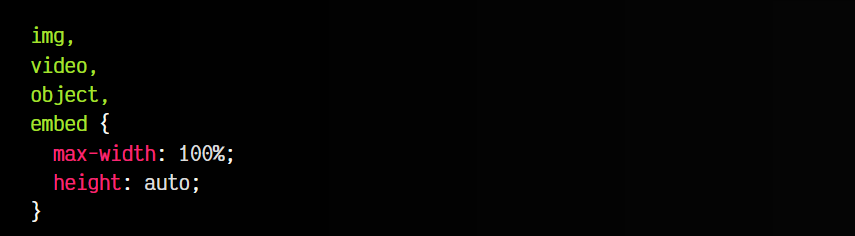
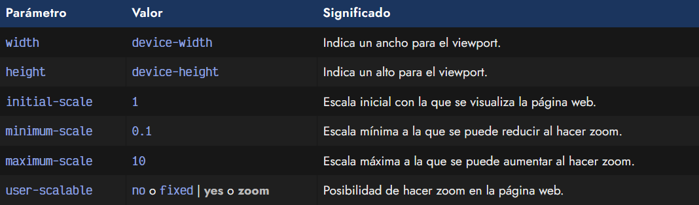

# 
Bases del Responsive Design

Como explicamos en el capítulo anterior, hay ciertos conceptos que hay que tener claros antes de comenzar con el Responsive Design. En esta sección vamos a ver como llevarlos a la práctica con código.

## Diseño con porcentajes
El primer paso para crear un diseño que se adapte correctamente, es comenzar a familiarizarse con un tipo de unidades: los porcentajes. Recordemos que los porcentajes son relativos al contenedor padre, por lo que si especificamos un porcentaje a un elemento, el navegador va a tomar dicho porcentaje del contenedor.

Al comenzar, algunos diseñadores tienen una percepción incorrecta de que los porcentajes toman el tamaño dependiendo de lo que mide la ventana del navegador. Realmente los porcentajes dependen siempre del tamaño del elemento padre que los contiene. Si el padre no tiene un tamaño establecido, se obtiene 0. Para basarnos en el tamaño del navegador, usamos [unidades de viewport](https://lenguajecss.com/css/unidades-css/relativas-viewport/).

Empecemos usando porcentajes con las propiedades width en un ejemplo sencillo. Vamos a establecer:

   - Un ancho de 100% a header, .page y footer
   - Un ancho de 30% a .menu
   - Un ancho de 70% a .content

Obtendríamos un diseño similar al siguiente:

El código HTML utilizado sería algo parecido a lo siguiente:

Nótese que los elementos .menu y .content se encuentran dentro de .page. Por otro lado, el código CSS correspondiente sería algo similar a lo siguiente:

Sin embargo, utilizar porcentajes no nos garantiza un diseño adaptativo de calidad, hay que comprender bien varios detalles. El primer problema que encontraremos será que si sumamos el tamaño de los elementos 70% + 30%, junto a los bordes de cada uno, 2px por cada lado, la suma es superior al 100% del contenedor padre, por lo que no cabe en su interior. El segundo elemento se desplaza a la zona inferior, descuadrando todo el diseño. Lo mismo puede ocurrir si intentamos añadir margin o padding.

Esto es algo muy habitual en CSS. Y frustrante al principio cuando no se comprende que ocurre.

Hay varias formas de solucionarlo:

   - Eliminar los bordes y reducir los porcentajes manualmente hasta que quepan en el 100% del padre.
   - Entender la propiedad box-sizing y cambiar el modo en el que se gestiona el modelo de cajas.
   - Opción ideal: Utilizar un sistema moderno como Flexbox o Grid.

## Solución recomendada
Como comentamos antes, una forma simple y recomendada de solucionar el problema del ejemplo anterior, es aprender a utilizar Flex o Grid. Hagamos el siguiente cambio en el código CSS del ejemplo anterior:

De esta forma, establecemos que el padre .page sea un elemento flexible, por lo tanto, conseguimos que nuestro diseño se adapte de forma adecuada a la página, sin necesidad de tener que ajustar los márgenes, rellenos, bordes o tamaño de los contenidos.

En este caso, el elemento tiene un tamaño máximo de 1024px, y un tamaño mínimo de 800px, por lo que si ajustamos el ancho de la ventana del navegador, dicho elemento iría variando en un rango de 800 a 1024 píxeles, y nunca saldría de estos rangos.

Es importante darse cuenta de que este ejemplo funciona porque no hay definido un width (por omisión, es igual a width: 100%). Desde que exista un width, las otras propiedades pierden efecto porque se está obligando a que tenga un tamaño fijo concreto.

Con las imágenes, videos y contenidos multimedia, podemos hacer lo mismo, consiguiendo así que las imágenes se escalen y adapten al formato especificado o incluso al tamaño de pantalla de los diferentes dispositivos utilizados:

## El viewport del navegadora
En muchos casos puede que oigas hablar del viewport del navegador. Esa palabra hace referencia a la región visible del navegador, o sea, la parte de la página que está visualizándose actualmente en el navegador. Los usuarios podemos redimensionar la ventana del navegador para reducir el tamaño del viewport y simular que se trata de una pantalla y dispositivo más pequeño.

Si queremos editar ciertos comportamientos del viewport del navegador, podemos editar el documento HTML para especificar el siguiente campo meta, antes de la parte del /head>:

Con esta etiqueta meta>, estamos estableciendo unos parámetros de comportamiento para el viewport del navegador. Veamos que significan y cuales más existen:

Las propiedades initial-scale , minimum-scale y maximum-scale permiten valores desde el 0.1 al 10 , aunque ciertos valores se traducen automáticamente a ciertos números determinados:

   - yes = 1
   - no = 0.1
   - device-width = 10
   - device-height = 10

Por otra parte, user-scalable permite definir si es posible que el usuario pueda «pellizcar» la pantalla para ampliar o reducir el zoom.

Aunque es posible utilizar algunos de estos parámetros, es aconsejable revisar detalladamente sus consecuencias. Lo recomendable es utilizar sólo los que se mencionan en el fragmento de código superior, para evitar problemas de accesibilidad que impidan ciertas acciones.