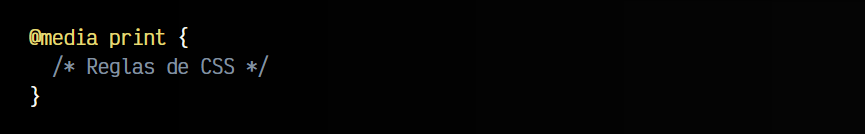
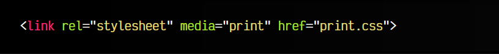
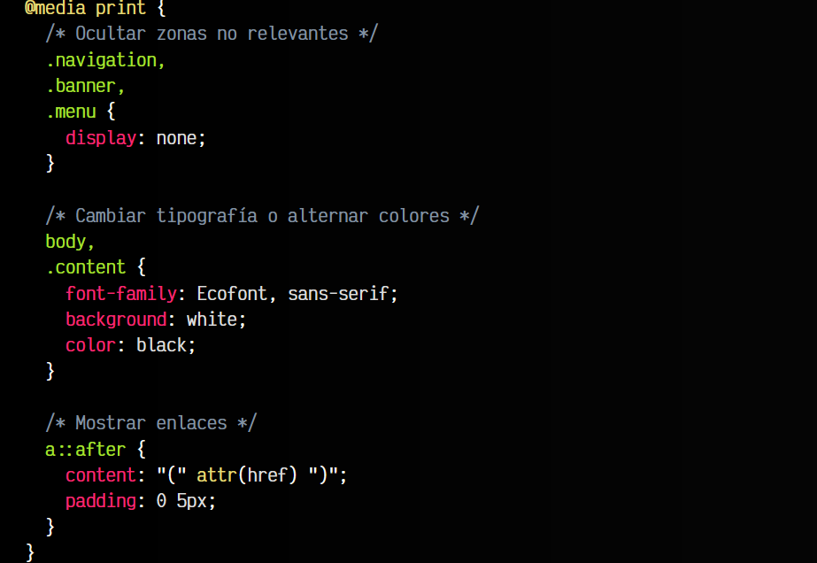
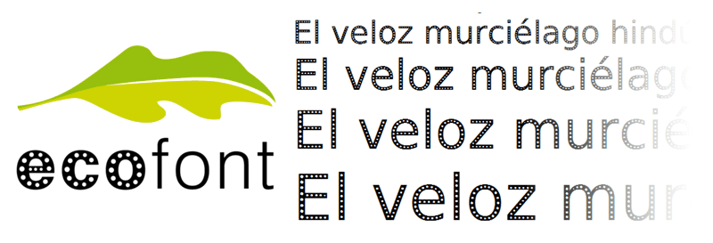

# 
Medios impresos

Ahora que ya disponemos de un conocimiento amplio y extenso de CSS, debemos saber que CSS no se limita sólo a páginas webs. Por ejemplo, muy probablemente conozcas uno de los formatos más populares de ebooks (libros electronicos): el formato EPUB. Este formato no es más que un archivo comprimido en formato .zip, que en su interior contiene HTML (más concretamente, XML) y CSS.

Algunos programas o aplicaciones, como por ejemplo el editor Visual Studio Code, la versión de escritorio de WhatsApp o Slack están hechos con Electron, que básicamente utilizan HTML y Javascript para crear la interfaz visual que utiliza el usuario y mediante CSS cambian el aspecto visual de la aplicación. Esto sólo son algunos casos en los que CSS forma parte de nuestra vida casi sin darnos cuenta.

## ¿Qué son los medios impresos?
Otra de las características de CSS que nos puede interesar es la de para preparar hojas de estilo destinadas a la impresión de documentos. Esto es, un documento CSS especialmente diseñado para que se aplique unicamente cuando el usuario desee imprimir una página.

Este sistema no es más que una de las posibilidades de los [media queries](https://lenguajecss.com/css/responsive-web-design/media-queries/). En lugar de aplicar una regla @media a screen (pantallas), lo aplicaramos a print (documentos de impresión):

También se puede hacer desde el HTML, a través de la etiqueta link>:

La razón es obvia, en una impresión nos pueden interesar ciertos detalles:

   - Eliminar fondos negros o intentar que predomine el texto blanco (gastar menos tinta).
   - Usar tipografías apropiadas para impresión (cansar menos la vista, reducir gasto de tinta).
   - Ocultar publicidad, menús, navegación, etc... (no tienen sentido en un documento impreso).
   - Mostrar ciertos detalles necesarios (la URL de los enlaces, por ejemplo).

## Ejemplo de medios impresos
Quizás, la forma más sencilla de añadir medios impresos a un documento CSS ya existente, es simplemente añadir las reglas de impresión @media print al final del documento, para que se apliquen sobre las anteriores que ya existen. De esta forma partimos del diseño actual que ya tenemos, haciendo pequeños cambios en la versión de impresión:

Si imprimes muy a menudo documentos, puedes utilizar tipografías ecológicas como [EcoFont](https://www.ecofont.com/) o [EcoSans](https://www.dafont.com/es/spranq-eco-sans.font), una tipografía que tiene pequeños agujeros en su interior para ahorrar tinta en la impresión de borradores y que mantiene casi el mismo aspecto visual:

Obviamente, depende del desarrollador preferir escribir unas reglas @media print al final del documento CSS aplicando herencia con el resto de los estilos de la página, o crear un documento CSS individual a parte, donde colocará todos los estilos de impresión y cargará a través de su elemento link media="print"> correspondiente.