# 
Medios paginados

Existen varias propiedades CSS interesantes para estos medios, que pueden ser utilizadas dentro de un bloque @page:

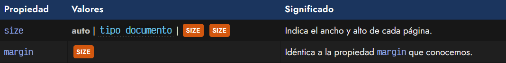

Mediante la propiedad size se puede establecer el formato de la página, tanto mediante los valores predefinidos portrait o landscape (vertical o apaisado), como especificando las medidas mediante unidades:

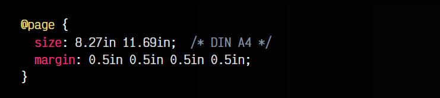

De forma adicional, también puedes indicar el tipo de documento mediante algunas palabras clave como valor de la propiedad size (las cuales se pueden usar junto a landscape o portrait para definir su orientación):

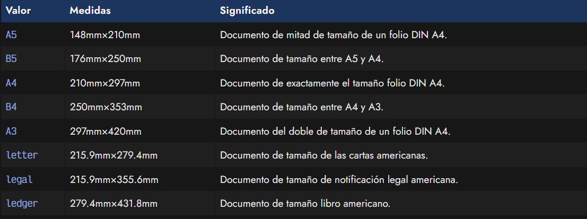

Nota: Cualquier propiedad utilizada dentro de una regla @page que no sea una de las anteriores será ignorada.

Una vez tenemos definida la estructura de cada página del documento, pasaremos de una página web que tiene una estructura continua a un documento paginado, donde cada cierto tamaño tiene un salto de página que interrumpe el contenido.

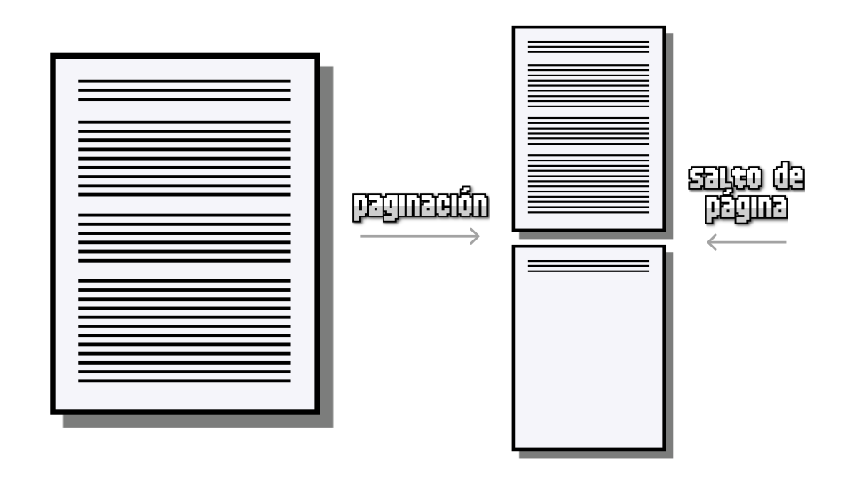

Al establecer dichos saltos de página, el contenido se adapta al tamaño de cada página especificado, pero puede ocurrir que debido a los límites impuestos por los saltos de página, un cierto contenido se corte a la mitad y se vea continuado en la siguiente página, comportamiento no deseable en prácticamente el 100% de los casos.

## Orphans & Widows
Existen casos en los que el comportamiento descrito anteriormente no sea un problema, sin embargo, pueden darse muchos casos en los que sí lo sería:

   - Una imagen o una tabla empieza al final de una página (se muestra cortada).
   - Un párrafo de texto comienza en la última línea de una página (es poco atractivo).
   - Un nuevo tema comienza a mitad de página (lo ideal sería comenzar a principio de página).

Para evitar estos problemas de paginación se suelen utilizar algunas propiedades interesantes:

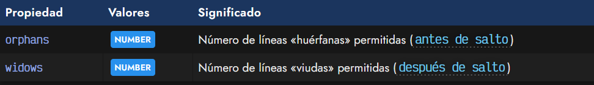

Mediante la propiedad orphans (líneas huérfanas) indicamos hasta que número de líneas no vamos a permitir que aparezcan de forma aislada al final de una página.

Por ejemplo, si especificamos orphans: 3, significa que cualquier párrafo cortado con el salto de página, debe mostrar más de 3 líneas al final de la página. En caso contrario, se moverá el párrafo completo a la siguiente página.

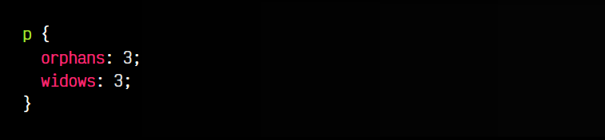

Por otra parte, la propiedad widows (líneas viudas) es la propiedad opuesta a orphans. Si al principio de una página quedan menos de ese número de líneas indicado en widows, se ajusta para que lo supere.

## Saltos de página
Por último, mencionar las propiedades de salto de página, muy útiles para evitar comportamientos que pueden quedar poco atractivos en un documento paginado. Estas propiedades pueden utilizarse tanto en medios paginados (contexto en el que estamos en este artículo), como en multicolumnas, donde tiene un soporte menor:

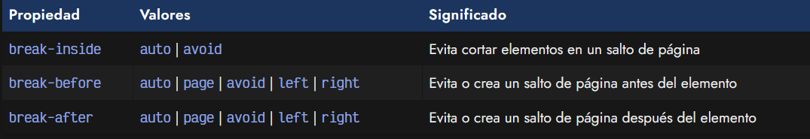

La propiedad break-inside se utiliza para evitar que un cierto elemento pueda ser cortado a la mitad en un salto de página, como por ejemplo imágenes, tablas o fragmentos de código:

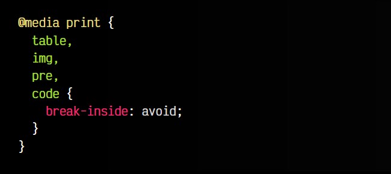

De forma similar, las propiedades break-before y break-after se utilizan para evitar o forzar al generar el documento paginado que ciertos elementos se mantengan antes o después del salto de página.

## Fragmentos rotos
Se considera un fragmento roto, cuando tenemos un elemento que, por las medidas del padre, se «interrumpe» y continua en la línea siguiente, pero por su naturaleza, da la impresión que se ha roto. Para cambiar este comportamiento, podemos utilizar la propiedad box-decoration-break:

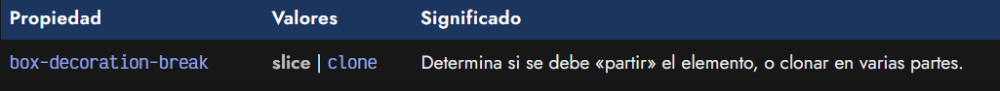

Un ejemplo claro del uso de esta propiedad, se puede ver en el siguiente ejemplo:

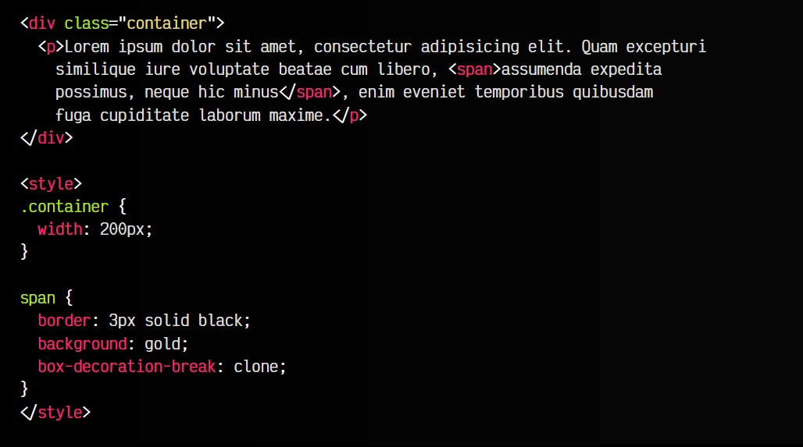

Observa que el elemento span>, un elemento que tiene una naturaleza en línea, se podría ver «partido» si tiene definido un borde y/o un fondo. Este es el comportamiento por defecto de la propiedad, que está establecida al valor slice. Podemos indicarle el valor clone, si lo que queremos es que el navegador cree varios clones independientes y «cierre» las partes, en lugar de mostrarla con aspecto de estar roto o «partido».

## Pseudoclases de página
También existen algunas [pseudoclases](https://lenguajecss.com/css/pseudoclases/que-son/) específicas para paginación, que permiten hacer referencia a páginas concretas del documento generado, pudiendo aplicar estilos sólo a este tipo de páginas:

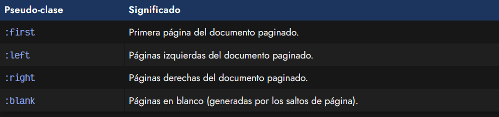

Sólo algunas propiedades CSS como margin, padding, background u otras pueden estar permitidas dentro de estas pseudoclases especiales.