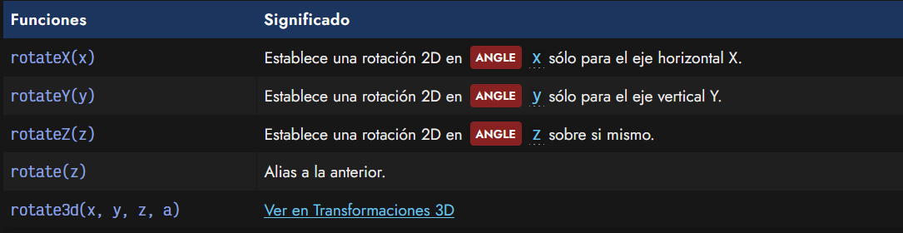
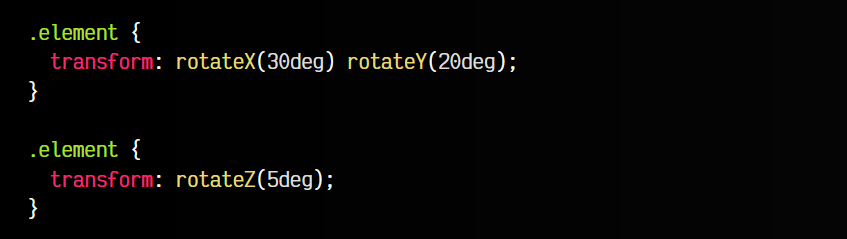
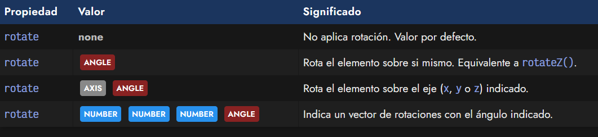
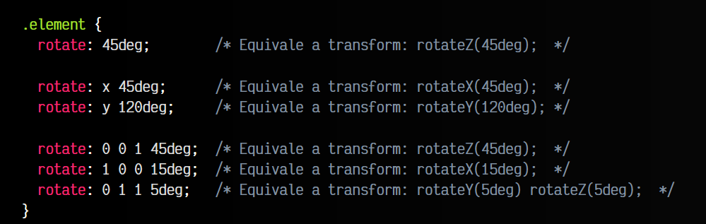

# 
Rotaciones 2D

Las funciones de rotación son aquellas que realizan una transformación en la que giran un elemento respecto a un eje específico. Para ello, las utilizaremos en el interior de la propiedad CSS transform y elegiremos una de las siguientes funciones de rotación.

## Funciones de rotación
Las funciones de rotación simplemente giran el elemento una cierta cantidad respecto al eje involucrado. Disponemos de las siguientes funciones de rotación:

Por ejemplo, con transform: rotate(5deg) realizamos una rotación de 5 grados del elemento sobre si mismo. Utilizando rotateX() y rotateY() podemos hacer lo mismo respecto al eje X o el eje Y respectivamente.

Es posible que las rotaciones en X e Y no queden exactamente como buscas y parezcan simplemente más pequeñas o grandes (estiradas), ya que estamos haciendo una rotación 2D. En el apartado de perspectivas hablaremos más más sobre esto.

## La propiedad rotate
En nuevas versiones de los navegadores, ya se soporta la propiedad individual rotate, y no hace falta utilizarla dentro de la propiedad transform.

Como se puede ver, se puede indicar 1 parámetro, 2 parámetros o 4 parámetros, dependiendo de la modalidad a utilizar. Veamos algunos ejemplos:

