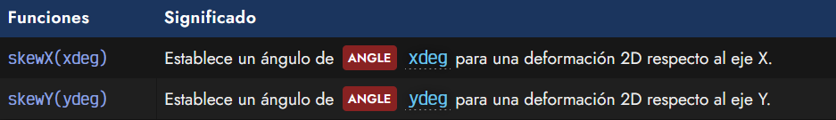
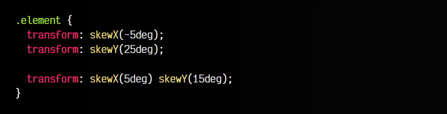

# 
Deformaciones 2D

Por último, las funciones de deformación establecen un ángulo para torcer, tumbar o inclinar un elemento en 2D. A diferencia de las anteriores, no tiene función correspondiente para 3D.

## Funciones de deformación
Las funciones de deformación disponibles en CSS son las siguientes:

Algunos ejemplos de uso de estas funciones, serían las siguientes:

Aunque la función skew() existe, no debería ser utilizada, ya que está marcada como obsoleta y serán retiradas de los navegadores en el futuro. En su lugar deberían utilizarse skewX() o skewY(), ya sea individualmente por separado o combinadas separando por espacio.