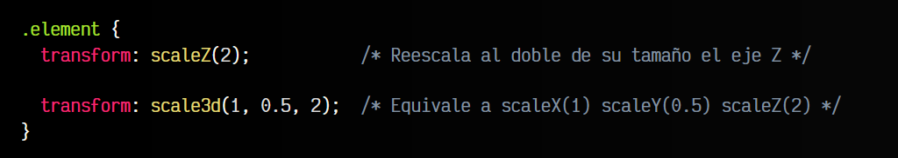

# 
Transformaciones 3D

Durante los temas anteriores hemos visto diferentes funciones de transformación en el ámbito del 2D. Sin embargo, CSS también incorpora varias funciones de transformación 3D, que de la misma forma se pueden utilizar con la propiedad transform.

## Transformaciones 3D
Estas funciones, en la mayoría de los casos, no son más que la incorporación del eje Z a las anteriores que ya habíamos visto, además de la adición de una función de atajo 3D para poder utilizarlas todas de una sola vez.

Antes de comenzar a verlas, recordar siempre que el eje X es el eje horizontal, el eje Y es el eje vertical y el eje Z es el eje de profundidad. Varios conceptos que se deben tener claros antes de comenzar con el 3D en CSS:

Para utilizar transformaciones 3D es necesario conocer algunas propiedades derivadas de transformaciones, como por ejemplo, las siguientes:

Por defecto, la propiedad transform-style está establecida a flat, o lo que es lo mismo, trata los elementos como elementos 2D, por lo que no podemos usar 3D, salvo que lo indiquemos expresamente con el valor preserve-3d. De esta forma, todos los elementos hijos del elemento que tenga esa propiedad, se tratarán como elementos 3D:

css:

html:

Observa que en este ejemplo, estamos aplicando al padre .container una propiedad transform-style: preserve-3d para dotar de 3D a los elementos hijos .element. Además, también le aplicamos una rotación en todos los ejes (para que se aprecie mejor el 3D) y una perspective (lo veremos y explicaremos en el próximo tema).

En el caso de la propiedad transform-origin, que ya explicamos en el primer tema de transformaciones, observa que simplemente hemos añadido un tercer parámetro para aplicar un punto de origen también en el eje Z. Recuerda que en el caso del eje Z, no se pueden utilizar porcentajes, sino sólo cantidades, como tamaños en píxels.

## Funciones de translación 3D
Las funciones de transformación que completarían la colección de transformaciones 2D que vimos anteriormente son las siguientes:

Con la propiedad translateZ() podemos hacer translaciones de profundidad y con la propiedad translate3D() podemos utilizar un atajo con el que aplicar translaciones en los 3 ejes: x, y y z:

css:

html:

Tanto en translateX() como en translateY() se pueden utilizar valores de porcentajes, en cuyo caso, se desplazará teniendo en cuenta que 100% es el tamaño exacto correspondiente al eje del elemento.

Por ejemplo: translateX(100%) desplazaría el elemento en horizontal exactamente su tamaño de ancho, mientras que translateY(200%) desplazaría el elemento el doble de su tamaño de alto en vertical.

Ojo: Ten en cuenta que, al contrario que en x e y, el valor z de translate3d() y translateZ() no puede ser un valor de porcentaje PERCENT, sino que debe ser una cantidad específica.

## Funciones de rotación 3D
De la misma forma que hemos visto las funciones de translación 3D, tenemos las funciones de rotación 3D. Observa que en este caso, rotateZ() es una función que permite indicar la rotación sobre su propio eje, algo que podíamos hacer ya en el ámbito 2D.

Sin embargo, se añade la propiedad rotate3d(), que nos permite indicar la cantidad de grados que queremos realizar en cada eje, de una forma muy flexible:

La función rotate3D() permite indicar un valor 0 o 1 para activar el eje correspondiente, seguido de un número de grados ANGLE. Funciona de la siguiente forma:

## Funciones de escalado 3D
De la misma forma que las anteriores que hemos visto, las funciones de escalado también tienen su versión 3D. Las funciones que añadimos a la lista son las siguientes:

Al igual que en funciones anteriores, las equivalencias son las siguientes:

Para que el escalado de Z sea evidente, quizás sería conveniente mirar primero el tema de perspectivas.

## Otras funciones
Existen algunas otras funciones de transformación menos utilizadas, como puede ser la creación de perspectivas o el uso de matrices de tranformación, mucho más potentes, pero también mucho más complejas:

Veamos un ejemplo con matrix() y otro con matrix3d():

En este caso, la función matrix(a, b, c, d, tx, ty) (6 parámetros) actua de la siguiente forma:

   - a equivale a scaleX()
   - b equivale a skewY()
   - c equivale a skewX()
   - d equivale a scaleY()
   - tx equivale a translateX()
   - ty equivale a translateY()

Por otro lado, si utilizamos matrix3d() (16 parámetros), tenemos una función de transformación mucho más compleja. Veamos un ejemplo de aplicación:

Tienes más información sobre estas funciones de matrices en el artículo [Understanding the CSS Transforms Matrix](https://dev.opera.com/articles/understanding-the-css-transforms-matrix/) de los desarrolladores del navegador Opera.

