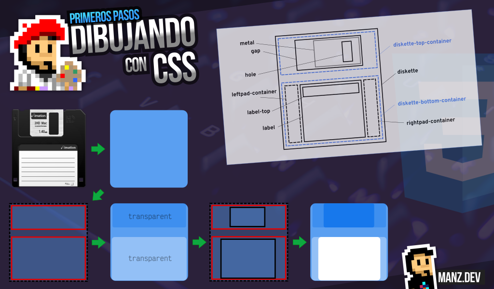
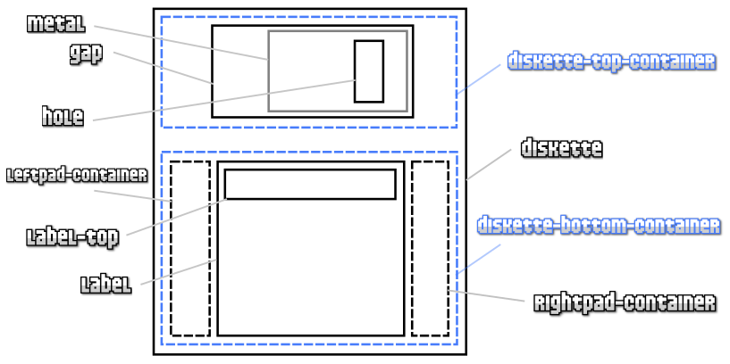
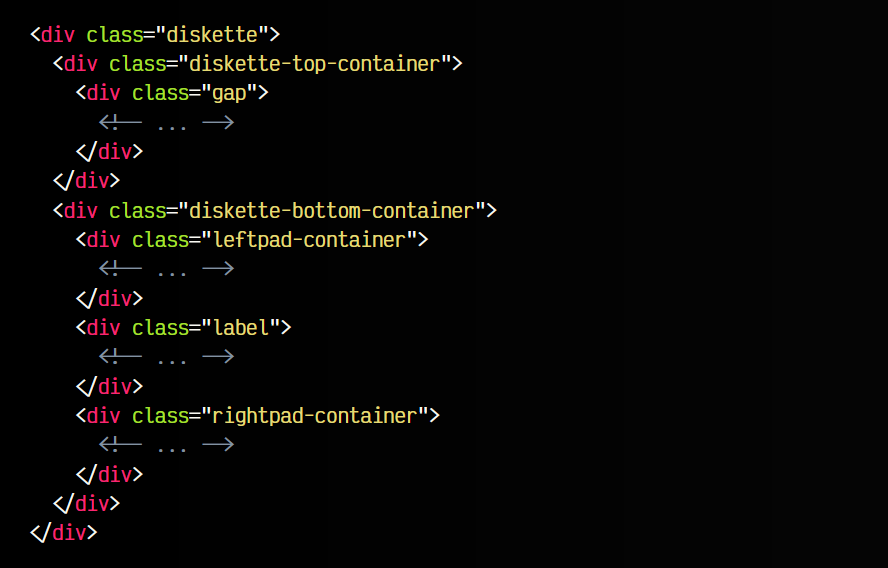

# 
Primeros pasos: Estructura HTML

Si has llegado a este artículo, es porque estás interesada/o en dibujar con código CSS. Si es la primera vez que lo haces, lee este artículo con algunas advertencias de dibujar con CSS, ya que es muy posible que te encuentres con gente que te aconseje no hacerlo, y explico varias cosas que debes saber para tener conocimiento en ese sentido.

## Elige un buen ejemplo
Antes de comenzar a dibujar con CSS, es importante elegir un buen ejemplo para trabajar. Hay ilustraciones complejas, ilustraciones sencillas e ilustraciones directamente imposibles (o que tardarías demasiado tiempo). Un buen consejo es no fliparse, y empezar por conceptos sencillos para ir entrenando y dominar antes de empezar con ejemplos más avanzados.

Buenos ejemplos podrían ser ilustraciones vectoriales, donde veas que está formado por elementos geométricos no demasiado complejos. Generalmente, ilustraciones rectas suelen ser más sencillas que las que tengan formas muy redondeadas. Para tus primeros ejemplos no escojas dibujos muy complicados. Es preferible empezar por conceptos sencillos.

Un ejemplo que me encanta utilizar como primer ejemplo es el clásico Diskette de 3 1/2. Se trata de un ejemplo que es sencillo de comprender, fácil de visualizar y que es perfecto para entrenar estrategias de colocación como flex o grid.

## Esquema inicial
El primer paso para dibujar con CSS, obviamente, después de aprender la teoría de CSS y haber practicado un poco, diría que es crear un diagrama donde separemos en capas lógicas cada parte del Diskette. Una buena forma de hacer esto sería, agarrar un papel o un programa de diseño, descomponer el dibujo en pequeños fragmentos más pequeños y empezar a dibujar cajas dentro de otras para esquematizarlo.

Nuestro caso del Diskette es un excelente ejemplo para practicar flex. Si tenemos en mente como se trabaja con Flex y sus modos de justificación de contenido (center, space-between, space-around, etc...) nos puede resultar super intuitivo ir creando la estructura de capas de nuestro Diskette.

Por ejemplo, un posible esquema del Diskette podría ser el siguiente (ojo, no es la única forma de hacerlo, ni la mejor, es sólo una posibilidad). Observa que he colocado con líneas discontinuas las capas que serán transparentes y con líneas continuas las capas que tendrán estilo visual:

Esta forma de estructurar las capas, nos permitirá establecer display: flex a los elementos necesarios e indicar como se comportarán sus hijos para ir colocándolos y acomodándolos según nuestras intenciones.

## Usa contenedores transparentes
Como hemos mencionado más atrás, un buen consejo a tener en cuenta es que podemos crear capas «invisibles» en el HTML que van a ocupar espacio y colocar su contenido, pero en el dibujo final no se verán porque son transparentes (no tienen color de fondo, ni de bordes). De esta forma, harán el trabajo de ubicar y acomodar elementos en el espacio de la ilustración.

Puedes utilizar el sufijo -container en este tipo de elementos HTML, para que te sea fácil de recordar.

## Estructura HTML
Una vez tengamos este esquema ideado, podemos comenzar a darle forma en nuestro HTML, añadiéndo los nombres de clase correspondientes e intentando mantener un orden y organización. Muchas de estas cosas las da la práctica, por lo que no te preocupes si la primera vez no sale demasiado bien.

Una posible estructura HTML inicial para el esquema superior sería el siguiente:

Es aconsejable no abordar toda la estructura HTML de golpe, ya que podría liarnos. Lo ideal sería estructurar los elementos externos y, quizás, los de primer nivel, e ir dando estilo CSS a cada uno de ellos para ir acomodando el diseño y ver si nos ha faltado algo.

## Encapsulación
A medida que avancemos, iremos añadiendo los elementos interiores y dándole estilo. En los primeros ejemplos que hagamos no será necesario, pero a medida que creemos ejemplos más sofisticados, comprobaremos que se nos hace bastante complejo trabajar con tantas clases y tener en cuenta tantas cosas. Esto es algo que ocurre en la vida real del desarrollador (no sólo en HTML/CSS, si no también en Javascript).

Si un elemento es demasiado complejo, mi recomendación es hacer uso de WebComponents, que es básicamente una forma de crearnos nuestras propias etiquetas HTML. De esta forma podemos crear estructuras más sencillas de ciertos elementos (la placa de metal, la etiqueta, etc...) y encapsular y simplificar los diseños para que sean más fáciles de crear e incluso de reutilizar si en el futuro lo necesitamos.

En el próximo artículos veremos algunas recomendaciones a la hora de escribir el código CSS.