# 
Bordes con im√°genes

Una de las limitaciones que tenía CSS, es que, si en lugar de utilizar los bordes de los que disponemos en CSS (sólidos, punteados, etc...) quisieramos hacer algo un poco más complejo con imágenes, podría volverse una tarea muy complicada. Por esa razón, CSS3 incorporó en su momento un sistema para crear bordes extensibles basados en una imagen de molde.

## La técnica 9-slice.
Dicho sistema se denomina 9-slice (muy utilizado en videojuegos) y se basa en delimitar una imagen trazando cuatro líneas (en rojo). Esto hará que la imagen quede dividida en 9 fragmentos, donde el fragmento central es descartado y el resto es utilizado de molde para los bordes de un elemento:

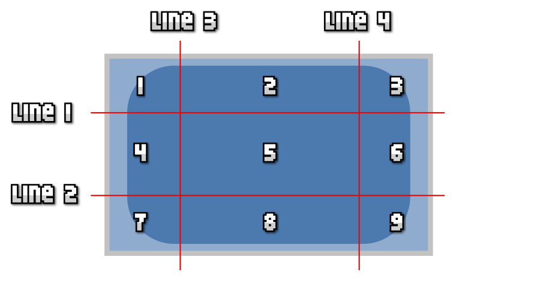

De esta forma, los fragmentos 1, 3, 7 y 9 se utilizarán para las esquinas y los fragmentos 2, 4, 6 y 8 se utilizarán para los bordes laterales, pudiendo expandirlos si se requiere y considera necesario con alguna de las propiedades que veremos a continuación.

## Propiedades de border-image.
Las propiedades que podemos utilizar para crear bordes con im√°genes son las siguientes:

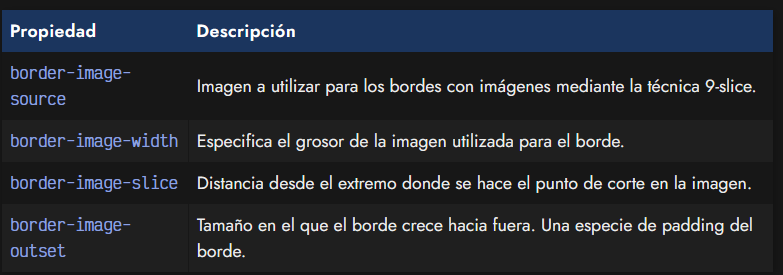

Estas propiedades pueden ser algo complicadas, por lo que vamos a repasar cada una de ellas haciendo varios ejemplos progresivos.

## Explicación del objetivo.
Utilizaremos la siguiente imagen expandible (izquierda), que simula ser un antiguo carrete fotográfico. Las líneas rojas no forman parte de la imagen original, sino que se utilizan en este ejemplo para dejar claro cuáles serían los límites marcados con la propiedad border-image-slice, que veremos más adelante. Una vez hecho esto, conseguiremos el resultado de la imagen de la derecha, en el cuál podremos ampliar el texto del elemento como queramos, ya que se adaptará a su contenido:

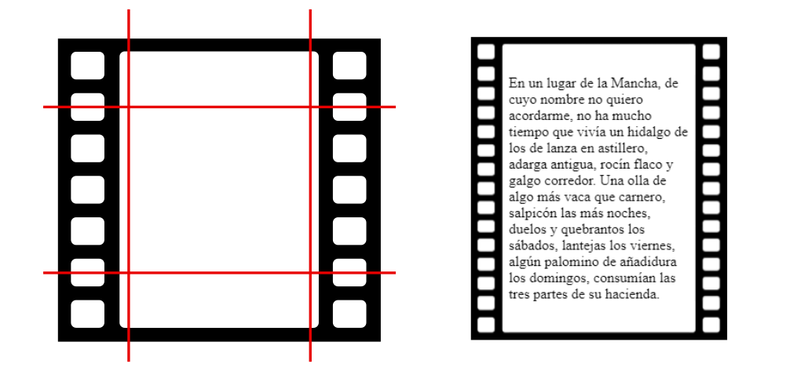

Comencemos con el primer ejemplo. Observa el siguiente código CSS, donde hacemos varias cosas iniciales sin llegar a utilizar border-image aún:

   - 1️⃣ Tenemos un elemento en el HTML, con contenido en su interior.
   - 2️⃣ Establecemos un ancho con width para nuestro elemento.
   - 3️⃣ Indicamos un border básico, usando una variable de CSS para reutilizarla más adelante.

html:
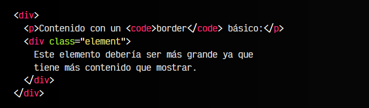

css:
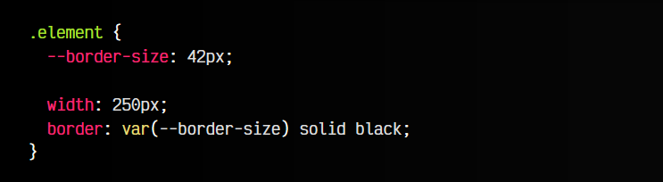

üëìvista:
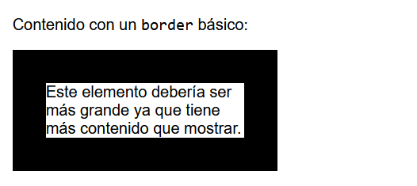

Como comprobarás, hemos establecido un borde básico, de 42px de grosor, de color negro, que bordea el contenido. Nuestra intención es comenzar a utilizar border-image para utilizar una imagen, en lugar de un color sólido.

## La propiedad border-image-source.
La primera propiedad que convendría analizar es border-image-source. En ella, mediante la función CSS url(), indicaremos una imagen para crear nuestro borde con imágenes. Funciona igual que cuando usamos url() en la propiedad background-image:

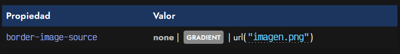

Recuerda que en CSS, si podemos utilizar imágenes, también podemos utilizar gradientes. Pero eso lo veremos más adelante. Veamos un ejemplo utilizando la propiedad border-image-source:

css:
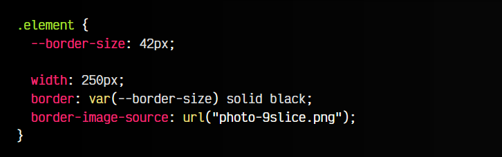

html:
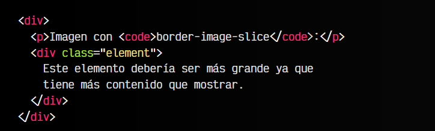

üëìvista:
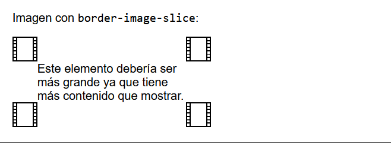

Comprobarás que el resultado es, cuanto menos, extraño. Al establecer una imagen con border-image-source, por defecto, lo que hace es establecer la imagen de modo que aparezca en cada esquina, redimensionándola. Esto dista mucho de lo que queremos conseguir, pero es un primer paso. Ahora utilizaremos otras propiedades para ajustarlo y dejarlo a nuestro gusto.

Es importante tener presente el tamaño de la imagen que utilicemos. En nuestro caso, la imagen photo-9slice.png tiene un tamaño de 500x470px

## La propiedad border-image-width.
La propiedad border-image-width indica el tamaño que tendrá el borde de la imagen. El tamaño puede ser indicado con unidades (píxeles o porcentajes, por ejemplo), como estamos acostumbrados. Sin embargo, también puedes usar un NUMBER(sin ninguna unidad), esto lo tomará como un múltiplo del tamaño establecido en border-width.

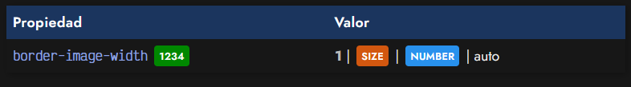

En nuestro ejemplo hemos indicado un LENGTH 42px, que coincide con el border-width, pero he hecho eso por simplicidad, porque es más intuitivo. Sin embargo, si utilizamos 1 en border-image-width significa que tomará el mismo valor de border-width. Un 2 sería el doble, etc... Si no le indicamos ningún valor, toma 1 por defecto.

css:
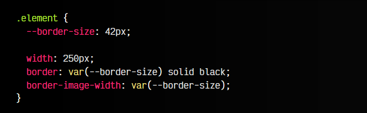

html:
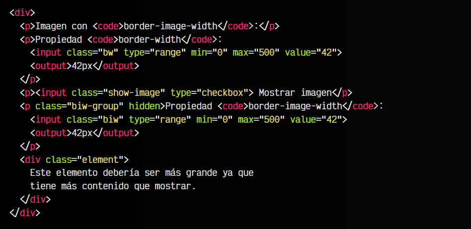

js:
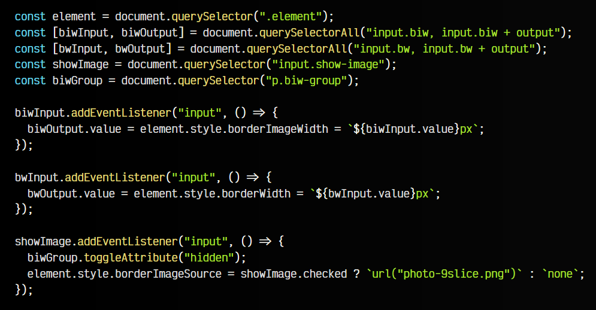

üëìvista:
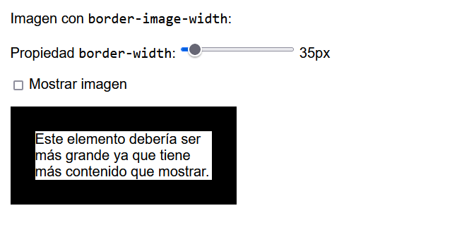

Juega un poco con los valores del tamaño width del elemento (sin imagen) y observa el espacio que ocupa. Luego, prueba a activar el border-image-source y cambiar su tamaño con border-image-width para comprender como funciona. No le verás mucho sentido de momento, ya que nos falta aprender algunas propiedades más, pero sabrás como funciona y podrás alterar el resultado final.

Por otro lado, recuerda que de la misma forma que propiedades como margin o padding, en la propiedad border-image-width se puede indicar 1, 2, 3 o 4 par√°metros , haciendo referencia a la parte superior, derecha, abajo e izquierda.

## La propiedad border-image-slice.
La propiedad border-image-slice define el desplazamiento de las líneas divisorias de la imagen, o lo que es lo mismo, el tamaño de los bordes de la imagen original que se escalará al tamaño de los bordes indicado en la propiedad anterior.

En este caso, solo podemos utilizar valores PERCENT o NUMBER. Por defecto, el valor es de 100% (tamaño de ancho completo de la imagen, como vimos antes), pero si usamos números sin unidad, simbolizarán los píxeles de recorte. También se puede especificar 1, 2, 3 ó 4 parámetros 1234, como en margin o padding.

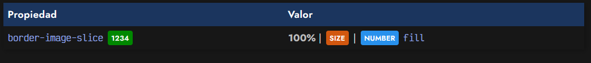

Por otro lado, añadiendo la palabra clave opcional fill, indicaremos que queremos rellenar el elemento con el fondo del fragmento 5, que por defecto es descartado. Útil en casos que quieras aprovechar el fondo.

En nuestro caso, nos podría valer un valor aproximado a 111 (111 píxeles de recorte) o 23%, ya que es más o menos la cantidad apropiada para establecer el límite deseado tanto de ancho como de alto.

css:
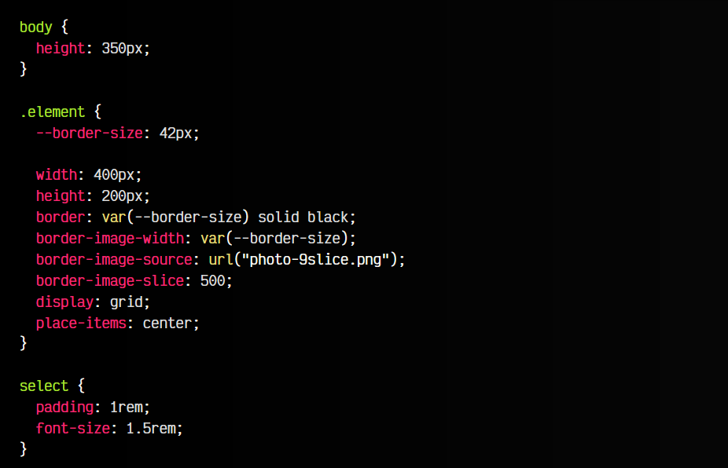

html:
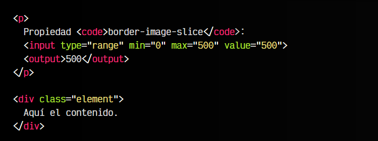

js:
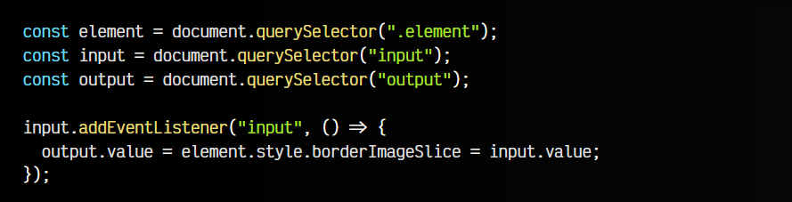

üëìvista:
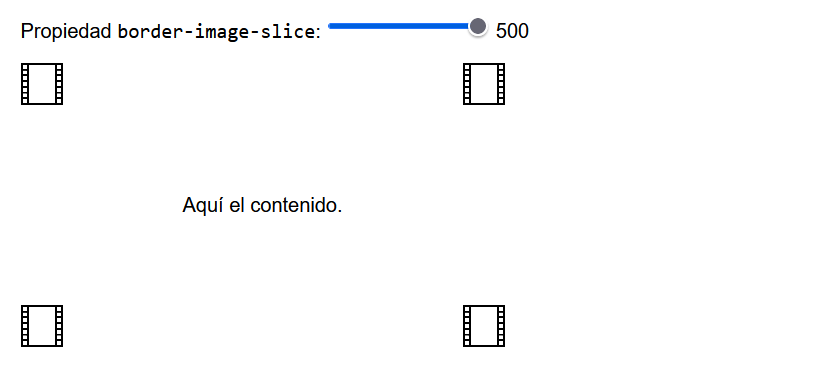
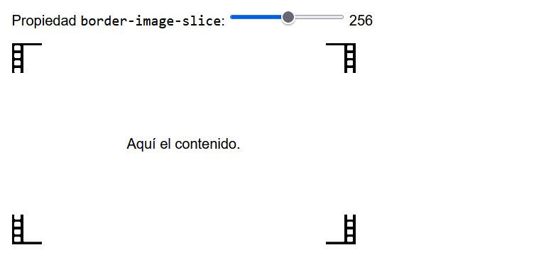

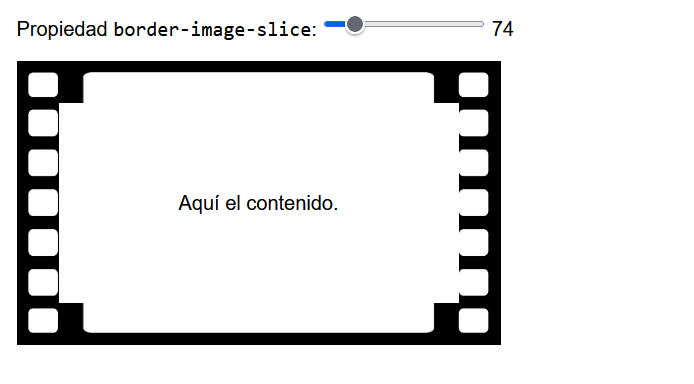

En este caso no se aprecia porque la imagen tiene un interior vacío (en blanco), sin embargo, si tuviera contenido y quisieramos utilizarlo, no tendríamos más que añadir fill al final de los valores de border-image-slice. Lo veremos más adelante.

## La propiedad border-image-outset.
La propiedad border-image-outset establece la cantidad en la que se extiende el borde más allá de su límite. Muy útil para compensar la imagen si se extiende hasta el contenido. Usar con cuidado, ya que puede desplazar el contenido.

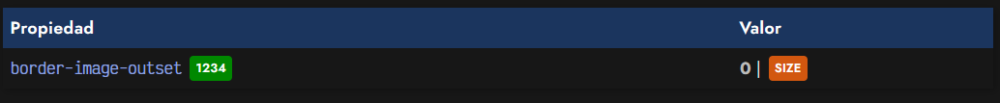

Por defecto, esta propiedad no tiene desplazamiento, o lo que es lo mismo, el valor por defecto de border-image-outset es de 0.

css:
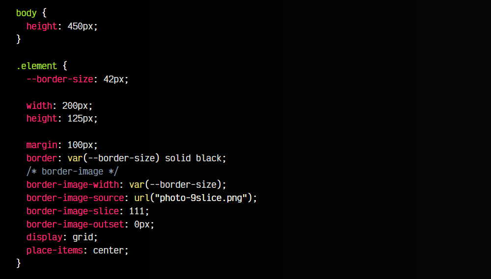
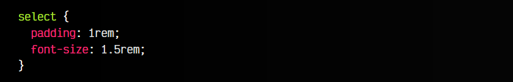

html:
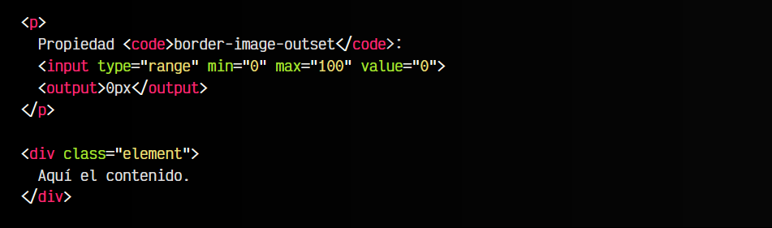

js:
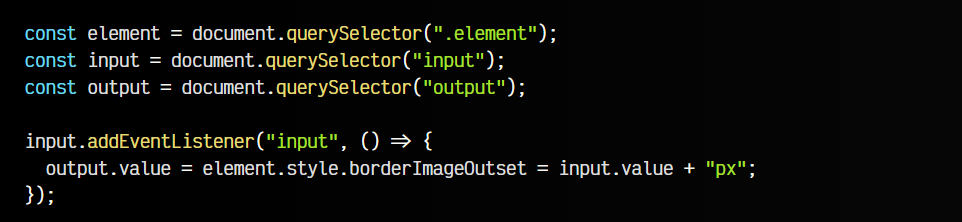

üëìvista:
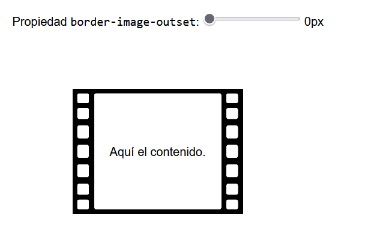
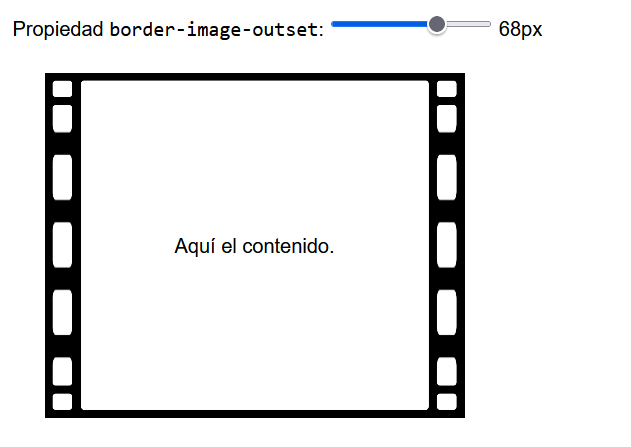
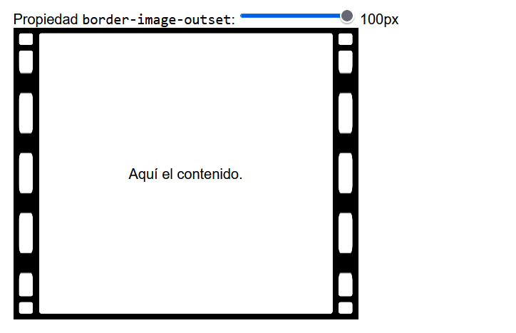

Con border-image-outset podemos controlar esa extensión, sin embargo, sería genial que también pudieramos hacer algo con ese estiramiento tan feo. Para ello, usaremos la siguiente propiedad.

## La propiedad border-image-repeat.
En algunas ocasiones, el modo en que se repite la imagen de borde no es la apropiada, o al menos, no es la que más se adapta a nuestro caso específico. Este comportamiento se puede modificar mediante la propiedad border-image-repeat y es de los detalles más potentes e interesantes de border-image:

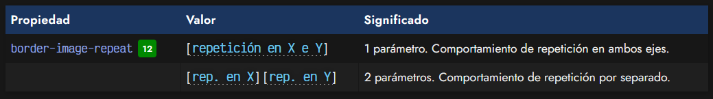

Con dicha propiedad se establece como deben comportarse los fragmentos del borde y el tipo de repetición que deben efectuar. Se puede usar la modalidad de un parámetro en la que se aplica a todos los bordes, o la modalidad de dos parámetros donde estableces diferente comportamiento para los bordes horizontales y verticales.

Esta propiedad puede tomar los siguientes valores:

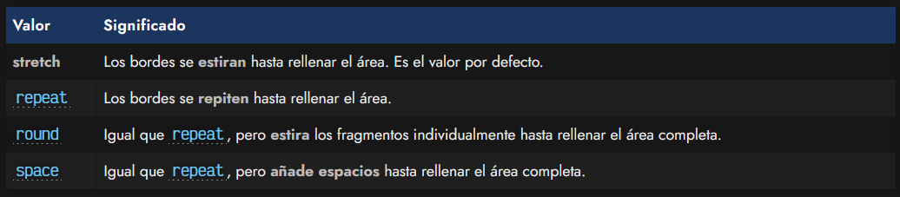

Para verlo más claramente, echemos un vistazo a esta representación visual del comportamiento de cada uno:

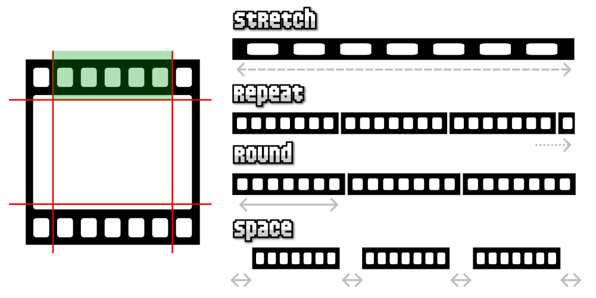

Border-image-repeat values

Es importante recalcar los dos √∫ltimos valores (round y space) act√∫an igual que repeat, pero con un comportamiento ligeramente diferente que nos puede interesar en el caso de que la zona repetida quede descompensada.

Utilizando la imagen y código CSS anterior, obtendríamos un resultado similar a este, que se adaptaría sólo al contenido que escribamos dentro del elemento HTML con clase borde :

css:
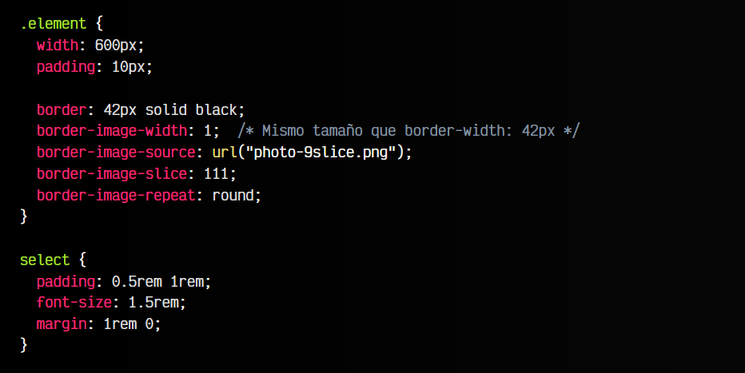

html:

js:
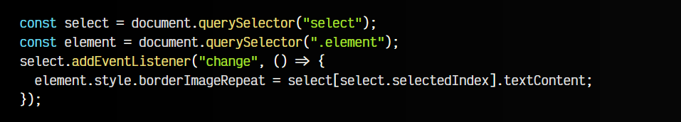

üëìvista:
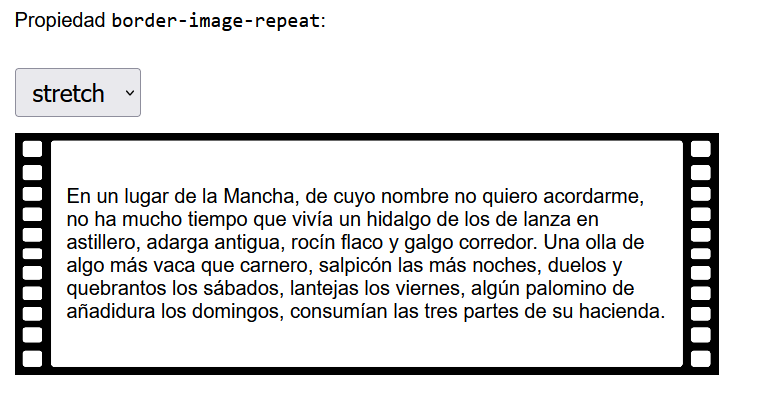
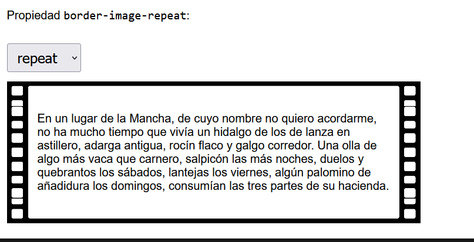
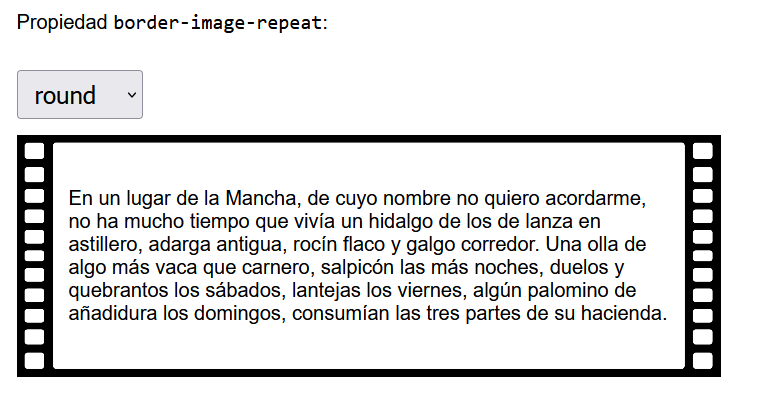
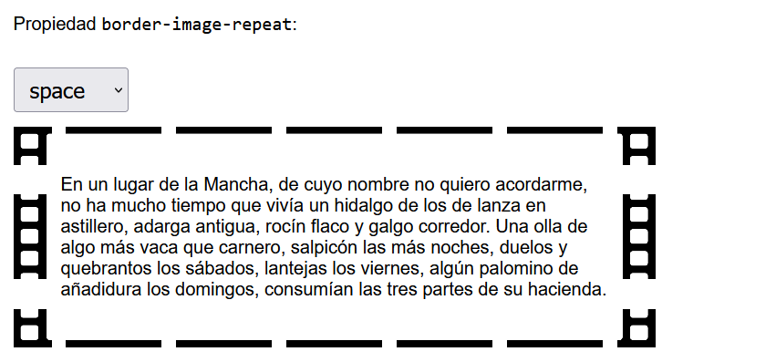

También es posible indicar dos parámetros en la propiedad border-image-repeat, de modo que cada parámetro se aplica a cada eje (horizontal y vertical).

## Atajo: Bordes con im√°genes.
Como suele ser costumbre, este tipo de propiedades tienen un atajo para ahorrar espacio y escribirlo todo de una sola vez. En este caso, la sintaxis es la siguiente:

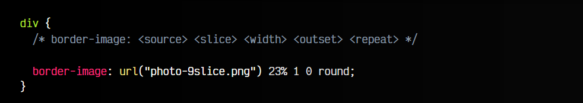
