# 
Códigos de colores

Uno de los primeros cambios de estilo que hacemos cuando aprendemos CSS es hacer variaciones en los colores de primer plano y de fondo de un documento HTML o de cualquiera de sus elementos o partes. Sin embargo, indicar el color específico no es una tarea fácil. Hay múltiples formas de definir un color en CSS, algunas más sencillas, otras más complejas.

## Propiedades de color.
Primero vamos a ver las propiedades CSS que podemos utilizar para cambiar el color de texto y el color de fondo de un elemento HTML:

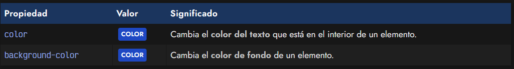

Como podemos ver en la tabla anterior, la propiedad color establece el color del texto, mientras que la propiedad background-color establece el color de fondo del elemento. De esta forma, podemos hacer cosas como estas:

css:
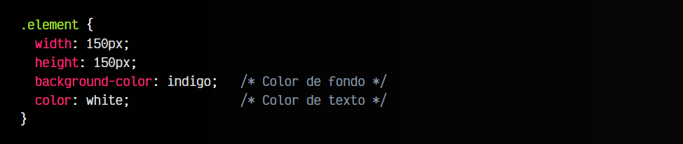

html:

👓vista:

Sin embargo, aunque se suele hacer mucho en fases de aprendizaje, lo normal no suele ser indicar colores con palabras clave, ya que es una forma poco precisa de hacerlo, sino utilizar alguna función CSS de colores que veremos a continuación.

Las propiedades color y background-color no son las únicas en las que podemos establecer colores. A medida que avancemos, encontraremos más propiedades donde usarlos.

## Formas de usar colores en CSS.
Todas las propiedades CSS donde existen valores COLOR, establecen la posibilidad de indicar varias formas alternativas (con algunos derivados) para especificar el color deseado:

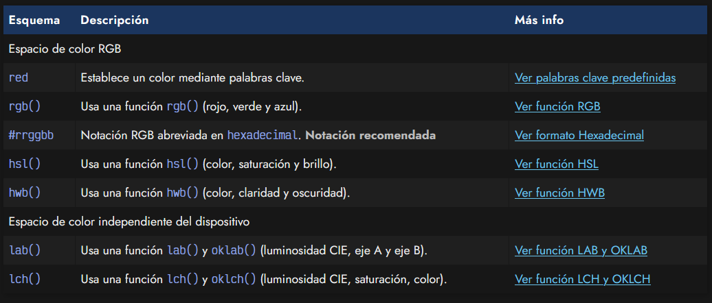

A continuación iremos explicando cada uno de estos formatos para entender como se especifican los colores en CSS y utilizar el método que más se adapte a nuestras necesidades.

La mayoría de los editores tienen los denominados ColorPicker, que no son más que un sistema cómodo y rápido para elegir un color a base de clics por una paleta o circulo visual. También podemos hacerlo directamente en buscadores como [Duck Duck Go](https://duckduckgo.com/?q=colorpicker) o [Google](https://www.google.com/search?q=colorpicker).

## Palabras clave de color.
El primer caso (el más sencillo pero también el más limitado) permite establecer el color utilizando palabras reservadas de colores, como red, blue, orange, white, navy, yellow u otras. Existen más de 140 palabras clave para indicar colores:

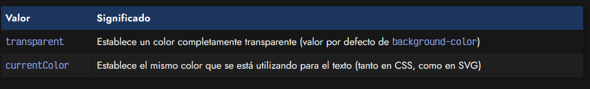
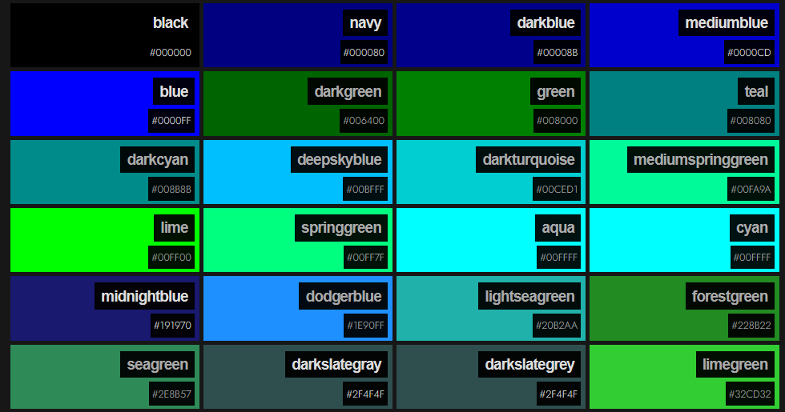
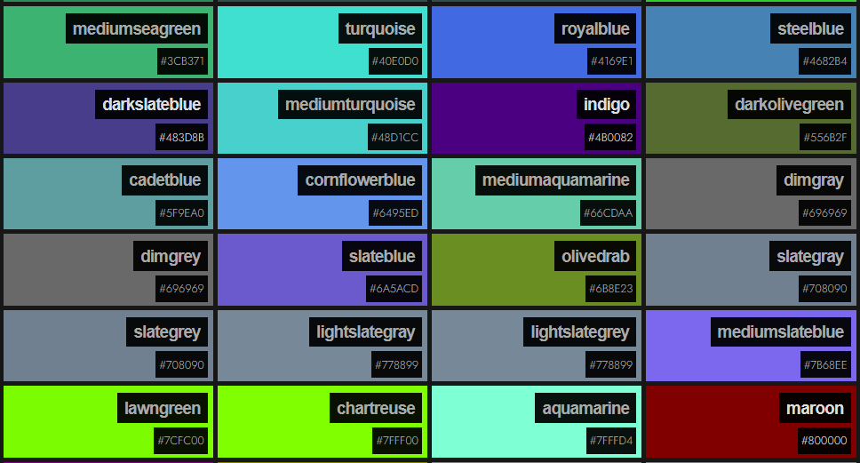
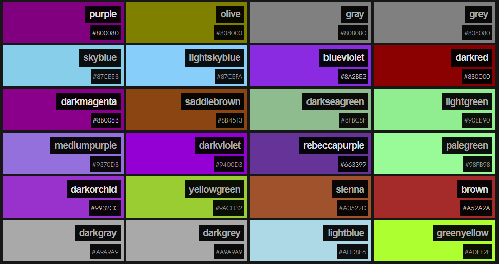
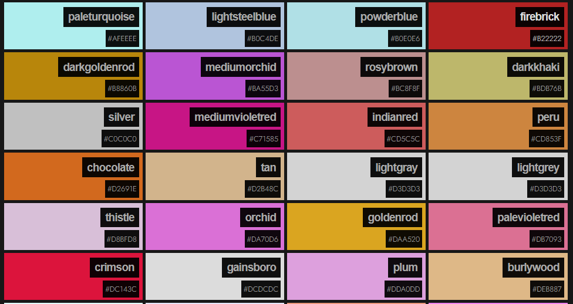
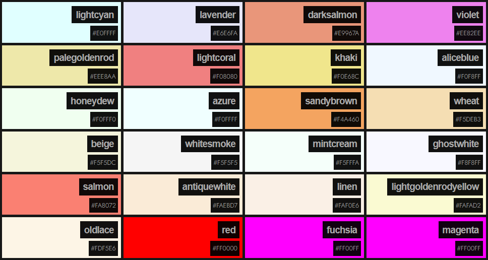

Además, existen algunos valores especiales que puedes utilizar cuando quieras especificar un color, como colores transparentes o el color actual del texto, muy útil para SVG, por ejemplo:

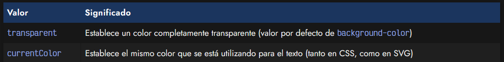

Veamos algunos ejemplos de palabras clave de color:

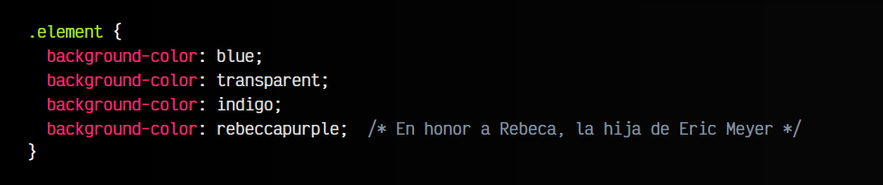

Como hemos dicho, estas palabras clave son limitadas, por lo que si necesitamos una tonalidad muy específica puede ser insuficiente, y sería mejor utilizar uno de los códigos o funciones de color que veremos en los próximos apartados.

## Colores del sistema.
Además de las palabras clave predefinidas anteriores, también tenemos algunas otras palabras clave para hacer referencia a ciertos colores establecidos por el sistema operativo. Estas palabras clave son las siguientes:

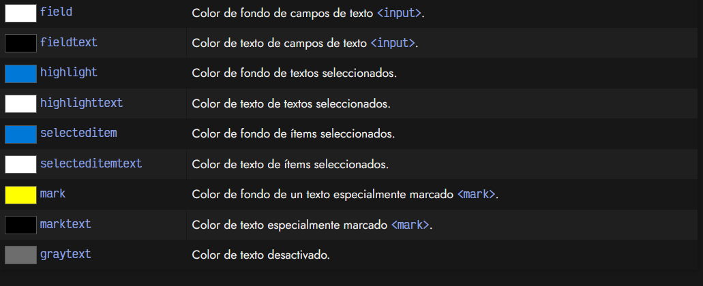

Los cuadritos anteriores se calculan a partir del sistema operativo en tu navegador. Si tienes un sistema operativo que no soporta alguna de estas palabras clave, te aparecerá con fondo rojo rayado.

## Canales alfa o transparencia.
En algunos casos, es muy posible que necesitemos indicar un color con cierto grado de transparencia, ya que hasta ahora solo podemos utilizar la palabra clave transparent que es una transparencia completa, del 100%. Con transparencias parciales podríamos conseguir que se aprecie el contenido que está detrás un elemento.

Sin embargo, existe la posibilidad de utilizar los denominados canales alfa, que permiten establecer un porcentaje de transparencia parcial sobre un color. Estos se pueden establecer en los diferentes formatos y funciones de la tabla anterior (salvo en los colores con palabras clave).

Además, también existe la propiedad opacity, mediante la cuál podemos hacer que un elemento y su contenido o elementos hijos tengan una transparencia parcial o completa. La veremos más adelante.

