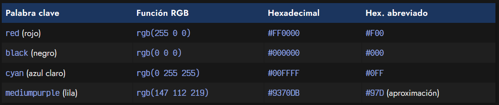
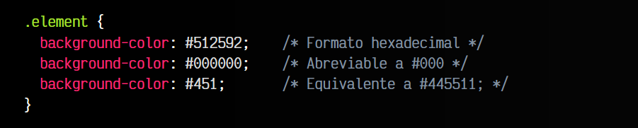
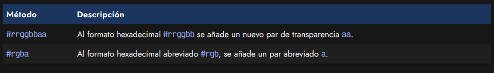
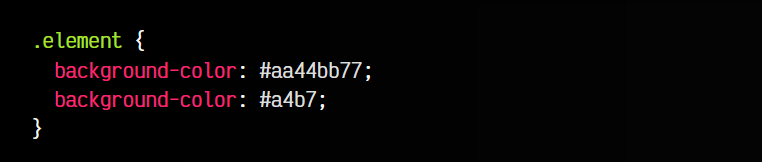

# 
El formato hexadecimal

El formato hexadecimal es el más utilizado por los desarrolladores web, y viene derivado del formato RGB, por lo que si aún no lo conoces, te recomendamos que le eches un vistazo primero a la función rgb(). Aunque en principio puede parecer algo extraño y confuso, sobre todo si no has oído hablar nunca del sistema numérico hexadecimal, el formato de colores hexadecimal es simplemente un formato RGB abreviado.

Los humanos en nuestro día a día utilizamos el sistema decimal, es decir, un sistema numérico basado en 10 números (0, 1, 2, 3, 4, 5, 6, 7, 8, 9). Existe un formato numérico llamado hexadecimal el cuál está basado en 16 números (0, 1, 2, 3, 4, 5, 6, 7, 8, 9, A, B, C, D, E y F), y es el que utilizaremos en este formato.

Así pues, en un color hexadecimal, que empieza siempre por #, cada par de letras o números simboliza el valor de un canal RGB, sólo que se está expresando en el sistema de numeración hexadecimal.

Por ejemplo, tenemos el color rojo en RGB, que es rgb(255 0 0). Si queremos pasarlo al formato hexadecimal, debemos convertir cada valor a hexadecimal, quedando FF (255), 00 (0) y 00 (0). Es decir, en hexadecimal: #FF0000.

## La sintaxis hexadecimal.
Ahora que sabemos como se escribe un color en formato hexadecimal, vamos a ver algunos ejemplos, basándonos en otros modelos de color como palabras clave, la función rgb() o el propio hexadecimal:

Observa que la última columna, denominada Hexadecimal abreviado tenemos un formato hexadecimal más corto. Lo explicaremos en la siguiente sección.

## Sintaxis abreviada.
Como se puede ver en la última columna de la tabla anterior, para ahorrar espacio y hacer el color más corto, puedes utilizar el formato hexadecimal abreviado. Este formato, se crea especificando sólo las primeras tres cifras de cada par hexadecimal. De esta forma, el color #9933AA se puede abreviar como #93A. El color abreviado sólo será 100% fiel, cuando los pares de cifras sean idénticos.

Veamos algunos ejemplos del formato hexadecimal:

Habitualmente, no es necesario escribir los formatos abreviados directamente, ya que hay herramientas que se pueden configurar y se encargan de acortar y realizar esas optimizaciones.

## Canal alfa o transparencia.
Aunque antiguamente no era posible, existe una forma de añadir un canal alfa o transparencia en los colores expresados en formato hexadecimal. Para ello, no tenemos más que añadir un par más al color hexadecimal, donde expresamos el grado de transparencia con un valor hexadecimal, donde:

 -   00 (0 en decimal) es totalmente transparente.
 -   FF (255 en decimal) es totalmente opaco.

De esta forma, el formato sería el siguiente:

Así pues, los ejemplos anteriores trasladados a código, se verían como en el fragmento de código CSS siguiente, donde tenemos el color #aa44bb y hemos añadido un par 77, que es aproximadamente un 46% de transparencia. Más abajo, tenemos su equivalente en hexadecimal abreviado:

Actualmente, el soporte de esta característica es bastante buena en los diferentes navegadores, por lo que se puede utilizar con seguridad.