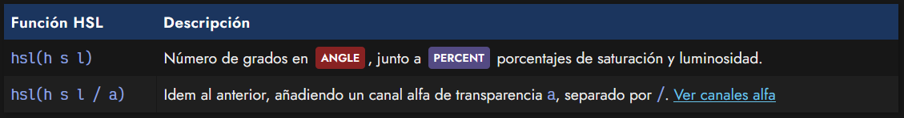
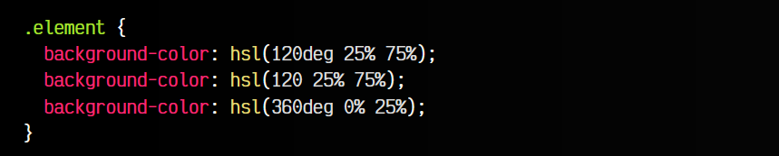
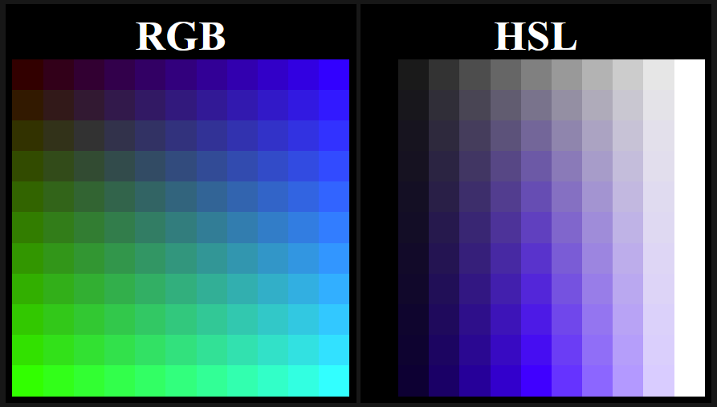
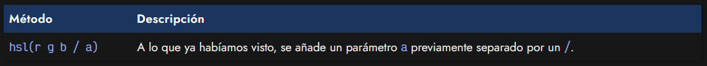
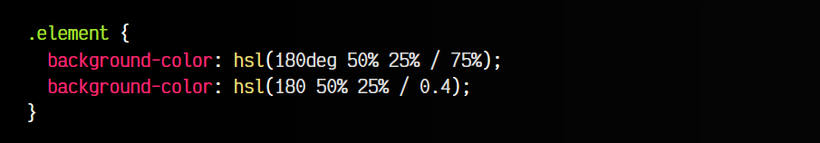
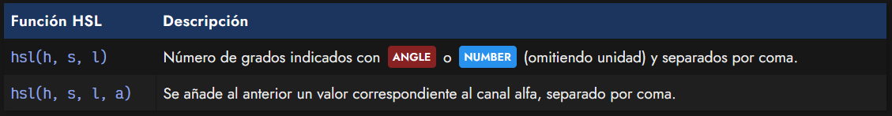
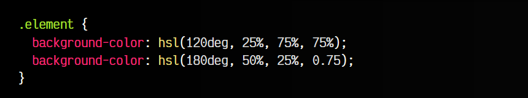

# 
La función HSL()

Las siglas HSL significan Color (hue), Saturación (saturation), Luminosidad (luminosity) y es un modelo para representar colores basado en el incremento o decremento de la luminosidad y la saturación de un matiz de color. Es un modelo de color bastante sencillo de comprender e intuitivo.

   - El matiz de color selecciona la gama de color a utilizar.
   - La saturación muestra el color más desaturado (más apagado) o más saturado (más vivo).
   - La luminosidad muestra el color más oscuro o más claro.

La forma de utilizar el modelo HSL en CSS es mediante la función hsl(), una función con parámetros mucho más intuitivos para la mayoría de los desarrolladores que otros como el formato hexadecimal o el modelo RGB. Su sintaxis es la que veremos a continuación en la siguiente tabla:

Ahora, expliquemos los parámetros de la función hsl():

 -  ANGLE El valor h es el matiz de color, con un valor de 0deg a 360deg. En caso de omitir la unidad como NUMBER, se asumen deg.
 -  PERCENT La cifra s es el porcentaje de saturación, de 0% a 100%.
 -  PERCENT La cifra l es el porcentaje de luminosidad, de 0% a 100%.

Veamos algunos ejemplos de la aplicación de la función hsl() en nuestro código:

Como se puede ver, podemos omitir las unidades con seguridad en el primer parámetro, ya que el formato NUMBER también es aceptado.

Observa la siguiente tabla, donde podemos comparar la distribución de colores en el modelo de color RGB y en el modelo de color HSL que estamos explicando en este artículo.

## Canal alfa o transparencia.
Al igual que con otros esquemas o modelos de color, también se pueden especificar canales alfa de transparencia en un color. Para ello, solo tenemos que añadir un parámetro más en la lista, separado por un slash /:

Recuerda que este número puede indicarse tanto en formato NUMBER, como un dígito del 0 al 1, con decimales, como en formato PERCENT, donde el número iría desde 0% hasta 100%:

De esta forma podemos indicar colores con cierto grado de transparencia usando la función hsl().

## Notación antigua (legacy).
Si llevas tiempo con CSS, o simplemente examinando código por ahí, es muy probable que hayas encontrado un formato de la función hsl() ligeramente diferente a lo explicado anteriormente. Se trata de la sintaxis legacy, es decir, una forma antigua de escribir colores mediante hsl() que, aunque funciona hoy en día, se recomienda ir acostumbrándose a la sintaxis explicada anteriormente, ya que en algún punto del futuro será reemplazada.

Dicha sintaxis legacy es la siguiente:

Observa que simplemente es añadir un parámetro más a la lista, separado también por comas. Veamos algunos ejemplos:

Es muy posible que también te hayas encontrado con una función hsla() en lugar de hsl() para usar canales alfa. Antiguamente había que utilizarlos de forma obligatoria, pero actualmente hsl() soporta canales alfa sin problemas. Con la función rgb() y rgba() ocurre exactamente lo mismo.

Consejo: Una herramienta genial para seleccionar varios colores en nuestros proyectos es [Adobe Color CC](https://color.adobe.com/es/). Nos permite escoger entre colores análogos, monocromáticos, tríadas, colores complementarios, compuestos o tonos similares. Muy visual e intuitiva. Otra herramienta, más simple pero muy práctica es [HSL Picker](https://hslpicker.com/), donde puedes elegir el color deseado utilizando el formato de colores HSL y pudiendo seleccionar incluso los canales alfa.

