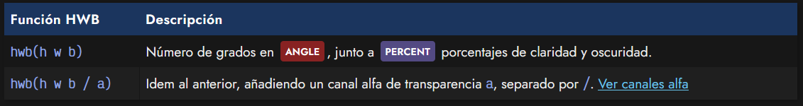
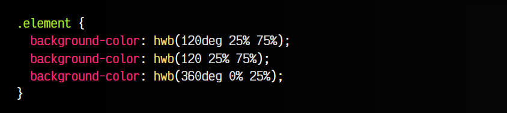
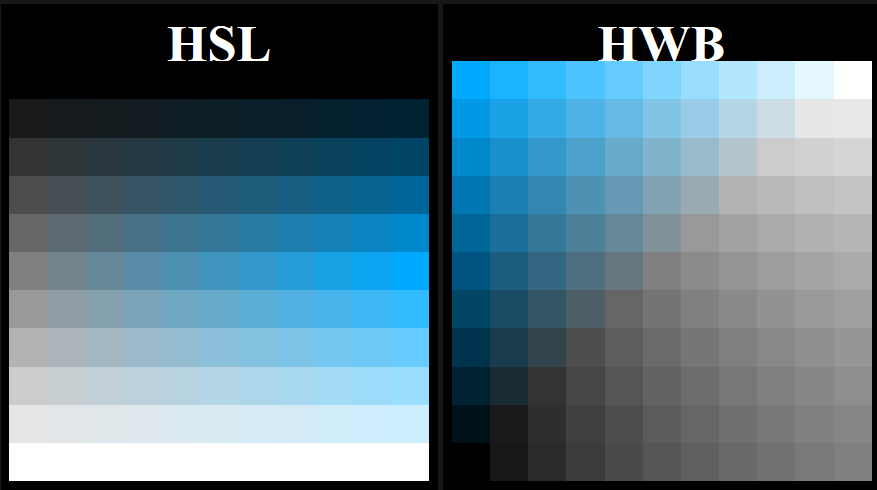
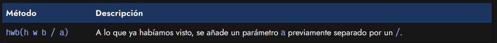
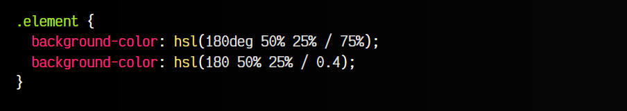

# 
La función HWB()

Las siglas HWB significan Color (hue), Claridad (whiteness), Oscuridad (blackness) y es un modelo para representar colores basado en valores más claros o más oscuros y un matiz de color. Es una variación «más humana» del modelo HSL, en el sentido que es más fácil de predecir por una persona.

En principio, los parámetros son muy similares a HSL, pero es más sencillo moverse por HWB:

   - El matiz de color selecciona la gama de color a utilizar.
   - La claridad hace el color más blanco.
   - La oscuridad hace el color más oscuro.

La forma de utilizar el modelo HWB en CSS es mediante la función hwb(). Como hemos mencionado, su sintaxis es prácticamente idéntica a hsl():

Ahora, expliquemos los parámetros de la función hwb():

   ANGLE El valor h es el matiz de color, con un valor de 0deg a 360deg. Se puede omitir la unidad como NUMBER.
   PERCENT La cifra w es el porcentaje de claridad, de 0% a 100%.
   PERCENT La cifra b es el porcentaje de oscuridad, de 0% a 100%.

Veamos algunos ejemplos de la aplicación de la función hwb() en nuestro código:

Por su sintaxis, puede parecer que los modelos de colores hwb() y hsl() son idénticos, pero en realidad son diferentes. Observa los siguientes recuadros, donde se puede ver como cambian los colores indicándolos con los mismos parámetros en cada modelo. Por ejemplo, un cuadrado de la tabla izquierda sería hsl(200, 40% 40%) y el mismo cuadrado de la tabla derecha sería hwb(200, 40% 40%).

En la primera tabla, hay que notar que la primera fila es completamente de color negro, mientras que la última fila es completamente de color blanco. Si nos fijamos en la segunda tabla, los colores están mejor distribuidos y se hace más fácil e intuitivo elegir un color «programaticamente».

## Canal alfa o transparencia.
Al igual que con otros esquemas o modelos de color, también se pueden especificar canales alfa de transparencia en un color. Para ello, solo tenemos que añadir un parámetro más en la lista, separado por un slash /:

Recuerda que este número puede indicarse tanto en formato NUMBER, como un dígito del 0 al 1, con decimales, como en formato PERCENT, donde el número iría desde 0% hasta 100%:

De esta forma podemos indicar colores con cierto grado de transparencia usando la función hsl().