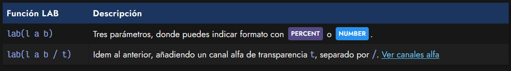
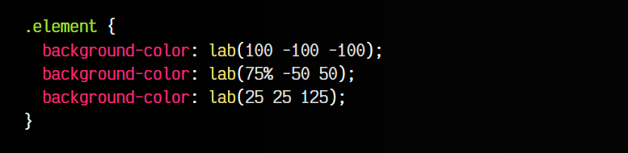
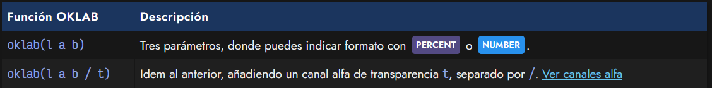
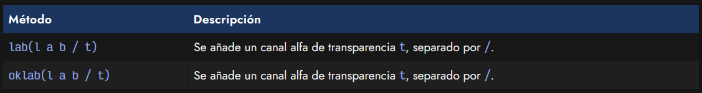
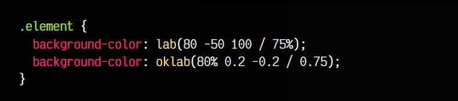
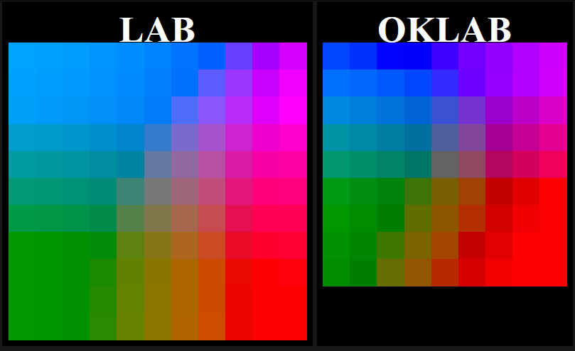

# 
La función LAB() y OKLAB()

El término LAB es una forma de hacer referencia a CIELAB (CIE 1976 L*a*b*), un modelo de color mucho más completo y realista que otros espacios de color como RGB, HSL, etc. Las siglas LAB significan Luminosidad CIE:

   - La L representa la luminosidad de negro a blanco.
   - La A representa la luminosidad de verde a rojo.
   - La B representa la luminosidad de azul a amarillo.

La forma de usar el modelo LAB en CSS es mediante la función lab(). Para ello, utilizaremos los 3 parámetros L, A y B:

Ahora, expliquemos los parámetros de la función lab():

   - El valor l es la luminosidad negro-blanco: un valor PERCENT de 0% a 100% o NUMERIC entre 0 y 100.
   - La cifra a es la luminosidad verde-rojo: un valor PERCENT de -100% a 100% o NUMERIC entre -125 y 125.
   - La cifra b es la luminosidad azul-amarillo un valor PERCENT de -100% a 100% o NUMERIC entre -125 y 125.

Veamos algunos ejemplos de la aplicación de la función lab() en nuestro código:

Es preferible utilizar los valores NUMERIC a y b con en lugar de PERCENT, puesto que algunos navegadores posiblemente aún no lo tengan implementado.

## La función oklab().
La función oklab() es una mejora de la función lab(). Los parámetros de la función oklab() cambian ligeramente respecto a lab():

Ahora, expliquemos los parámetros de la función oklab():

   - El valor l es la luminosidad negro-blanco: un valor PERCENT de 0% a 100% o NUMERIC entre 0 y 1.
   - El valor a es la luminosidad verde-rojo: un valor PERCENT de -100% a 100% o NUMERIC entre -0.4 y 0.4.
   - El valor b es la luminosidad azul-amarillo: un valor PERCENT de -100% a 100% o NUMERIC entre -0.4 y 0.4.

## Canal alfa o transparencia.
Al igual que con otros esquemas o modelos de color, también se pueden especificar canales alfa de transparencia en un color. Para ello, solo tenemos que añadir un parámetro más en la lista, separado por un slash /:

Recuerda que este número puede indicarse tanto en formato NUMBER, como un dígito del 0 al 1, con decimales, como en formato PERCENT, donde el número iría desde 0% hasta 100%:

De esta forma podemos indicar colores con cierto grado de transparencia usando la función lab() o oklab().

## Comparación lab() vs oklab().
En las siguientes tablas podemos ver la diferencia entre la función lab() y la función oklab(). Observa que, dejando el ratón sobre el cuadrito, puedes ver el valor que estamos utilizando.

OKLAB

Mientras que los parámetros A y B de lab() se mueven entre valores -125 y 125, los parámetros A y B de oklab() se mueven entre valores -0.4 y 0.4.

