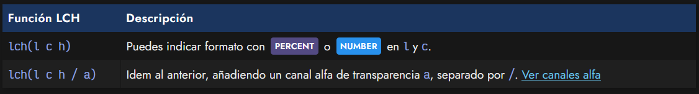
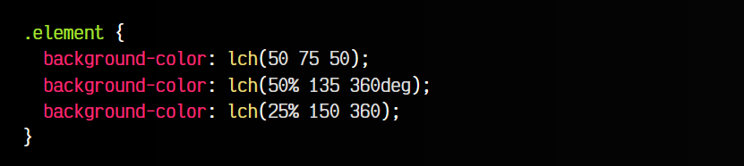
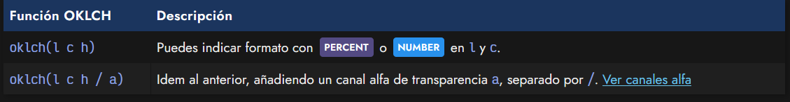
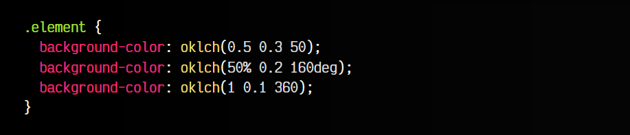
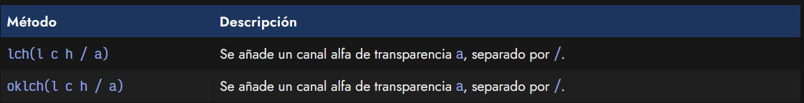
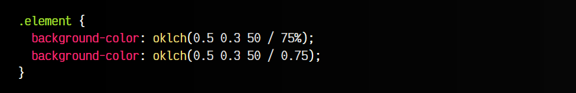
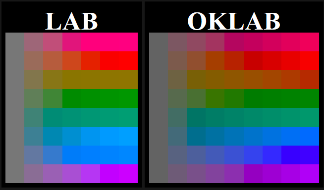

# 
La función LCH() y OKLCH()

El término LCH es una forma de hacer referencia a CIE LCH, un modelo de color donde la L de luminosidad es idéntico a CIE LAB, pero utiliza coordenadas cilíndricas en los parámetros C y H:

   - La L representa la luminosidad de negro a blanco.
   - La C representa la saturación, en forma de distancia geométrica desde el eje L.
   - La H representa el tono de color, en forma de ángulo desde el eje A positivo y el eje B positivo.

## La función lch().
La forma de usar el modelo LCH en CSS es mediante la función lch(). Para ello, utilizaremos los 3 parámetros L, C y H:

Ahora, expliquemos los parámetros de la función lch():

   - El valor l es la luminosidad negro-blanco: un valor PERCENT de 0% a 100% o NUMBER entre 0 y 100.
   - El valor c es la saturación: un valor PERCENT de 0% a 100% o NUMBER entre 0 y 150.
   - El valor h es el tono de color: un valor ANGLE entre 0deg y 360deg o NUMBER sin unidades.

Veamos algunos ejemplos de la aplicación de la función lab() en nuestro código:

Es preferible utilizar los valores c con NUMBER en lugar de PERCENT, puesto que algunos navegadores posiblemente aún no lo tengan implementado.

## La función oklch().
La función oklch() es una mejora de la función lch(). Los parámetros de la función oklch() cambian ligeramente respecto a lch():

Ahora, expliquemos los parámetros de la función lch():

   - El valor l es la luminosidad negro-blanco: un valor PERCENT de 0% a 100% o NUMBER entre 0 y 100.
   - El valor c es la saturación: un valor PERCENT de 0% a 100% o NUMBER entre 0 y 0.4.
   - La valor h es el tono de color: un valor ANGLE  entre 0deg y 360deg o NUMBER sin unidades.

Veamos algunos ejemplos de la aplicación de la función oklch() en nuestro código:

Es preferible utilizar los valores c con NUMBER en lugar de PERCENT, puesto que algunos navegadores posiblemente aún no lo tengan implementado.

## Canal alfa o transparencia.
Al igual que con otros esquemas o modelos de color, también se pueden especificar canales alfa de transparencia en un color. Para ello, solo tenemos que añadir un parámetro más en la lista, separado por un slash /:

Recuerda que este número puede indicarse tanto en formato NUMBER, como un dígito del 0 al 1, con decimales, como en formato PERCENT, donde el número iría desde 0% hasta 100%:

De esta forma podemos indicar colores con cierto grado de transparencia usando la función lch() o oklch().

## Comparación lch() vs oklch().
En las siguientes tablas podemos ver la diferencia entre la función lch() y la función oklch(). Observa que, dejando el ratón sobre el cuadrito, puedes ver el valor que estamos utilizando.

OKLAB

Mientras que los parámetros C y H de lch() se mueven entre valores 0 y 150, los parámetros C y H de oklch() se mueven entre valores 0 y 0.4.

