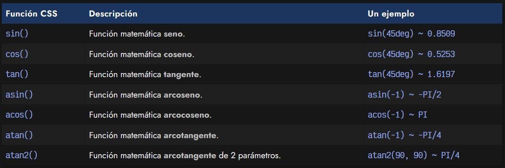
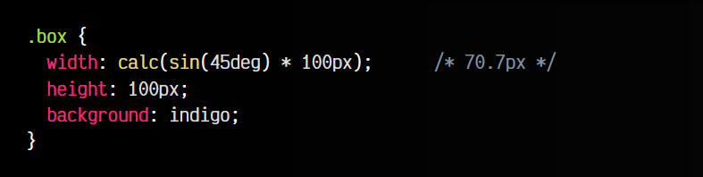
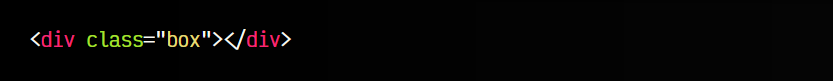
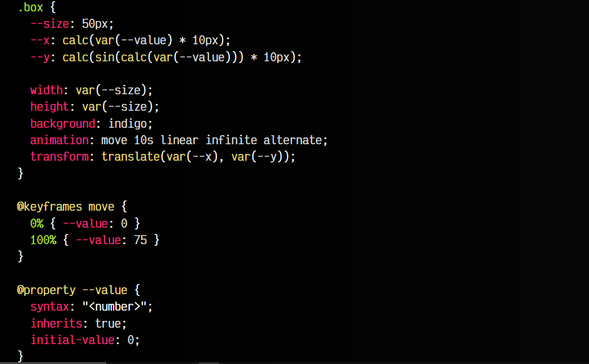
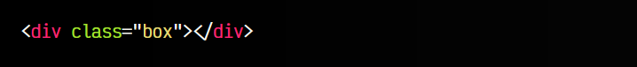

# 
Funciones trigonométricas CSS

Recientemente se han añadido una serie de funciones CSS que permiten realizar calculos trigonométricos básicos sin necesidad de utilizar Javascript. Esto nos da una gran cantidad de posibilidades a la hora de realizar tareas geométricas e incluso animaciones.

as funciones CSS trigonométricas disponibles actualmente son las siguientes:

La forma de utilizarlas es muy similar a funciones que ya hemos visto anteriormente, como calc(), min() o round():

css:

html:

vista:

En este ejemplo, hemos realizado la siguiente operación:

   - Seno de 45deg = 0.7071
   - 0.7071 * 100px = 70.71px

## Animaciones con trigonometría.
Sin embargo, esto puede ser más interesante si lo mezclamos con animaciones CSS. Veamos un ejemplo un poco más complejo, donde utilizamos la propiedad animation de CSS y la regla @property para darle un tipo de dato a una variable CSS:

   - 1️⃣ El cuadrado .box tiene un tamaño de 50x50 píxels.
   - 2️⃣ Mediante una animación CSS, aumentamos la variable --value de 0 a 75.
   - 3️⃣ Le damos un tipo de dato numérico con @property para que sea animable.
   - 4️⃣ En --x multiplicamos por 10px el número --value, para convertirlo en píxels y aumentarlo un poco.
   - 5️⃣ En --y calculamos el seno del valor de --value, multiplicado por 10px.

css:

html:

vista:

Más adelante, explicaremos tanto las [animaciones CSS](https://lenguajecss.com/css/animaciones/animaciones/), como el uso de la [propiedad @property](https://lenguajecss.com/css/reglas-css/la-regla-property/) que permite asignar un tipo de dato a una variable CSS.

