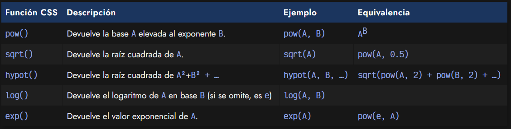
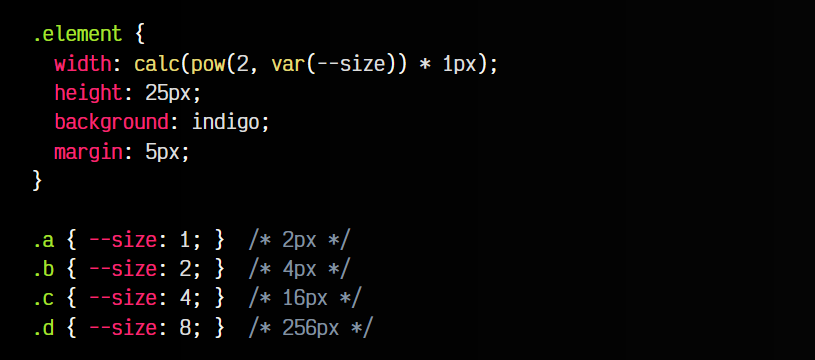

# 
Funciones exponenciales CSS

En el caso de que necesitemos funciones CSS para jugar con valores exponenciales, también podemos utilizar la siguiente familia de funciones, que nos permiten realizar cálculos de potenciación, raíces cuadradas, hipotenusa, logaritmos, etc.

Las funciones exponenciales en CSS (y relacionadas) son las siguientes:

Ten en cuenta, que la función hypot(), al contrario que el resto de funciones anteriores, permite indicar valores con unidades como px o em.

Veamos un ejemplo para ver elementos donde utilizamos la función CSS pow(), que la utilizaremos para usar potencias de 2:

css:

html:

vista:

