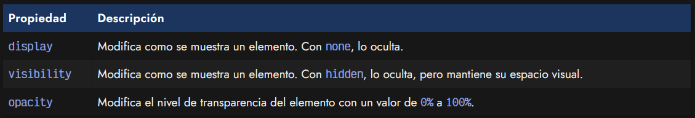
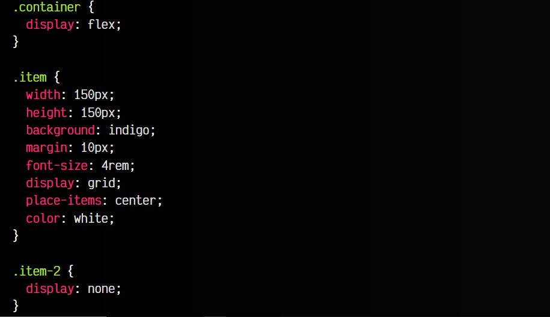
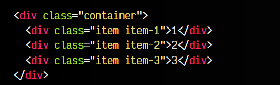
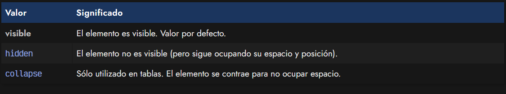
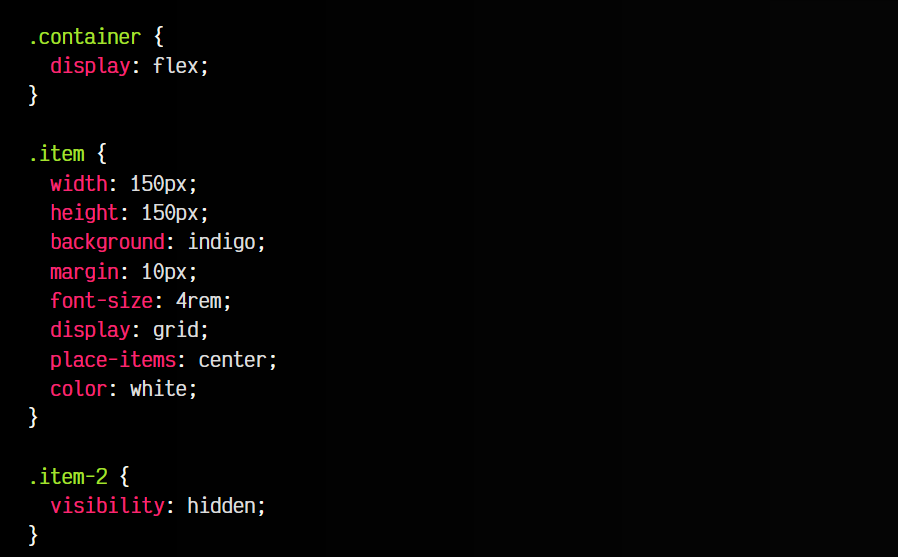
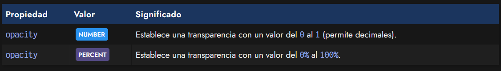
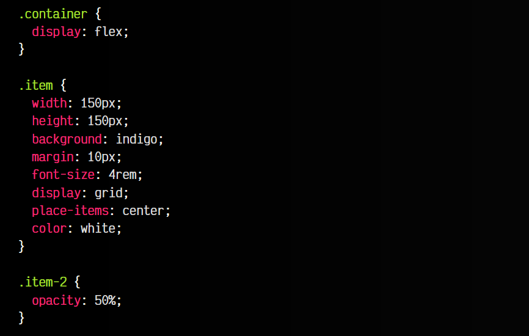
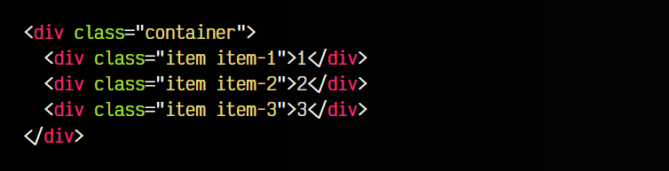

# 
Visibilidad de elementoss

Una de las necesidades básicas en CSS es la de mostrar y ocultar elementos. Sin embargo, esta aparentemente funcionalidad, tiene múltiples formas de conseguirse, así como matices concretos y enfoques diferentes para obtener resultados parecidos, pero no exactamente iguales.

Existen múltiples formas de modificar la visibilidad de ciertos elementos de una página, donde hay 3 formas principales que destacan sobre otras. Vamos a analizar dichas formas, atendiendo a ciertos matices importantes:

Para comprenderlo mejor, expliquemos detalladamente cada uno de los casos.

## 
La propiedad display

Quizás, la forma más habitual y conocida de ocultar un elemento es utilizar la propiedad display con el valor none. Esto hace que el navegador ignore por completo ese elemento, dejándolo de mostrar visualmente.

Ya veremos más adelante, que la propiedad display es un pilar fundamental del desarrollo web, y que mediante esta propiedad podemos utilizar mecanismos de colocación y maquetación como Flex, Grid u otros. Sin embargo, vamos a quedarnos de momento con la posibilidad de ocultar elementos con display: none y de volverlos a mostrar con display: block (u otros que explicaremos más adelante):

css:

html:

vista:

Esta debe ser la opción general que tomemos cuando queremos ocultar una imagen al usuario. Sin embargo, existen otros casos que también pueden sernos de utilidad.

Aunque en un futuro cercano esto va a cambiar, la propiedad display: none puede dificultar tareas de animación y transiciones, donde suele ser más apropiado utilizar opacity. Hablaremos de la propiedad display un poco más adelante, junto a los fundamentos de maquetación.

## 
La propiedad visibility

Existe una propiedad CSS llamada visibility, mediante la cuál podemos establecer el valor hidden. Esto realizará una acción muy similar a display: none, con la diferencia que en este caso, se mantiene el «hueco» que ocupaba el elemento cuando se mostraba, pero manteniendo dicho espacio vacío (elemento oculto).

Dicha propiedad visibility tiene los siguientes valores posibles:

Veamos el ejemplo anterior, pero aplicando un visibility: hidden en lugar de un display: none:

css:

html:

vista:

En definitiva, utilizar visibility: hidden es muy interesante si queremos que un elemento y su contenido «se vuelva invisible», para así seguir ocupando su espacio y evitar que los elementos adyacentes se desplacen, lo que suele ser un comportamiento no deseado en muchas ocasiones.

## 
La propiedad opacity

Por otro lado, otra opción interesante y relacionada podría ser la posibilidad de utilizar la propiedad opacity, especialmente útil si se utiliza junto a transiciones o animaciones.

La sintaxis de la propiedad opacity es la siguiente:

La propiedad opacity permite indicar valores numéricos desde 0 a 1, pudiendo indicar decimales. Si lo prefieres, también puedes optar por utilizar valores en porcentaje: de 0% (completamente transparente) a 100% (completamente visible). El grado de opacidad establecido se aplicará al elemento en cuestión y a todos sus hijos.

css:

html:

vista:

Como se puede ver en la demo, el efecto de la propiedad opacity al 50% hace que parezca que ese elemento está con un color más claro, sin embargo, lo que ocurre es que está semitransparente, porque hemos reducido la opacidad a la mitad.

Recuerda que la propiedad opacity afecta al elemento indicado y a todos sus hijos.

Existen algunos matices que conviene destacar:

   - 1️⃣ Utiliza un canal alfa en el color de fondo en el color de fondo background-color si quieres que el fondo tenga transparencia, pero el contenido del elemento (texto, imágenes, etc...) no se vea afectado por la transparencia.

   - 2️⃣ Es posible utilizar la función opacity() de la propiedad filter, la cuál se puede acumular y sumar junto a otras funciones de filtros.

   - 3️⃣ Otra opción, podría ser utilizar un pseudoelemento ::before o ::after para mantener la nueva información separada del contenido del elemento. De esta forma, se puede aplicar una función opacity() al pseudoelemento y sólo le afectará a él, manteniendo el elemento intacto.

Estos valores, al ser cuantificables, el navegador sabe perfectamente como transicionarlos o animarlos y se pueden hacer efectos donde elementos aparezcan o se desvanezcan gradualmente. Tienes más información detallada en el artículo dedicado a las [transiciones CSS](https://lenguajecss.com/css/animaciones/transiciones/).
