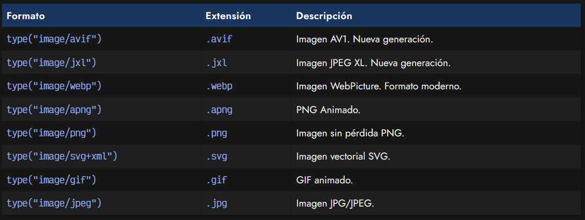

# 
La función image-set()

En el momento de leer este artículo deberías saber colocar imágenes en una web tanto a través de la etiqueta HTML , como utilizando la propiedad background-image de CSS. Quizás también conozcas [la etiqueta picture](https://lenguajehtml.com/html/multimedia/etiqueta-html-picture/) de HTML, que puede ser utilizada para indicar varias imágenes a modo de fallback y elegir entre ellas. Sin embargo... ¿Existe alguna forma de hacerlo en CSS?

## 
¿Qué es un fallback?

Cuando hablamos de fallback, hacemos referencia a una palabra que utilizamos de forma similar a «alternativa». En situaciones donde una opción primaria o principal no se puede utilizar o no está disponible, un fallback es la opción alternativa o secundaria que utilizaríamos.

## 
La función image-set()

En CSS, existe una función image-set() que puede utilizarse para establecer fallbacks de imágenes. En situaciones en las que no podemos (o no queremos) utilizar la opción primaria, podemos ofrecer otra opción que posiblemente encaje mejor en nuestro caso específico.

La sintaxis sería la siguiente:

Una opción interesante podría ser guardar la función image-set() en una variable CSS, de modo que luego podamos trabajar con esa imagen como la «imagen elegida».

## 
Condiciones de fallback

En el anterior ejemplo hemos añadido el texto condición para definir que en ese área podemos escribir una de las siguientes condiciones:

   - 1️⃣ Dependiendo del formato de imagen: Puedes querer que, en el caso de que el navegador no soporte un formato concreto, utilice otro.

   - 2️⃣ Dependiendo de la resolución de imagen: Puedes querer que, en el caso de que el dispositivo tenga una mayor densidad de píxeles, pueda utilizar imágenes de mayor resolución.

Cada uno de estos casos podría ser interesantes para aprovechar mejor los recursos del dispositivo y mejorar la experiencia de usuario. Veamos cada uno de estos casos detenidamente.

## 
Fallbacks según el formato de imagen

Al igual que podemos utilizar la etiqueta <picture> para establecer fallbacks con formatos de imágenes modernos aún no muy extendidos, de modo que si el navegador que utilizamos lo soporta, sólo descargue y utilice dicha imagen, podemos hacerlo en CSS mediante la función image-set().

En este caso hemos indicado lo siguiente:

   - 1️⃣ Si el navegador soporta el formato .avif, descargará esa imagen y la utilizará, ignorando el resto.
   - 2️⃣ En caso contrario, si soporta el formato .webp, descargará la imagen y la usará, ignorando el resto.
   - 3️⃣ En caso contrario, si soporta el formato .jpg, descargará esa imagen y la usará.

El orden es importante, y en la función type() podemos utilizar un MIME válido para imágenes, como los siguientes de la tabla:

## 
Fallbacks según densidad de pantalla

Otro caso interesante que podría ocurrir es que queramos proporcionar diferentes imágenes segun la resolución / densidad de pantalla del dispositivo. En ese caso, utilizaremos la siguiente sintaxis:

En este caso, hemos utilizado el texto 1x, 2x y 3x para indicar la resolución en cuestión. El nombre de la imagen simplemente es una propuesta, donde añadimos el sufijo @1x antes de la extensión, pero esto puede ser nombrado a gusto de cada uno. Se podría utilizar image-low.webp, image.webp e image-large.webp, por ejemplo.

   - 1️⃣ En el caso de 1x: La densidad de pantalla es 96 ppp. La resolución por defecto.
   - 2️⃣ En el caso de 2x: La densidad de pantalla es 192 ppp.
   - 3️⃣ En el caso de 3x: La densidad de pantalla es 288 ppp.

De esta forma, si nuestra pantalla puede mostrar imágenes a mejor calidad, podemos proporcionar esas imágenes adicionales con mejor resolución, ya que estamos seguros que el dispositivo las puede mostrar.

## 
Fallbacks según ancho de banda

El caso anterior también se puede interpretar de otra forma. Asumiendo que 1x es el valor del dispositivo más simple, podemos indicar una versión de alta calidad en valores de 2x o superiores y en 1x indicar un tipo de imagen que no es necesario descargar: gradientes.

De esta forma, reducimos al máximo las necesidades de ancho de banda del dispositivo de baja resolución.

## 
Fallback de image-set()

Aunque la función image-set() tiene buen soporte actualmente, en el caso de querer dar un fallback para navegadores antiguos que no lo soporten o implementen, podemos simplemente indicar en una línea anterior el fallback con la función url():

El navegador que soporte la función image-set() sobreescribirá la propiedad anterior, y el navegador que no soporte la función image-set() simplemente ignorará esa línea y se quedará con la anterior.