# 
CSS Moderno: antes vs ahora

Es muy posible que te lleves tiempo sin tocar CSS y desconozcas muchas de las novedades que incorpora CSS actualmente. En esta página he hecho una lista de tareas comunes que hoy en día se pueden hacer de una forma mejor que la que comunmente está más extendida.

En estos ejemplos, encontrarás una forma tradicional de hacer las cosas a la izquierda, una forma más moderna en la zona derecha.

## Combinador :is().
#### Agrupación de selectores.
Reescribir de forma más compacta y sencilla los selectores múltiples combinados [ [Más info](https://lenguajecss.com/css/selectores/combinadores-logicos/#el-combinador-is) ]

antes:
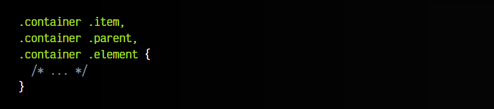

ahora:
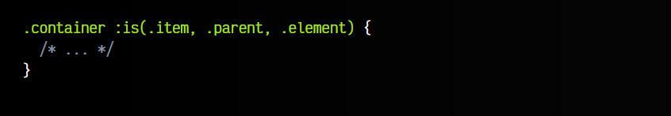

## Colores RGB.
#### Escribir colores.
Escribir colores RGB con canales alfa (transparencias) [ [Más info](https://lenguajecss.com/css/colores/funcion-rgb/#la-funci%C3%B3n-rgb) ]

antes:
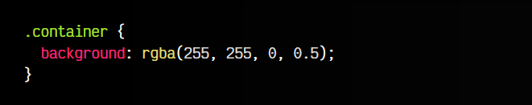

ahora:
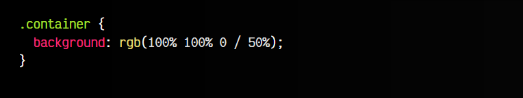

## Nesting CSS.
#### Anidar código CSS.
Crear componentes CSS nativos autocontenidos dentro de otros [ [Más info](https://lenguajecss.com/css/calidad-de-codigo/css-nesting/) ]

antes:
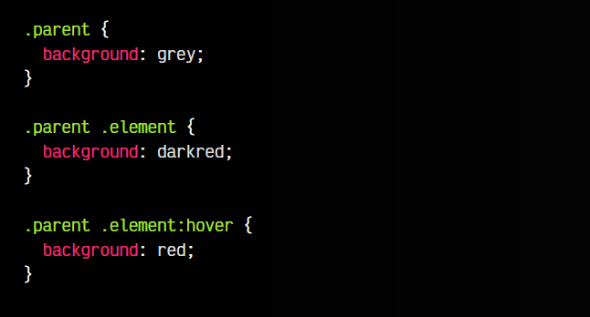

ahora:
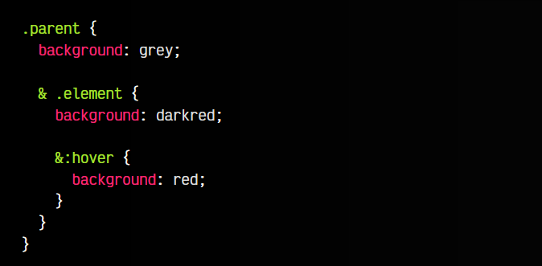

## Centrado CSS.
#### Centrar el contenido de un elemento.
Realizar un centrado en ambos ejes directamente, con una sola propiedad [ [Más info](https://lenguajecss.com/css/maquetacion-y-colocacion/grid-css-alinear/) ]

antes:
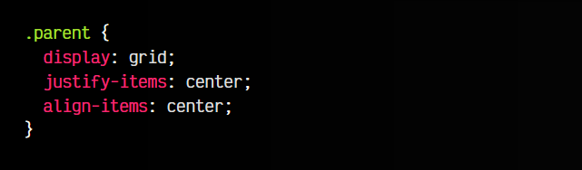

ahora:
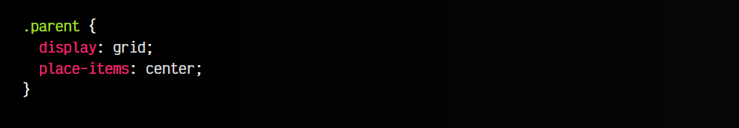

## Variables CSS.
#### Reutilizar información.
Utilizar custom properties para guardar información en variables [ [Más info](https://lenguajecss.com/css/cascada-css/css-custom-properties/) ]

antes:
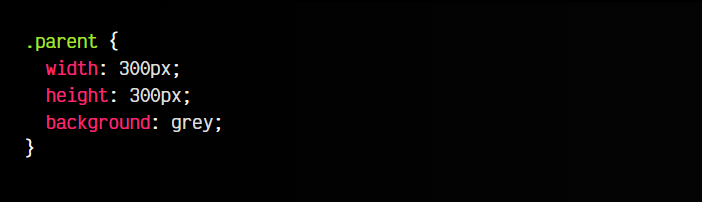

ahora:
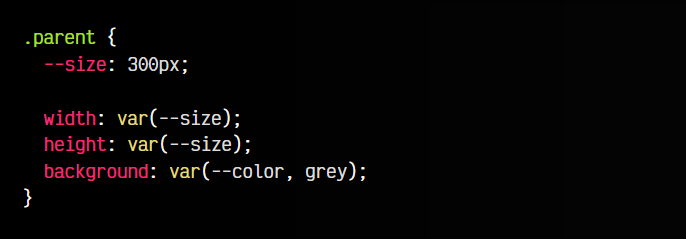

## Media Queries.
#### Sintaxis flexible de rangos.
Posibilidad de utilizar una sintaxis más amigable para media queries [ [Más info](https://lenguajecss.com/css/responsive-web-design/media-queries/#media-query-range-syntax) ]

antes:
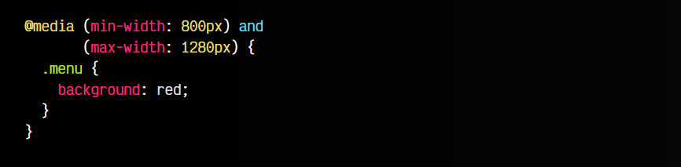

ahora:
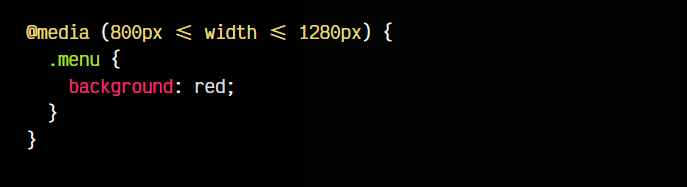

