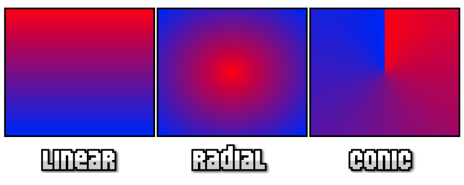
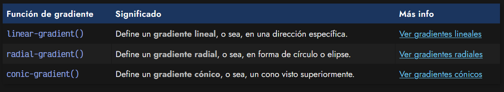
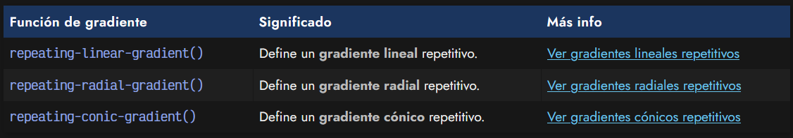

# 
¿Qué son los gradientes?

La propiedad background-image además de imágenes mediante la función url(), posee un mecanismo interesantísimo que permite establecer gradientes o degradados a partir de código. Hace muchos años, la única forma para crear gradientes era mediante un editor de imágenes y establecerlo como una imagen de fondo. Por suerte, ya podemos hacerlo mediante código.

## 
¿Qué es un gradiente o degradado?

Un gradiente o degradado es básicamente un color que cambia a otro color de forma gradual o brusca. El gradiente puede cambiar a múltiples colores, formas o incluso direcciones.

Esencialmente, existen 3 funciones de gradientes: linear-gradient(), radial-gradient() y conic-gradient():

Para crearlos, basta con utilizar alguna de las siguientes funciones en una propiedad background-image o su correspondiente propiedad de atajo background:

Estas funciones se detallan en profundidad en sus respectivas secciones. Ten en cuenta que todas las propiedades de CSS que acepten imágenes, aceptarán también gradientes o degradados.

Piensa que los navegadores, internamente, crean una imagen con el gradiente indicado en código. Por esa razón utilizamos background-image y no un background-gradient o un background-color.

## 
Gradientes repetibles

Además de las funciones anteriores, cada una de ellas también tiene una versión «repetible», donde podemos crear gradientes concéntricos, que se repiten una y otra vez.

Las funciones para crear este tipo de gradientes repetitivos se basan en añadir el prefijo repeating- a las funciones de gradientes anteriores. Estaríamos hablando de las siguientes funciones:

Ten en cuenta que al utilizar gradientes repetitivos es muy importante indicar las dimensiones del gradiente que se va a repetir. Lo explicaremos en sus respectivos artículos.

