# 
Gradientes lineales

El primer tipo de gradiente es el gradiente lineal, que permite crear fondos degradados que van en una dirección y cambian de un color a otro, dependiendo de la lista de colores indicada por parámetro.

## La función linear-gradient()
La sintaxis a utilizar debe ser una de las siguientes:

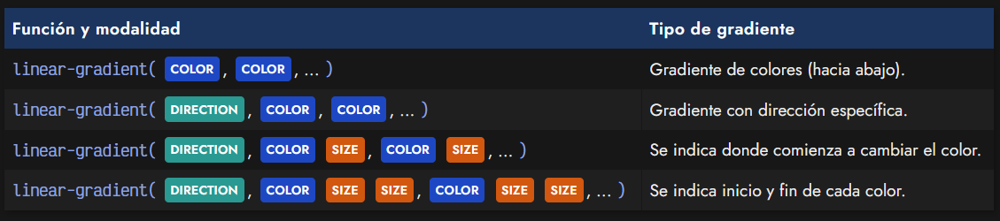

El ejemplo más básico de los anteriores es la primera modalidad, donde simplemente indicaremos los colores del gradiente uno detrás de otro, y como mínimo, deben haber dos colores:

css:
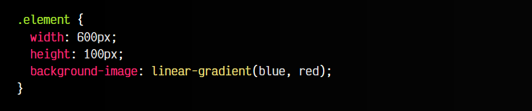

html:
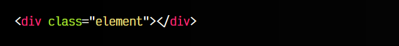

vista:
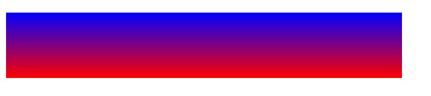

Esto creará un degradado con los colores indicados (de azul a rojo) y por defecto, la dirección del gradiente será desde arriba hacia abajo. Si se desea, se puede añadir más colores para hacer un gradiente más complejo:

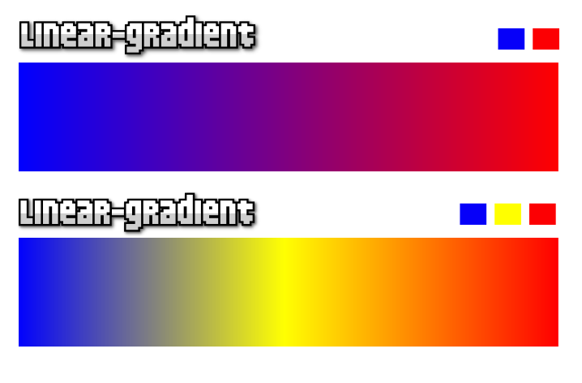

Pero hay otros parámetros que se pueden indicar para hacer gradientes más flexibles y personalizables a parte de la lista de colores. Son los siguientes parámetros:

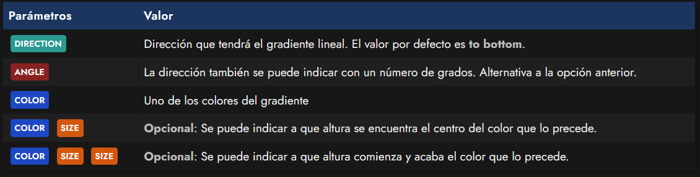

* Los SIZE valores también pueden indicarse con porcentajes .

 ## 
Dirección del gradiente

 En el ejemplo visual de la imagen anterior, la dirección del gradiente es horizontal (hacia la derecha). El primer ejemplo tiene sólo 2 colores (azul y rojo), mientras que el segundo tiene 3 colores (azul, amarillo y rojo). Ambos tienen como dirección una orientación hacia la derecha. Esto en código se traduciría en lo siguiente:

 css:
 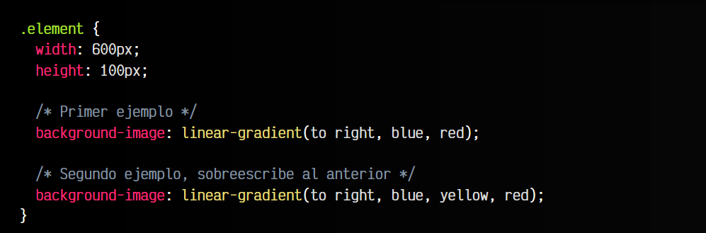

 html:
 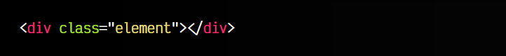

 vista:
 

 Como vemos, el primer parámetro utilizado fue to right, que es lo que indica la orientación del gradiente. En este parámetro se puede indicar tanto una palabra clave DIRECCION como un número de grados ANGLE que represente la dirección:

 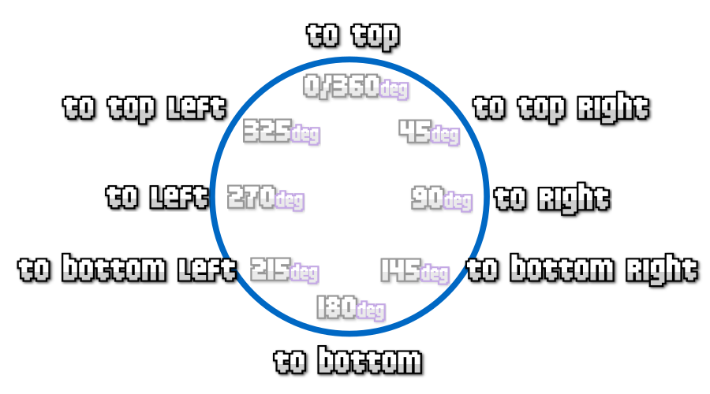

 Para que quede aún más claro, veamos una tabla de equivalencias con las diferentes unidades que podríamos usar:

 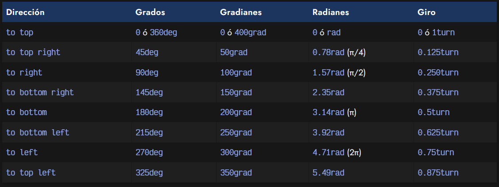

 Nota: Si utilizas alguna de las unidades en lugar de las palabras clave puedes usar valores intermedios (por ejemplo, 280deg o 58deg) y ser más preciso con la dirección si lo necesitas.

## 
Posición del color

Por defecto, las distancias entre colores se ajustan automáticamente con proporciones equilibradas. Sin embargo, si especificamos un tamaño SIZE (porcentaje o píxeles, por ejemplo) justo después del color en cuestión, podremos variar la posición en la que aparece ese color.

css:
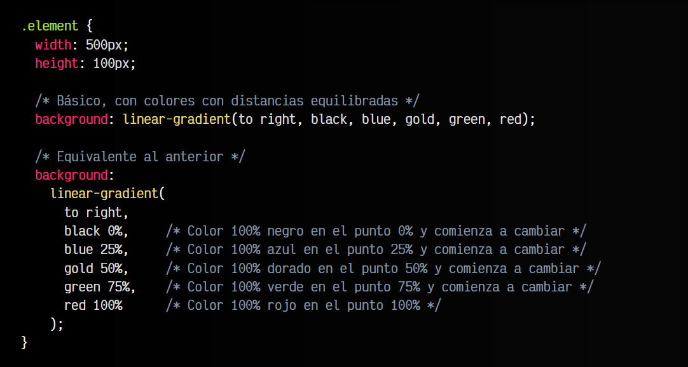

html:
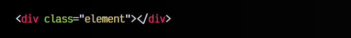

vista:

Este porcentaje PERCENT o SIZE representa el punto central del color que lo precede, respecto al tamaño del gradiente completo. Observa la imagen que tenemos a continuación, donde se muestran tres colores: el azul comenzando a cambiar en la posición 50% del elemento, el rojo comenzando a cambiar en la posición 55%, y el verde comenzando a cambiar en la posición 75%. Se vería algo así:

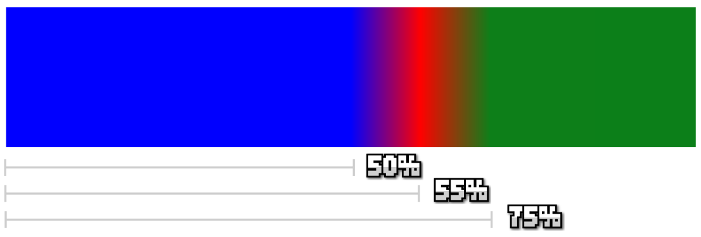

Sin embargo, nos queda una modalidad más que podemos utilizar.

## 
Inicio y final del color

En esta última modalidad podemos establecer dos tamaños después de indicar el color, uno correspondiente al momento donde empieza el color y otro correspondiente al momento donde acaba el color. Ten en cuenta que esto no quiere decir que después de ese punto, no exista un cambio paulatino a otro color donde se van mezclando:

css:
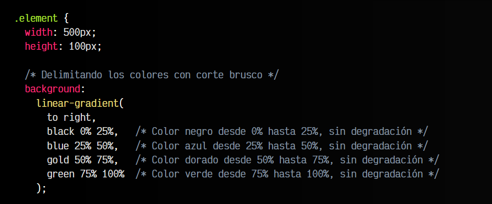
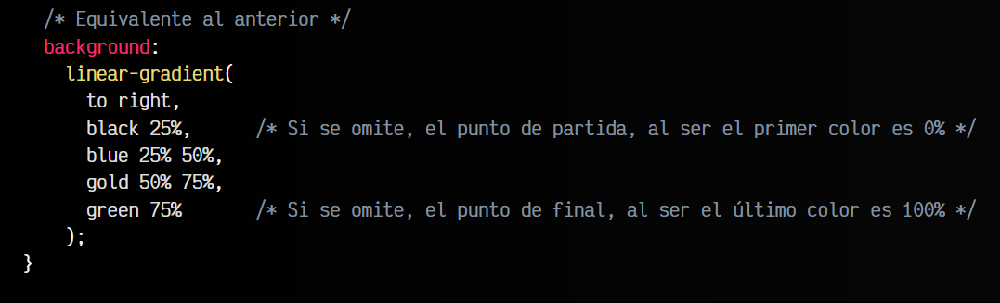

html:
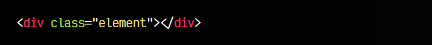

vista:

En este caso, los saltos de un color a otro son totalmente bruscos, ya que el porcentaje de terminación de un color, coincide con el porcentaje de inicio del siguiente color. También podríamos evitar que coincidan, estableciendo un pequeño degradado entre porcentajes.

## 
La función repeating-linear-gradient()

Si en lugar de utilizar la función linear-gradient() usamos la función repeating-linear-gradient(), podemos indicar un patrón de colores que se van a repetir continuamente.

El truco está en que los tamaños SIZE indicados a continuación del color, teniendo en cuenta que no debe llegar al 100%, y el navegador se encargará de completarlos y repetirlos una y otra vez hasta que no quede más espacio en el elemento HTML seleccionado:

css:
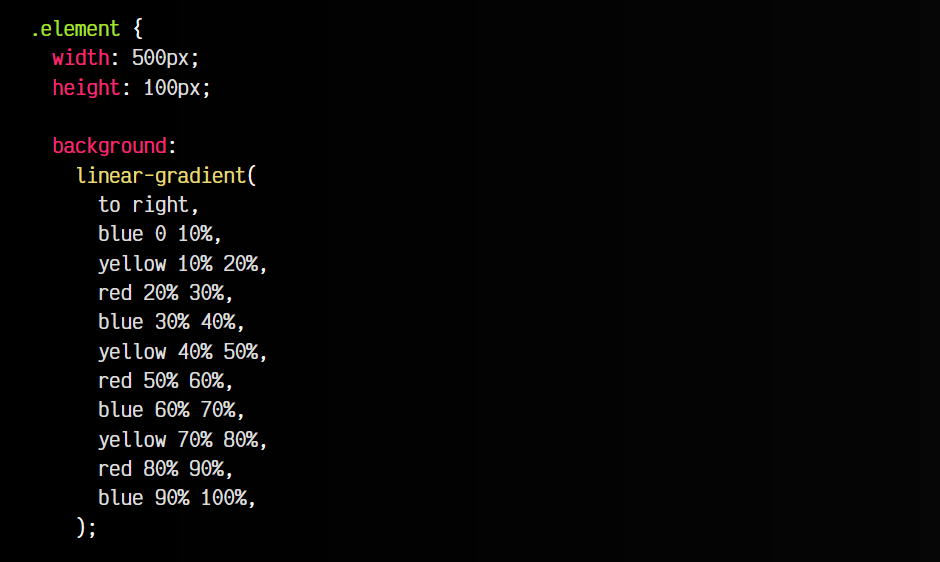
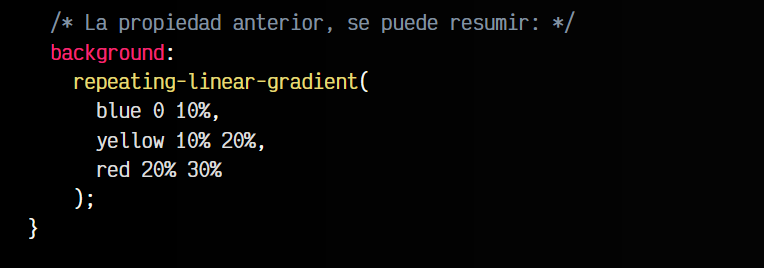

html:
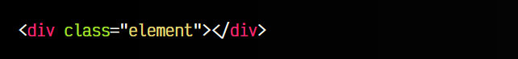

vista:
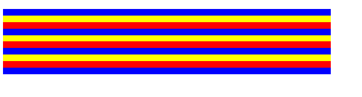

Como se puede ver, el patrón azul-amarillo-rojo se ajusta a los tamaños indicados y el navegador se encarga de repetirlos una y otra vez.