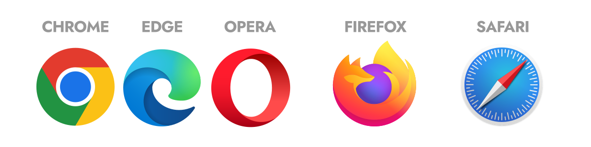
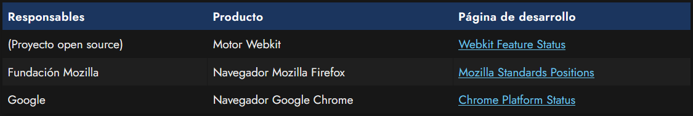
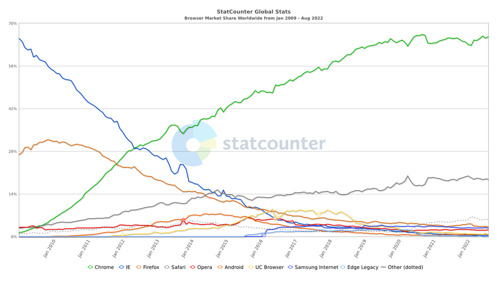
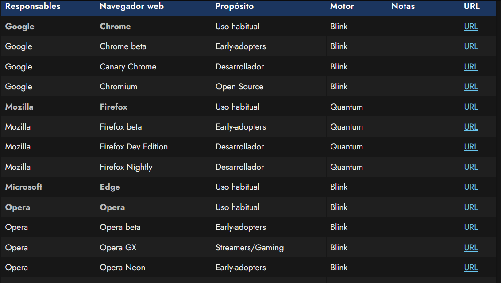
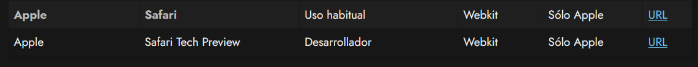
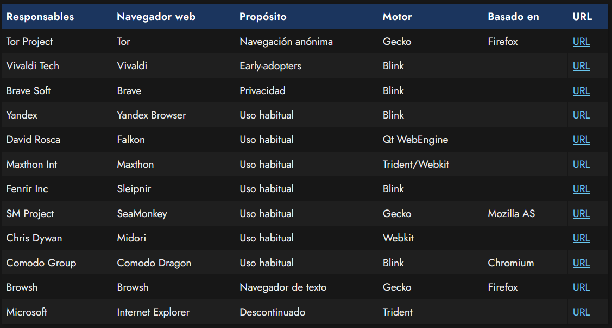
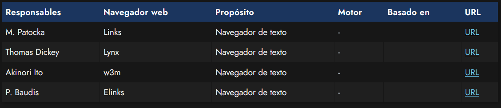

# 
Navegadores web

Los navegadores web (también llamados clientes) son esos programas que utilizamos para acceder a Internet y visualizar páginas en nuestros dispositivos. Todos los usuarios conocen al menos uno o varios navegadores web, aunque sea los más populares como Google Chrome o Mozilla Firefox. Sin embargo, existen muchos más. Para ser un buen diseñador o desarrollador web es recomendable conocer bien el ecosistema de navegadores existente y sus principales características, que no son pocas.

## Ecosistema de navegadores
En un mundo ideal, todas las páginas webs se verían correctamente y de la misma forma en todos los navegadores web disponibles, sin embargo, y una de las cosas que más llama la atención del diseño web cuando estamos empezando, es que no sólo debemos construir una web correctamente, sino que además debemos ser conscientes de los navegadores más utilizados, así como de sus carencias y virtudes.

En principio, los navegadores principales son Chrome (Google), Edge (Microsoft), Opera (Opera), que utilizan los tres el motor de Chrome, Firefox (Mozilla) que utiliza su propio motor y Safari (Apple) que utiliza su propio motor (en el que además está basado el de Google). Además, existen otros navegadores, pero hablaremos de todo esto más tarde.

En un principio, el consorcio W3C se encarga de definir unas especificaciones y «normas» de recomendación, para que posteriormente, las compañías desarrolladoras de navegadores web las sigan y puedan crear un navegador correctamente. Pero como no estamos en un mundo perfecto (y el tiempo es un recurso limitado), dichas compañías establecen prioridades, desarrollan características antes que otras, e incluso algunas características deciden no implementarlas por razones específicas o internas.

Las compañías más comprometidas con sus navegadores web, tienen a disposición de los diseñadores, programadores y entusiastas, una especie de diario cronológico, donde mencionan su hoja de ruta con las características que van implementando, descartando o sus planes de futuro, así como información adicional sobre el tema en cuestión:

También podemos ver los últimos cambios en [WebStatus](https://webstatus.dev/), una especie de resumen de novedades.

## Historia de los navegadores
Si echamos un vistazo atrás, la historia de los navegadores ha variado muchísimo. Quizás, el cambio más importante en los últimos 10 años ha sido el reemplazo de Internet Explorer, como navegador más popular, a Google Chrome. Antiguamente, Internet Explorer fue un navegador que se había estancado y no implementaba nuevas características y funcionalidades, al contrario que sus competidores. Pero además, para empeorar la situación, era el navegador más utilizado por los usuarios, debido al liderazgo de Windows como sistema operativo. Esto impedía que las nuevas tecnologías webs se adoptaran y frenaba su avance. Por suerte, esto ha ido cambiando a lo largo de los años y la situación hoy en día es bastante diferente.

A continuación se puede ver la evolución de los navegadores más populares durante esta última década (desde 2009 hasta 2016). Vemos que los navegadores más perjudicados son Internet Explorer y Mozilla Firefox, mientras que Chrome ha experimentado un incremento muy grande. Safari también ha experimentado un ligero incremento, probablemente debido al éxito de dispositivos como iPhone o iPad.

Como toda estadística, debe ser tomada con precaución porque existen sesgos en sus datos. Esta estadística ha sido extraída de [Global StatCounter](https://gs.statcounter.com/). También puedes echar un vistazo a algunas estadísticas más en [w3counter](https://www.w3counter.com/trends), aunque quizás la más interesante y adecuada sea [CanIUse: Usage table](https://caniuse.com/usage-table), donde podemos encontrar los navegadores más utilizados, separado por versiones y mostrado con porcentajes.

## Navegadores actuales
A continuación, tenemos una lista de la rama de los 5 navegadores más populares, que son aquellos que tienen una cuota de mercado considerable. Algunos de estos navegadores tienen varias versiones diferentes, como por ejemplo, versiones beta (con funcionalidades aún no existentes en la versión oficial) o versiones de desarrollador (orientadas para el uso de programadores o diseñadores).

## Versiones de los navegadores
Es también muy importante saber que la versión del navegador determina las características y funcionalidades disponibles, ya que de una versión a otra puede carecer de ciertas características que se van añadiendo poco a poco.

Existe una herramienta llamada CanIUse, a lo largo de las columnas de cada navegador, si las funcionalidades están implementadas en la versión concreta del mismo, o cuando empezarán a funcionar.

Es por tanto, lógico pensar, que si tenemos un alto porcentaje de usuarios que utilizan una versión de un navegador que no soporta la funcionalidad que queremos utilizar, haya que buscar alternativas o abstenerse a utilizarla hasta que ese porcentaje se reduzca.

Por suerte, desde hace ya bastante tiempo los navegadores han comenzado a implementar una estrategia de actualización silenciosa (en inglés: evergreen browser), con la cuál consigues que el usuario con conexión a Internet tenga siempre el navegador actualizado a su última versión. Esto es así, ya que el grueso de los usuarios no suele actualizar manualmente la versión de su navegador, y esto provocaba que existiera una gran cuota de usuarios con navegadores sin actualizar.

## Otros navegadores
A continuación, tenemos una lista de otros navegadores menores, que no superan una cuota de mercado a nivel global de un 1%, pero que pueden ser interesantes en el futuro, para casos particulares o podrían experimentar un aumento de su cuota en los próximos años:

Existen muchos más navegadores, esto sólo es una lista de los que he considerado más relevantes.

## Navegadores de texto
Los siguientes navegadores son navegadores para terminales de texto puro, útiles en determinados ámbitos o para tareas específicas, como por ejemplo, comprobar como se ve una web en dispositivos que tienen funcionalidades limitadas:

