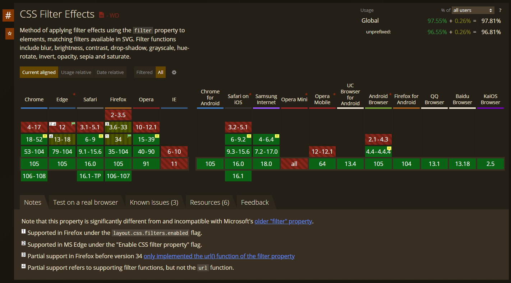
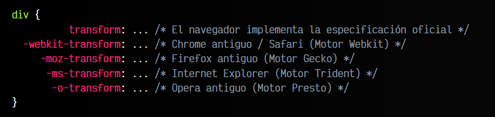
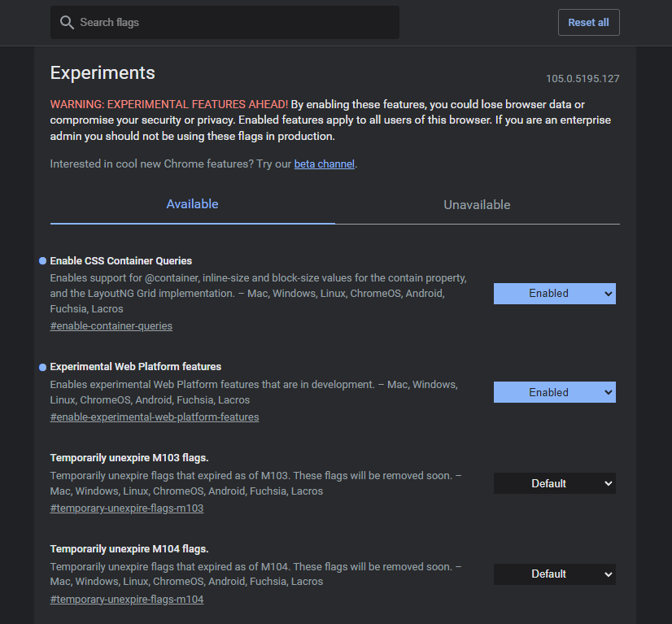

# 
Compatibilidad y soporte

Debido al ritmo y la rápida velocidad de Internet respecto a las tecnologías y los lenguajes, es muy complicado tener una lista simple de características que se encuentren implementadas en cada navegador web, algo que además puede variar incluso en cuestión de pocas semanas o meses.

Los desarrolladores necesitan tener información actualizada sobre las características disponibles en cada navegador, de modo que puedan aprovechar con exactitud esas novedades en su trabajo diario.

En este post vamos a explorar cuales son los mecanismos más interesantes para conocer el soporte de una característica determinada en un navegador concreto.

## Iniciativa Baseline
Existe una iniciativa creada por Google, Microsoft, Mozilla y Apple para simplificar la compatibilidad de características en los diferentes navegadores en el mundo del Frontend. Es posible que a partir de ahora veas estos iconos. Cada uno de ellos representa un concepto:

Iniciativa Baseline (compatibilidad en navegadores)

   - Limited: El icono amarillo representa que la característica en cuestión aún tiene soporte limitado, y en algunos navegadores podría no estar soportada o funcionar de forma incorrecta.

   - Newly: El icono azul representa que la característica está soportada en todos los navegadores, pero el soporte es relativamente reciente (se trata de una característica moderna). Se recomienda utilizar estas características si tu audiencia usa las últimas versiones de los navegadores o no es crucial dar soporte a navegadores muy antiguos.

   - Widely: El icono verde representa que se trata de una característica segura, ya que es soportada desde hace más de 2 años y medio en todos los navegadores, por lo que se puede usar con seguridad.

En este sitio web, observarás frecuentemente un widget similar al siguiente al principio de cada sección para indicar la compatibilidad de la característica de la cuál vamos a hablar:

En dicho widget puedes observar el icono baseline, el año desde el que está soportada dicha característica, el soporte en navegadores y un enlace a la especificación oficial de la característica.

Esta es la característica recomendada para dar prioridad, ya que te da información simple y suficiente para saber el estado de compatibilidad sin llegar a abrumar o complicar la información. Si necesitamos más información, podremos recurrir a alguna de las siguientes que mencionaremos.

## Herramienta CanIUse
Por muchos años, la página Can I Use es y ha sido una web colaborativa mediante la cuál se puede saber el estado actual, previo e incluso futuro de las propiedades CSS, elementos HTML, o características Javascript disponibles en cada navegador.

En esta página se puede buscar, a través de un buscador y de forma rápida y cómoda, el estado de ciertas características por parte de las diferentes versiones de los navegadores:

   - Rojo: La característica no está soportada en dicha versión.
   - Dorado: La característica no está soportada por completo (soporte parcial) en dicha versión.
   - Verde: La característica está soportada en dicha versión.
   - Guión en cuadrito amarillo: La característica se puede usar con prefijos (ver más adelante).
   - Bandera: La característica se puede activar mediante flags (ver más adelante).

Esta herramienta es una excelente forma de comprobar rápidamente el estado de ciertas características específicas en determinados navegadores.

## Prefijos CSS de navegador 
Nota: El sistema de prefijos en propiedades, aunque aún se utiliza, se ha marcado como obsoleto y terminará desapareciendo, a favor de la configuración de flags en el navegador (ver más adelante).

Algunas de las propiedades que veremos no están definidas por completo, sólo son borradores o pueden variar en la especificación definitiva, por lo que los navegadores las implementan utilizando una serie de vendor prefixes (prefijos por navegador), que facilitan la segmentación de funcionalidades.

De esta forma, podemos utilizar varios prefijos para asegurarnos que aunque dichas funcionalidades tengan un comportamiento o sintaxis diferente en cada navegador, podemos hacer referencia a cada una de ellas por separado:

En el ejemplo anterior, la propiedad transform se refiere a los navegadores que tengan implementada la especificación definitiva por completo e ignorará el resto de propiedades. Por otro lado, otro navegador (o el mismo en una versión más antigua) puede tener implementada una versión anterior a la definitiva, por lo que hará caso a las propiedades con un prefijo concreto.

En el caso de querer utilizar vendor prefixes, recomiendo encarecidamente utilizar sistemas como [Autoprefixer](https://lenguajecss.com/postcss/plugins/autoprefixer/) (plugin de PostCSS), una herramienta que añade de forma automática y transparente los prefijos, basándose en información de herramientas como [Can I Use](https://caniuse.com/). Te ahorrará mucho tiempo y te permitirá tener un código más legible y modular al no tener que repetir y mantener ese código prefijado.

## Flags de navegador 
En lugar de utilizar los prefijos a la hora de desarrollar, existe una forma denominada flags de navegador, donde en el caso de cada navegador puedes habilitar o deshabilitar opciones experimentales para probar ciertas características que aún no están terminadas, de modo que es el usuario el que decide si funcionarán o no en su navegador.

Para ello, debes acceder a la dirección about:config en el caso de Firefox, o about:flags en el caso de Chrome. Activarás una sección experimental en el navegador donde puedes habilitar o deshabilitar características especiales (y generalmente inestables) para comprobar su funcionamiento.

En este ejemplo, puedes ver como las opciones experimentales CSS Container Queries y Experimental Web Platform features están activadas en Google Chrome.

Recuerda que actualmente, los vendor prefixes mencionados anteriormente están en proceso de desaparecer. Las principales compañías de navegadores han optado por favorecer el uso de flags en el navegador del usuario para activar o desactivar opciones experimentales. Por esta razón, se aconseja utilizar vendor prefixes solo cuando necesitas soporte específico en navegadores muy antiguos.

