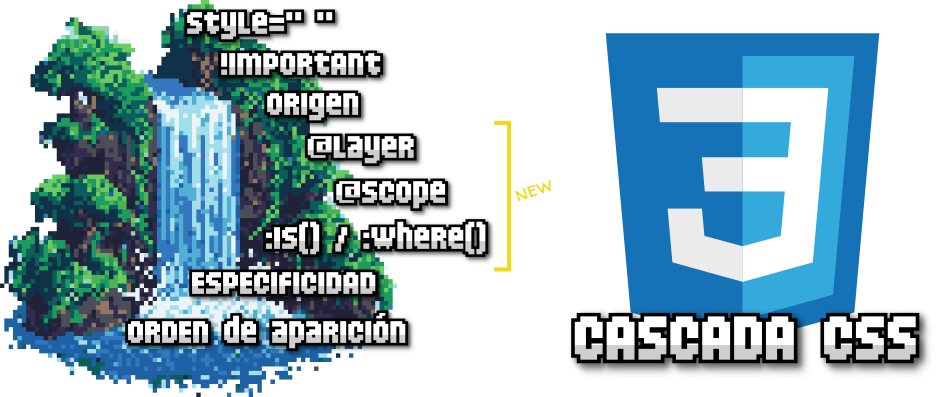
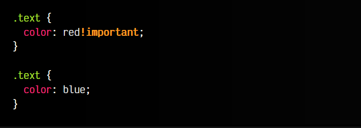
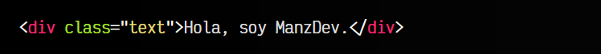
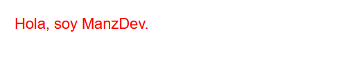
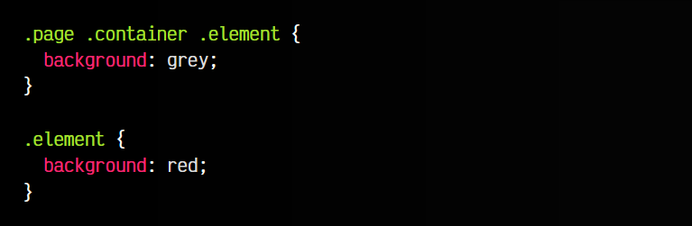

# 
Cascada en CSS

Uno de los conceptos más importantes de CSS, y a la vez, uno de los conceptos más desconocidos (o malentendidos) es el denominado concepto de la Cascada de CSS. De hecho, la cascada no es un tema poco importante, ya que es C inicial de las siglas CSS.

En algunos casos, el concepto de cascada —aunque importantísimo— puede resultar muy avanzado como para verlo en un tema de introducción. Si estás en una fase muy inicial de aprendizaje y aún no conoces bien CSS, se aconseja posponer su lectura.

## ¿Qué es la Cascada CSS?
Cuando hablamos de la Cascada CSS nos referimos al algoritmo (conjunto de reglas y normas) que tiene el navegador para aplicar estilos CSS a un elemento HTML. No es tan sencillo como la mayoría cree, ya que hay múltiples casos (¡muchísimos!) donde pueden existir ambigüedades, y el navegador debe resolverlas para saber que estilo debe aplicar primero y cuál después.

Imagina que tenemos enlazados dos archivos .css mediante una etiqueta <link> y en cada uno tenemos un mismo selector .text aplicando colores diferentes. ¿Cuál de los dos se aplicará finalmente? Quizás pienses que el último que haya sido definido. A veces, esto es cierto, pero muchas otras veces no.

La cascada comprende varios temas importantes a la hora de resolver dichos conflictos:

   - Importancia: Los estilos pueden tener mayor o menor importancia, lo que puede darles prioridad.
   - Origen: Dependiendo del origen del CSS, tendrá mayor o menor prioridad.
   - Layers, scope y :where(): Nuevos mecanismos para controlar la especificidad CSS.
   - Especificidad: Cuanto más específicos sean los selectores CSS, mayor prioridad.
   - Orden de aparición: El orden en el que aparece o se procesa el CSS influye.

Vamos a repasar cada uno de ellos para comprenderlo lo mejor posible.

## Importancia
Un detalle muy conocido de CSS es la posibillidad de añadir el texto !important al final del valor de una línea CSS, forzando al navegador a darle prioridad al estilo sobre otros. Veamos un ejemplo de como funciona:

css:

html:

vista:

Observa que, a pesar de tener definido un color blue posteriormente, el texto !important le da prioridad al anterior, dibujando el color de texto en rojo, en lugar de azul. En el caso de tener varias reglas con !important, prevalecería la que además se encuentre en último lugar.

OJO: Desgraciadamente, esta es una de las características más conocidas de CSS debido a que es una forma «cómoda» de forzar una regla CSS. Su uso no tiene porque ser una mala práctica, pero el abuso y uso indiscriminado si lo es y usar !important debería evitarse si es posible.

Existe una excepción destacable: Las transiciones CSS y las animaciones CSS tienen mayor prioridad que el resto del código CSS. De hecho, las transiciones tienen incluso más prioridad que el !important: Transiciones CSS > !important > Animaciones CSS > CSS normal.

## Origen
Un detalle poco conocido de la cascada de CSS es que hay un concepto llamado «origen CSS», que define si tendrá mayor o menor prioridad. Hay 3 tipos de orígenes, ordenados de mayor a menor importancia:

   - 1️⃣🟥 Autor: Mayor prioridad. Es el CSS que creamos los desarrolladores en una web.
   - 2️⃣🟧 Usuario: Es el CSS que puede crear el usuario del navegador. Por ejemplo, usando UserStyles.
   - 3️⃣🟨 Navegador: Es el CSS que tiene y aplica el navegador por defecto.

Por ejemplo, si escribimos un h1 en una página sin CSS, comprobaremos que tiene algunos estilos por defecto: tamaño, márgenes, etc. Lo mismo pasa con otras etiquetas como body, p, ul, etc. Esto sería CSS de origen de navegador, y muchos usuarios utilizan un reset para modificarlos.

Existe una casuística algo extraña, y es que en el caso de que una propiedad CSS de cada origen tuviera definido un !important, el orden de importancia anterior se invertiría, resultando que el CSS del navegador tendría prioridad sobre el CSS de usuario y de autor.

## Capas, scope y :where
Si vienes de un CSS más tradicional, de hace algunos años, este bloque (marcado en amarillo en la imagen superior) es un bloque de nuevas características de CSS que permiten gestionar mejor la cascada:

   - 1️⃣ Capas: La regla @layer nos permite crear capas (como las de Photoshop) para aislar los estilos en diferentes capas y no tener problemas de especificidad CSS.

   - 2️⃣ Limitar scope: La regla @scope es un nuevo mecanismo que nos permite limitar desde y hasta donde se aplicará el estilo en el DOM de una página.

   - 3️⃣ Reducir especificidad: El combinador :where() nos permite escribir CSS con una especificidad muy baja, ideal para casos en los que sabemos que posteriormente necesitaremos sobreescribirla.
  
Estos nuevos mecanismos se recomienda leerlos por separado un poco más adelante, ya que son algo avanzados y no son absolutamente necesarios al principio. Ten en cuenta que son muy potentes si ya llevas tiempo trabajando con CSS.

## Especificidad CSS
La especificidad es una de las partes más importantes de la Cascada de CSS, ya que es el resultado del algoritmo del navegador para saber que estilos debe renderizar y cuales no.

A muy grandes rasgos, cuando nosotros utilizamos un selector CSS muy específico, este tiene preferencia sobre un selector CSS menos específico:

En este sencillo ejemplo, ambos selectores terminan en .element, por lo tanto se le va a dar estilo al mismo elemento. Sin embargo, entran en conflicto porque es la misma propiedad background la que van a modificar. La forma de resolver esto por parte del navegador es detectar que selector es más específico, y en nuestro caso, el primero es mucho más específico.

Sin embargo, no es una buena práctica hacer selectores muy específicos, y la forma en que lo calcula el navegador puede no llegar a ser intuitiva, por lo que aconsejo echar un vistazo al artículo donde profundizamos en ello:

► Aprender más sobre [Especificidad CSS](https://lenguajecss.com/css/cascada-css/especificidad-css/)

## Orden de aparición
Por último, una parte que si suele ser intuitiva es el orden de aparición. Hay múltiples formas de añadir CSS a un documento HTML, por lo que cada una de ellas tiene mayor o menor prioridad:

   - 1️⃣🟥 Atributo style en una etiqueta HTML. Mayor prioridad.
   - 2️⃣🟧 Bloque de estilos style en el documento HTML.
   - 3️⃣🟨 Archivo .css externo referenciado mediante link rel="stylesheet". Menor prioridad.

No obstante, hay varios matices y detalles importantes a tener en cuenta, así que si quieres profundizar, te aconsejo echar un vistazo al artículo donde profundizamos en este tema:

► Aprender más sobre [Orden CSS](https://lenguajecss.com/css/cascada-css/orden-css/)

