# 
Herencia en CSS

Hay ciertos detalles que hay que tener claros antes de empezar a profundizar en CSS. El concepto de cascada y el de herencia son dos de las características CSS más infravaloradas y que más problemas suelen producir, ya que sin lugar a dudas son los que menos se conocen y los que mayor frustración acarrean porque se utilizan indebidamente.

## ¿Qué es la herencia en CSS?
Antes de empezar, debemos saber que algunas propiedades CSS, como color o font-family, se heredan desde los elementos HTML padres a los elementos HTML hijos, modificando el valor que tienen por defecto.

Observa el siguiente ejemplo, donde aplicamos un color verde al texto del elemento con la clase .container (elemento padre):

css:
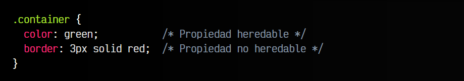

html:
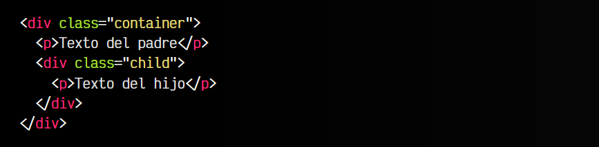

vista:
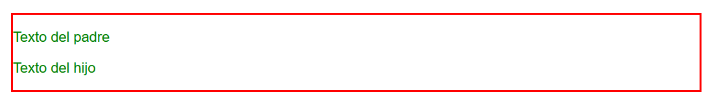

Si observas el resultado y el código HTML, verás que tanto el texto de .container (padre) como el texto de .child (hijo) aparecerán de color verde. Esto en cierta forma debería resultarnos lógico, ya que el elemento .child se encuentra en el interior de .container, y no hay ninguna otra regla que le dé color de texto a ese elemento interior.

Sin embargo, con el borde rojo sólo se aplica borde al .container. El elemento .child (su hijo) no se ve afectado. Esto ocurre porque algunas propiedades como color o font-family se heredan en los hijos, mientras que otras propiedades como border, no.

Si la propiedad border aplicara herencia a sus hijos, todos los elementos HTML situados en el interior de .container tendrían su propio borde rojo, comportamiento que no suele ser el deseado. La herencia sólo ocurre con algunas propiedades donde suele ser deseable.

## Forzar herencia en propiedades
Sin embargo, podemos forzar la herencia de forma manual, utilizando ciertos valores especiales que están disponibles en todas las propiedades CSS existentes:

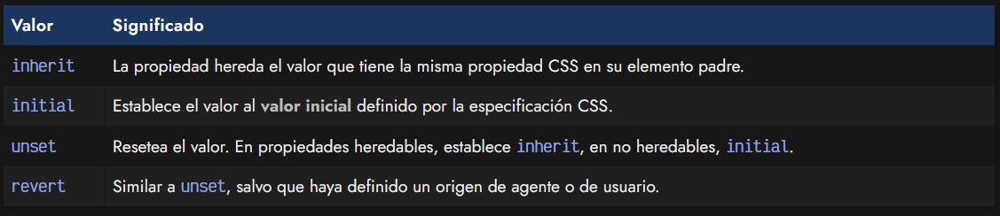

Veamos un ejemplo de cada una de ellas por separado.

## El valor inherit
Siguiendo el mismo ejemplo anterior, vamos a modificar el CSS de modo que el elemento hijo utilice un borde con el valor inherit, es decir, que herede el valor de la propiedad del mismo tipo de su padre:

css:
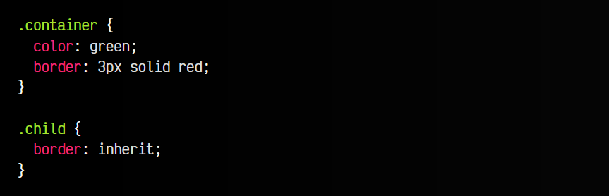

html:
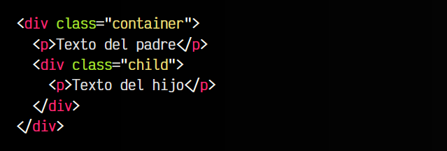

vista:
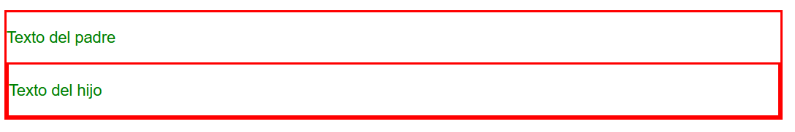

Al utilizar el valor inherit, la propiedad border del elemento hijo hereda el valor de la propiedad border de su elemento padre, pasando a tener un borde propio, al igual que su elemento padre.

## El valor initial
Veamos ahora el mismo ejemplo, pero utilizando la propiedad color, que al contrario que border, se trata de una propiedad heredable:

css:
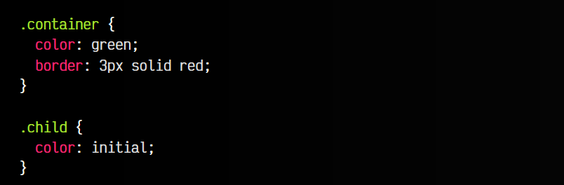

html:
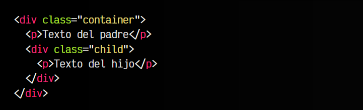

vista:
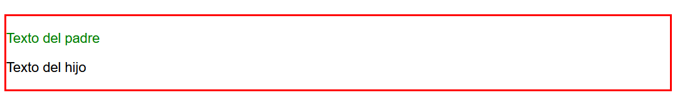

Por defecto, .child muestra el mismo color de texto que el elemento padre, ya que hereda su valor de color. Sin embargo, si utilizamos el valor initial en la propiedad color, se pasa a utilizar un color negro para el texto, ya que es el valor inicial por defecto que le establece el navegador.

## La propiedad all
Existe una propiedad CSS denominada all que sirve para resetear todas las propiedades establecidas del selector en cuestión. Por ejemplo, imaginemos un div con clase element. Este elemento, por defecto, es «invisible»: no tiene tamaño de alto, no tiene color de fondo y no tiene borde. Le establecemos unas dimensiones, un color de fondo y un borde:

css:
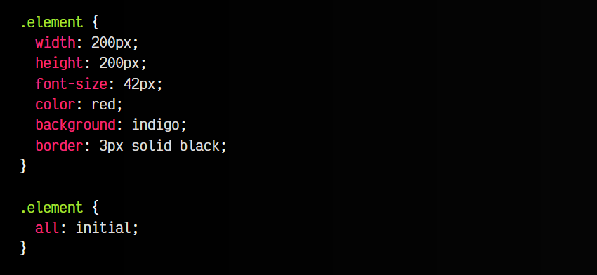

html:

vista:

Si utilizamos la propiedad all con alguno de los valores que explicamos en el apartado anterior, el navegador reseteará todas las propiedades CSS a sus valores por defecto.

Recuerda que la propiedad all no reseteará las propiedades CSS direction, unicode-bidi ni las variables CSS establecidas.