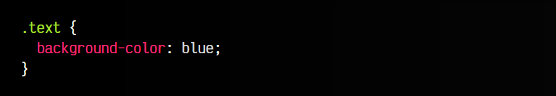
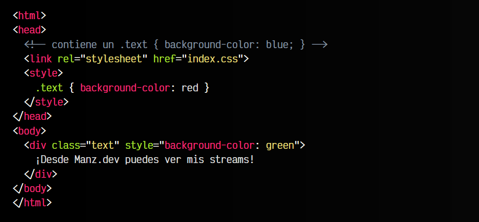
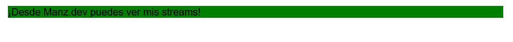
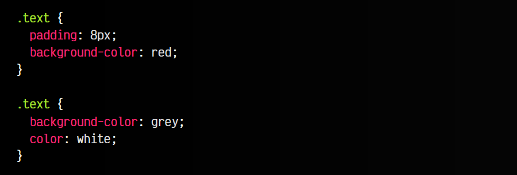
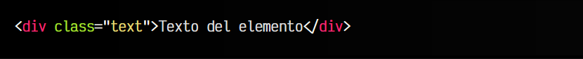
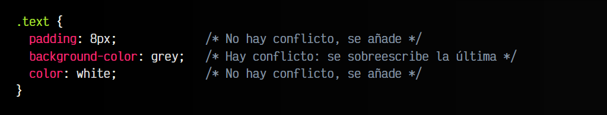
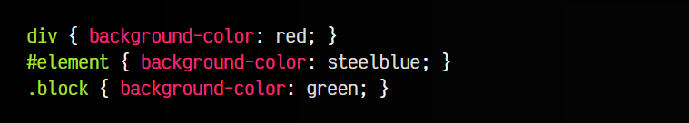
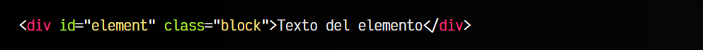
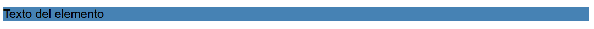

# 
Orden CSS

Probablemente conozcas varias formas de añadir código CSS a una página web. Por si no es así, puedes refrescarlas en el tema introductorio Cómo enlazar CSS desde HTML, donde vimos que es posible aplicar estilos CSS a un documento de tres formas diferentes:

   - 1️⃣ Atributo style en una etiqueta HTML.
   - 2️⃣ Bloque de estilos style en el documento HTML.
   - 3️⃣ Archivo .css externo referenciado mediante link rel="stylesheet".

En principio, si utilizaramos sólo una de ellas, no habría problema. Pero... ¿Qué ocurre si utilizamos varias y hay conflicto? ¿Y si cambiamos el orden? ¿Qué propiedad tendría prioridad sobre la otra? Vamos a analizar estos casos y entender como funciona.

## Conflictos de nombres CSS
Solemos decir que hay un conflicto o una colisión de nombres CSS cuando tenemos varios fragmentos CSS que le dan diferentes estilos a un mismo elemento. El navegador debe resolver ese conflicto de alguna forma, ya que no puede aplicar, por ejemplo, dos colores diferentes a un mismo elemento. Uno de los dos debe predominar sobre el otro.

Vamos a imaginar que tenemos diferentes lugares del código donde le damos un color de fondo a un bloque con clase .text:

## Prioridad: De diferentes vías
Veamos el siguiente ejemplo. En él, podrás ver que se aplican al mismo selector .text tres colores diferentes: azul en el link, rojo en el style y verdeen la propia etiqueta HTML mediante estilos en línea:

html:

vista:

En este caso, tendría prioridad el estilo definido en la propia etiqueta HTML, ya que el orden de prioridad es el siguiente (de mayor a menor):

   - 1️⃣🟥 El atributo style="" del HTML.
   - 2️⃣🟧 Bloque de estilos style en el HTML.
   - 3️⃣🟨 Archivo .css externo vía link rel="stylesheet".

Lo habitual suele ser escribir los estilos en una hoja de estilos externa (recomendable, más fácil de mantener y más organizado) de modo que tendría la menor prioridad. Si en algún caso necesitamos añadir CSS con mayor prioridad, lo haríamos en un bloque style o en un estilo en línea.

## Orden: De fuentes del mismo tipo
Supongamos ahora que nos encontramos en una misma hoja de estilos, donde aplicamos estilos nuevamente a exactamente el mismo selector. Utilizamos la propiedad background-color pero con diferente valor en cada coincidencia. Algo similar a lo siguiente:

css:

html:

vista:

La pregunta sería: ¿Cuál de las dos propiedades background-color prevalece? Se refieren al mismo elemento y están en el mismo lugar. La respuesta es muy fácil: Prevalece siempre la última regla definida.

El resultado final interpretado por el navegador (valor computado) sería el siguiente:

## Especificidad: De diferente tipo
Sin embargo, puede ocurrir que en determinados casos no esté tan claro cuál es el estilo que debería sobreescribir a los anteriores. Ahí es cuando entra en juego el concepto de Especificidad CSS que mencionamos anteriormente, y en el que profundizaremos más adelante.

Este concepto es el que se encarga de eliminar la ambigüedad determinando cuál es el grupo más específico y el que debería prevalecer sobre el resto. Para entenderlo, veamos un ejemplo explicado. Supongamos un caso donde tenemos un mismo elemento div con un id y una clase:

css:

html:

vista:

Si nos fijamos en el HTML, nuestro único div encaja con los tres selectores del CSS:

   - 1️⃣ Es un div por lo que se le aplica el color rojo.
   - 2️⃣ Tiene el id con valor element, por lo que se le aplica el color azul.
   - 3️⃣ Tiene la clase con valor block, por lo que se le aplica el color verde.

Aunque puede que lo que nos resulte más natural es pensar que el estilo vencedor es el último definido, en este caso no ocurre así.

El navegador analiza lo específico que es el elemento, para descubrir cuál es el vencedor:

   - El primero tiene 0,0,1 de especificidad (es un elemento)
   - El segundo tiene 1,0,0 de especificidad (es un id)
   - El tercero tiene 0,1,0 de especificidad (es un class)

Por lo tanto, el que vence es el segundo (número más alto), ya que los id son los elementos que tienen la especificidad más alta, por lo que no necesitan ser los últimos en aparecer. Un poco más adelante, explicaremos en detalle como funciona la especificidad CSS, ya que se puede complicar mucho dependiendo del selector.

► Aprender más sobre la [Especificidad CSS](https://lenguajecss.com/css/cascada-css/especificidad-css/)

