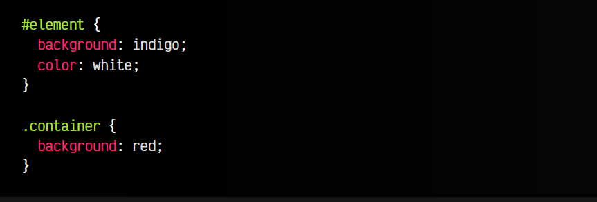
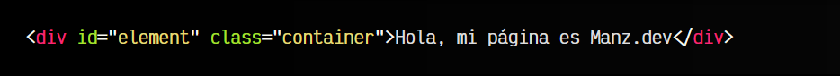
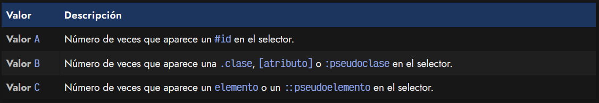
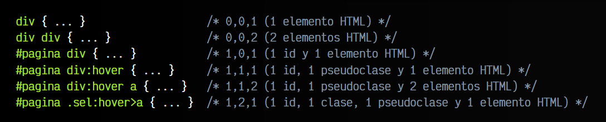
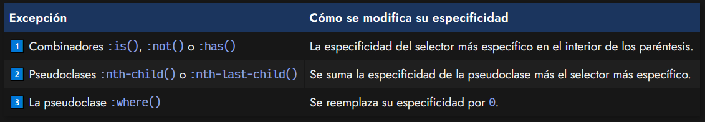

# 
Especificidad CSS

Curiosamente, la Especificidad CSS es uno de los detalles más importantes de CSS, y a la misma vez es de las cosas que, sorprendemente, mucha gente desconoce, aún cuando debería ser esencial conocerlo.

La Especificidad CSS es el nombre que recibe un mecanismo del navegador que se encarga de, en el caso de que exista ambigüedad y hayan varios bloques de estilos compitiendo uno contra otro para dar estilo a un mismo elemento, resolver dicha ambigüedad y decidir cuál es el grupo de estilos «vencedor».

Para ello, el navegador analizar los selectores y le otorga un valor numérico. El selector que tenga el valor numérico más alto, es el que finalmente aplicará sus estilos.

En muchas ocasiones, los desarrolladores piensan que CSS funciona de una forma similar a un lenguaje de programación como Javascript, y que simplemente los estilos vencedores son los que se escriben más abajo en el CSS. No siempre ocurre esto, por eso es importante conocer la Especificidad CSS.

## Conflictos de especificidad CSS
Para entenderlo, vamos a ver un ejemplo donde habría un conflicto de especificidad CSS. Observa el siguiente fragmento de código e imaginemos lo que haría el navegador. Recalcar que el mismo elemento HTML tiene tanto id como clase:

css:

html:

vista:

En este caso, tenemos un conflicto, ya que existe ambigüedad. Ambos bloques están seleccionando el mismo elemento y están compitiendo para la propiedad CSS background. Como se puede ver en la demo, el vencedor es el selector #element. Sin embargo, muchas personas piensan que, como se seleccionan ambos, vence el que está más abajo porque sobreescribe el anterior. Esto es erróneo.

## ¿Cómo se calcula la Especificidad?
El navegador tiene un sistema llamado Especificidad CSS, donde en situaciones de conflicto como la anterior, calculará que selector es más específico, siguiendo unas ciertas normas, y obtienendo como resultado un valor numérico.

Dicho valor numérico se suele representar con 3 cifras, separadas por comas: A,B,C:

Teniendo en cuenta esto, veamos algunos ejemplos con diferentes selectores CSS y calculemos su cifra de especificidad CSS. Recuerda que cuanto más alta sea, más específico es el selector y mayor prioridad de que gane sobre otros selectores en conflicto:

Estos cálculos no hace falta hacerlos a mano o mentalmente, existen calculadoras de especificidad que pueden darte el valor por si tienes curiosidad por saber cuál tiene mayor o menor especificidad. De hecho, las DevTools del navegador, también suelen mostrar la especificidad si mueves el ratón sobre el selector.

Tienes dos excelentes calculadoras de especificidad en [Calculadora de Keegan](https://specificity.keegan.st/) y en [Calculadora de Polypane](https://polypane.app/css-specificity-calculator/) donde podrás calcular la especificidad de un selector CSS rápida y cómodamente.

## Excepciones de Especificidad CSS
Recuerda también que hay ciertas excepciones a la hora de calcular la especificidad (puedes comprobarlo en las calculadoras):

Recuerda que hay varios mecanismos para controlar la cascada de CSS. Puedes echar un vistazo a todos ellos en el post sobre [la cascada de CSS.](https://lenguajecss.com/css/cascada-css/que-es-cascada/)

