# 
La regla @layer

La regla @layer de CSS, permite declarar una capa de cascada. Estas capas son muy similares y funcionan de forma muy parecida a las capas de cualquier editor gráfico. Permiten agrupar código CSS en el interior de una capa, y finalmente, fusionarlo todo manteniendo el orden especificado, algo que puede hacer mucho más fácil el organizar CSS, sobretodo de cara a la especificidad.

Veamos un ejemplo de la sintaxis de la regla @layer:

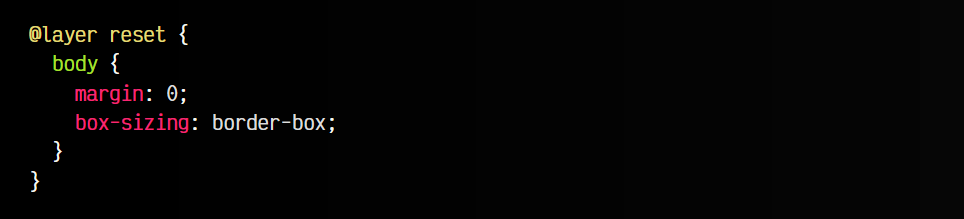

En este caso, estamos creando una capa reset que va a incluir código CSS que normalmente hace un reseteo en ciertas propiedades sobre la forma que funciona un navegador. El nombre reset lo establece el desarrollador, y puede ser cualquier otro nombre que desee. Esto significa que, a partir de ahora, existirá una capa reset que incluye los estilos indicados en el interior de dicha regla.

Pero, aparte de la creación de una capa, ¿cuál es su finalidad? ¿Para qué necesitamos las capas? Básicamente para poder reordenarlas y evitar problemas de especificidad que pueden aparecer a la larga. Lo iremos explicando a lo largo del artículo.

Ten en cuenta que esta característica aún es experimental y puede no estar soportada en algunos navegadores.

## Crear capas en CSS
rimero, vamos a conocer las múltiples formas de crear capas en CSS utilizando la regla @layer, o incluso utilizando la regla @import. Veamos que sintaxis tenemos disponibles:

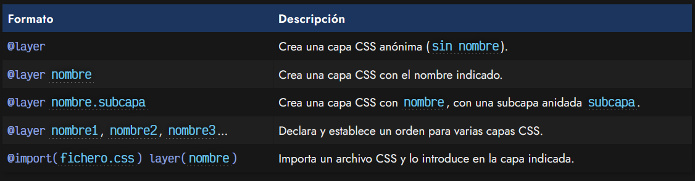

Utilizando la regla @layer podemos crear una capa CSS con un nombre determinado:

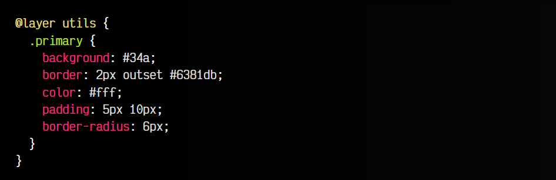

Al crear capas, de forma implícita estamos indicando el orden de las capas (orden en el que han sido definidas). Esto es una parte muy importante de la creación de capas en CSS, ya que determina el orden en el que se van a evaluar. Sin embargo, veremos más adelante que ese orden puede modificarse.

## Capas anónimas
Si en lugar de escribir el nombre de la capa (utils en nuestro ejemplo) no escribimos nada, estamos creando una capa anónima sin nombre, que es lo mismo que ocurre si colocamos CSS sin ninguna capa, al final se creará una capa anónima donde se incluirá ese código CSS.

La sintaxis explícita sería la siguiente:

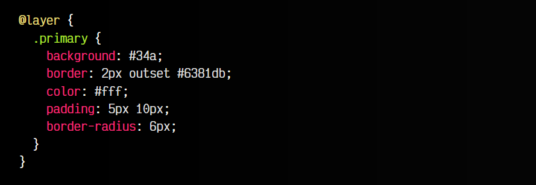

Ten en cuenta que en el siguiente apartado veremos que existen formas de hacer referencia a capas para reordenarlas o añadir más contenido en dicha capa.

En el caso de crear capas anónimas, no existe ninguna forma de hacer referencia a ellas posteriormente para añadir más código CSS o reordenarlas. Recuerda que si creamos múltiples capas anónimas como en el ejemplo anterior, el navegador creará múltiples capas anónimas diferentes.

## Orden de las capas
Podemos cambiar el orden de las capas, si establecemos una regla @layer con las diferentes capas separadas por coma. Hay que asegurarse que esto ocurre antes de la creación de las capas, ya que una vez están declaradas, no se puede cambiar su orden:

css:
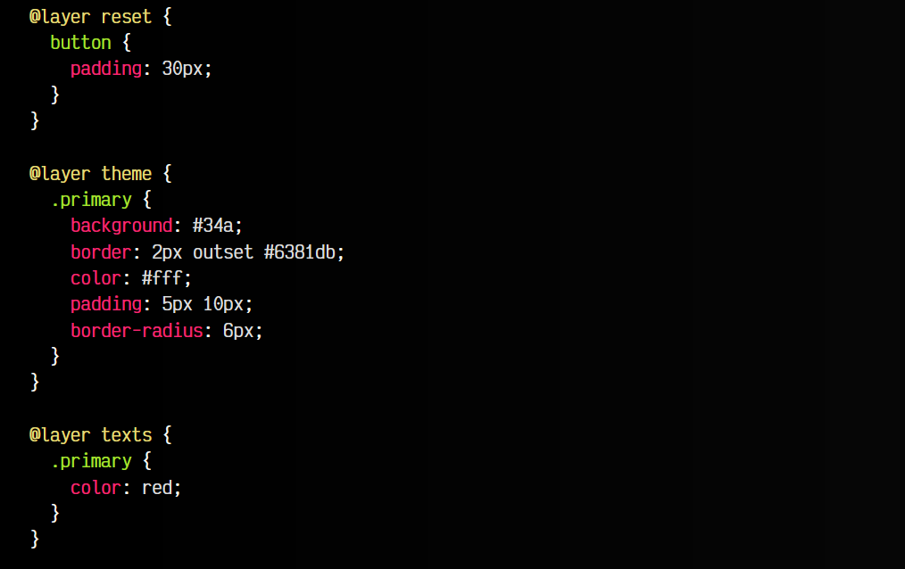

html:
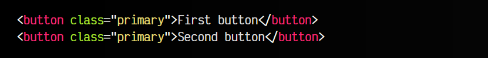

vista:
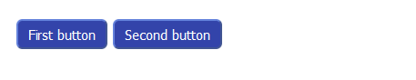

Si en el caso anterior, no definimos la primera línea, el orden de las capas sería reset, theme, texts, sin embargo, al haberlo definido, el orden de las capas del ejemplo anterior se establece en reset, texts, theme. Observa que la diferencia aparente es que el texto de los botones aparecen en color rojo. Para ello, hay que comprender como funciona la especificidad de CSS.

Este ejemplo es muy sencillo, y simplemente, con la primera regla @layer cambiamos el orden en el que se procesan las capas, consiguiendo darle prioridad a la capa theme porque está en último lugar, sobreescribiendo los estilos del color de texto de la capa texts.

En el caso de indicar múltiples veces una misma capa, el navegador fusionará los estilos en la misma capa. Esto permitirá que en algunos casos podamos añadir más estilos a una capa ya definida. Imagina que añadimos el siguiente código CSS al ejemplo anterior:

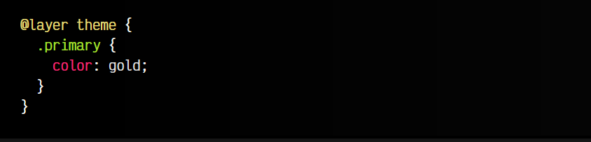

Observa que en este caso, el color de texto del botón será gold.

Ten en cuenta que cualquier estilo declarado sin capa, independientemente del orden de aparición, se agrupará en una capa anónima y se aplicará siempre al final del resto de capas declaradas.

## La especificidad en capas CSS
Observa el siguiente ejemplo. En él, encontrarás tres grupos de código CSS donde se utiliza el selector. En estos bloques de código no suele haber dudas, ya que al ser el mismo selector, se aplica el orden y la herencia, y simplemente se fusionan los estilos, sobreescribiendo el último a los anteriores de coincidir las propiedades:

css:
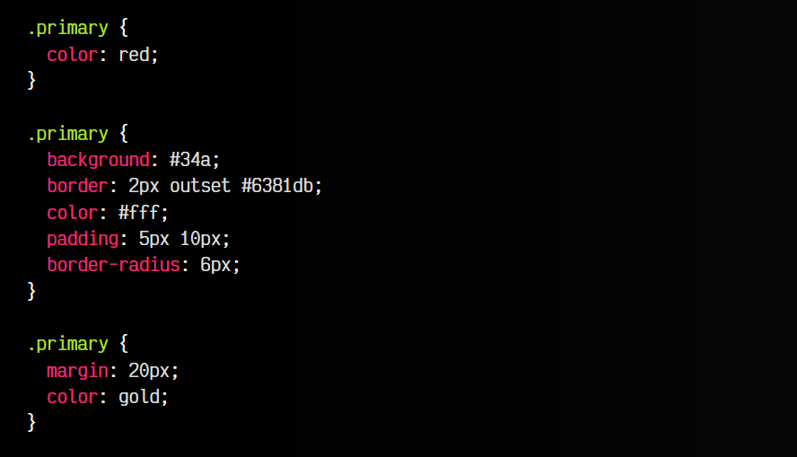

html:
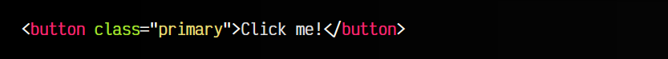

vista:

Sin embargo, modifiquemos las clases para hacer más específicos los selectores. En cada grupo seleccionamos el mismo elemento pero con diferente especificidad:

  - Primer grupo: Botones button que tienen un atributo class y clase primary (especificidad 021)
   - Segundo grupo: Botones button que tienen clase primary. (especificidad 011)
   - Tercer grupo: Botones que tienen clase primary. (especificidad 010)

Al contrario que muchos desarrolladores piensan, en CSS no se fusionan los estilos al ser (al fin y al cabo) el mismo elemento, sino que los selectores más especificos son los que tendrán prioridad, independientemente del orden:

css:
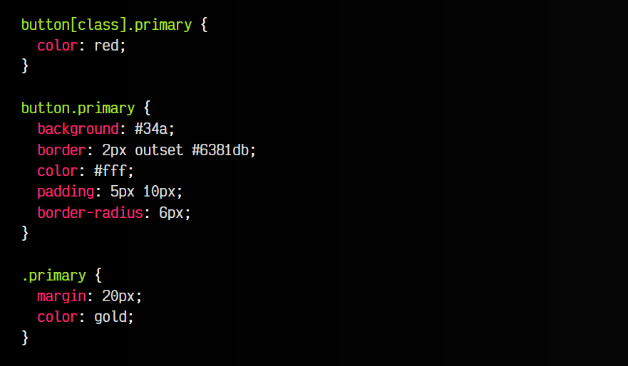

html:
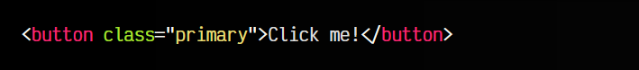

vista:

En este caso, se aplicará primero el último grupo (al ser el menos especifico), luego se aplicarán los estilos del segundo grupo, sobreescribiendo el color blanco por el color dorado. Por último, el primer bloque sobreescribirá con el color rojo.

Modifiquemos un poco el ejemplo anterior, y vamos a añadir el primer grupo en una capa llamada texts:

css:
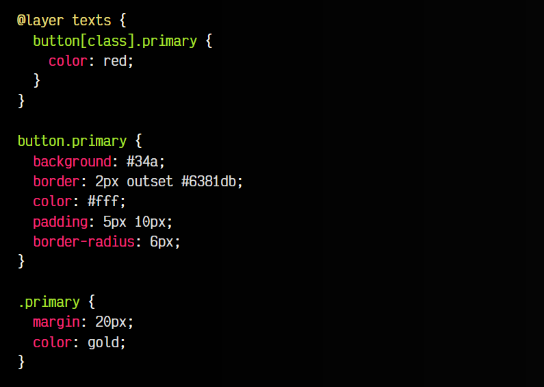

html:
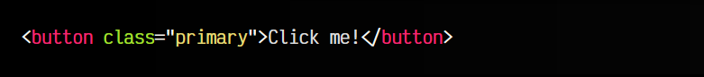

vista:

Ahora, observa que la capa texts creada será la primera en procesarse por el navegador. Lo primero que hará es agrupar todos los estilos en dicha capa, calcular sus especificidades y aplicarlas. Luego, buscará si existen otras capas diferentes para procesarlas. Si no existen más, agrupará el resto de los estilos fuera de capas en una capa anónima y los aplicará después de los anteriores.

De esta forma, hemos cambiado el comportamiento que explicamos al principio por algo que, unido a la posibilidad de agrupar en diferentes capas y ordenar mediante la regla @layer se convierte en un recurso muy potente para organizar código por parte de los desarrolladores.

## Capas CSS anidadas
Dentro de las capas de CSS, también es posible crear capas dentro de otras. Para ello, solo tenemos que utilizar la regla @layer dentro de otra regla @layer, como se puede ver a continuación:

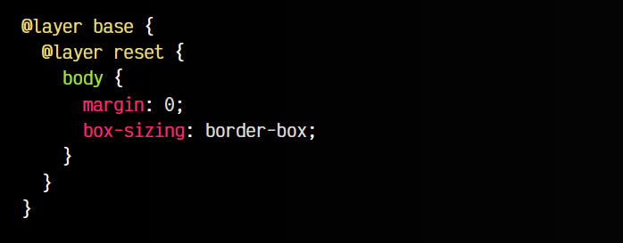

Ten en cuenta que también puedes usar una sintaxis rápida separando los nombres de la capa con puntos. El ejemplo anterior podría definirse también de la siguiente forma:

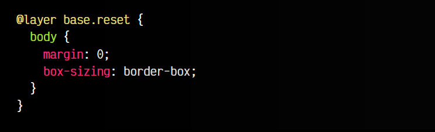

## Importar CSS en una capa
Si ya conocemos la regla @import, sabremos que es posible utilizarla para importar código CSS de ficheros externos e incorporarlo a nuestra página. Sin embargo, existe una forma de hacerlo añadiéndolo a una capa CSS específica, utilizando la palabra clave layer tras la importación:

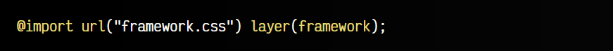

Esto permitirá que incluso código externo que tengamos separados en diferentes archivos, se pueda colocar directamente en una capa.