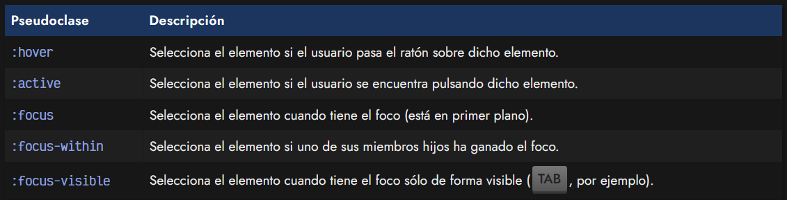
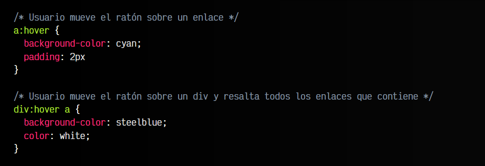
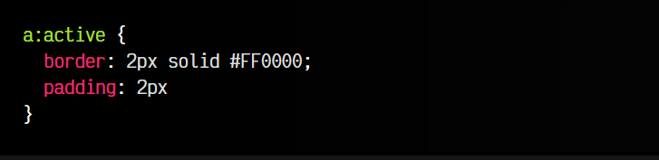
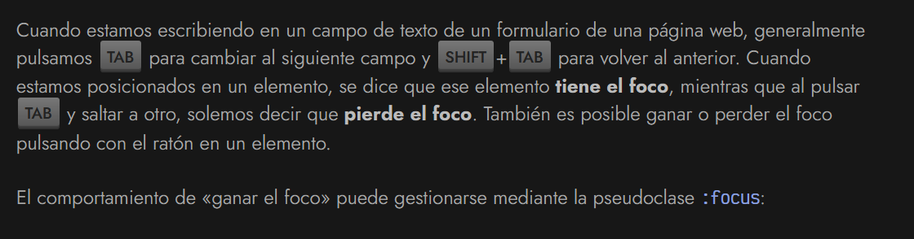
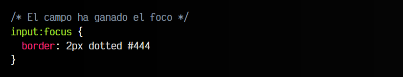
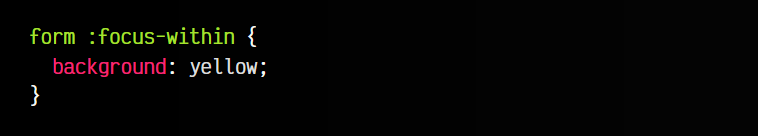
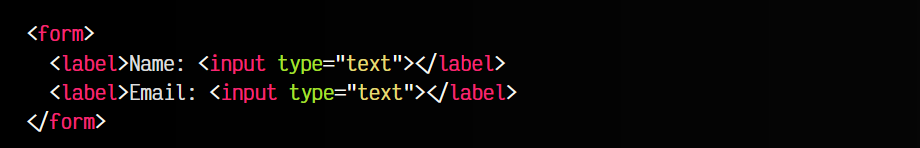
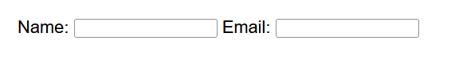
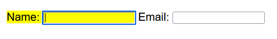
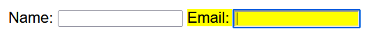

# 
Pseudoclases de interacción

Las pseudoclases de interacción se pueden utilizar en cualquier elemento, aunque lo más frecuente es usarlo en elementos interactivos como enlaces, botones o similares, y pueden seleccionar elementos cuando ocurre una cierta interacción por parte del usuario en ellos. ¿Qué tipo de interacción es esa? Pueden ser varias:

## La pseudoclase :hover
La primera de ellas, :hover, es muy útil e interesante, ya que permite aplicar estilos a un elemento justo cuando el usuario pasa el ratón (o más concretamente, un dispositivo apuntador) sobre él. Es una de las pseudoclases más utilizadas:

Observese que podemos realizar acciones un poco más específicas, como el segundo ejemplo anterior, donde al movernos sobre un elemento div (div:hover), aplicaremos los estilos a los enlaces (a) que están dentro del mencionado div.

## La pseudoclase :active
Por otro lado, la segunda pseudoclase, :active, permite resaltar los elementos que se encuentran activos, o lo que es lo mismo, elementos que están siendo pulsados en ese instante con el ratón por el usuario:

Es importante destacar que esta pseudoclase no puede encargarse de detectar pulsación con persistencia, es decir, no guarda el estado de «ha sido pulsado», sino que sólo es capaz de detectar este comportamiento en el momento justo de ser pulsado. Si necesitamos persistencia, tendríamos que hacer uso de Javascript.

Nota: Aunque estas pseudoclases se inventaron para interactuar con un ratón en un sistema de escritorio, pueden llegar a funcionar en dispositivos táctiles. Aún así, ten en cuenta que el :hover no tiene demasiado sentido en el contexto de dispositivos móviles, ya que un usuario no navega por móvil arrastrando el dedo por la pantalla continuamente.

## La pseudoclase :focus

Estas pseudoclases suelen utilizarse con elementos de formularios como "input", "textarea" o similares, pero también pueden utilizarse con otros elementos, como por ejemplo enlaces "a". Esta es una excelente oportunidad para personalizar el estilo de los campos de texto de un formulario ("input" y "textarea") para que cambien cuando el usuario escribe y se mueve por ellos.

La pseudoclase :focus tiene dos variaciones concretas, las explicaremos a continuación.

## La pseudoclase :focus-within
La pseudoclase :focus-within permite darle estilo no sólo al elemento que tiene el foco, sino también a los elementos contenedores relacionados con el elemento que gana el foco. En este ejemplo, :focus-within permite que cuando uno de los campos "input" del formulario gane el foco, podamos iluminar también el elemento label, que es su contenedor:

css:

html:

vista:

## La pseudoclase :focus-visible
En el caso de la pseudoclase :focus-visible es prácticamente idéntico a :focus, solo que podemos aplicar estilos al elemento que gana el foco, pero sólo cuando se ha ganado el foco exclusivamente de forma visible, como por ejemplo, pulsando la tecla TAB y accediendo al elemento. Esto puede resultar muy útil cuando quieres que el foco coincida con un tema visual para la página.

