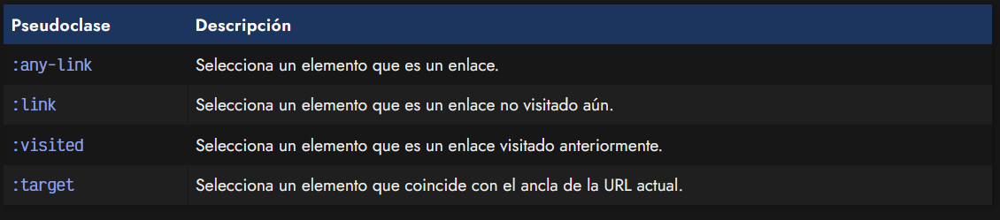
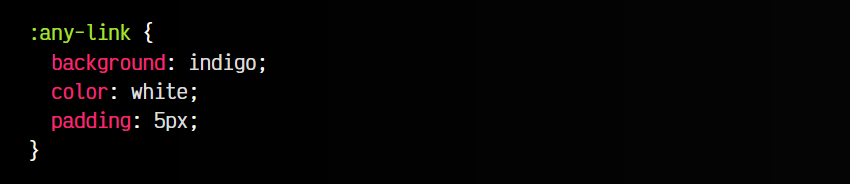
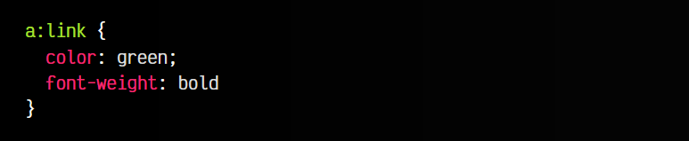
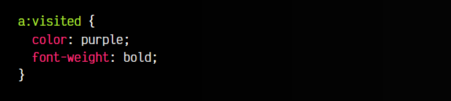
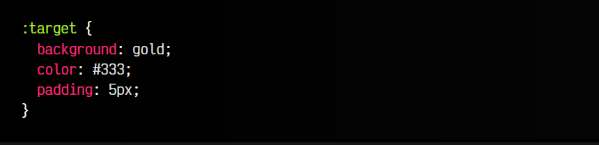

# 
Pseudoclases de ubicación

Existen algunas pseudoclases orientadas a los enlaces o hipervínculos. En este caso, permiten cambiar los estilos dependiendo del comportamiento del enlace. Entre ellas, se encuentran las siguientes:

## La pseudoclase :any-link
Con la pseudoclase :any-link se puede hacer referencia, como dice su nombre, a elementos que sean cualquier tipo de enlaces. En este caso, y si no se delimitan de alguna forma, incluye etiquetas "a" y "area", ya que ambas se consideran enlaces.

## La pseudoclase :link
Por otro lado, la pseudoclase :link permite seleccionar enlaces a páginas que aún no han sido visitadas por el navegador del usuario, lo que puede ser interesante para personalizar el color de este tipo de enlaces. Por defecto, estos enlaces sin visitar suelen ser de color azul.

Veamos un ejemplo donde los cambiamos:

## La pseudoclase :visited
También tenemos la pseudoclase :visited, que se utiliza para seleccionar y dar estilo a los enlaces que hayan sido visitados previamente en el navegador del usuario. Por defecto, estos enlaces suelen ser de color violeta.

## La pseudoclase :target
Con la pseudoclase :target podemos seleccionar un elemento HTML donde su id (ancla) coincida con el ancla que tenemos actualmente en la URL de navegación. Es decir, si en nuestra URL tenemos el ancla #section1, entonces se seleccionará el elemento con id="section1":

Ideal para seleccionar cabeceras de secciones a modo de ancla en un documento HTML.

