# 
Pseudoclases de estructura

Existe una amplia gama de pseudoclases que permiten seleccionar elementos de un documento HTML según su posición y/o estructura en el documento. Vamos a dividirlas en varias categorías y analizarlas detalladamente.

## Elementos raíz
Existen algunas pseudoclases con la que podemos hacer referencia al elemento padre raíz del documento donde estamos trabajando. En el caso de estar trabajando en un documento HTML, el elemento raíz es <html>, mientras que en el caso de estar trabajando en un componente, el elemento raíz es el propio componente. Las pseudoclases que podemos usar en cada caso son las siguientes:

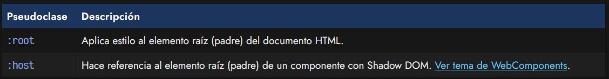

## La pseudoclase :root
La pseudoclase :root hace referencia al elemento raíz del documento HTML, o lo que es lo mismo, la etiqueta <html>. Sin embargo, en muchas ocasiones veremos que en lugar de utilizar directamente la etiqueta, se utiliza la pseudoclase :root. Al ser una pseudoclase, tiene una especificidad CSS más alta (0,1,0) que el elemento html, el cuál, al ser una etiqueta HTML, tiene una especificidad más baja (0,0,1):

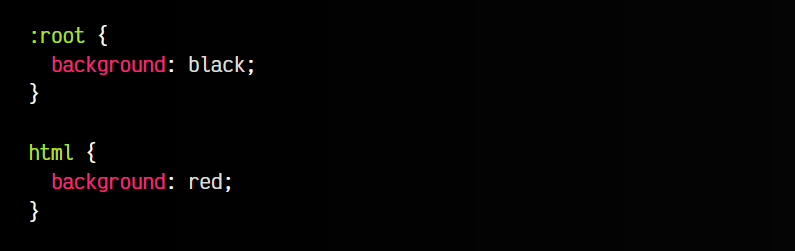

En ambos casos, estamos dando un color de fondo al elemento <html>, sin embargo, si especificamos ambos, la pseudoclase :root sale vencedora, y sobreescribe el color de fondo indicado en html.

Aunque no es estrictamente necesario, generalmente, la pseudoclase :root suele utilizarse para establecer [variables CSS](https://lenguajecss.com/css/cascada-css/css-custom-properties/) «globales» que afectan a todo el documento HTML.

## El primer y último hijo
A continuación muestro un pequeño resumen de estas pseudoclases:

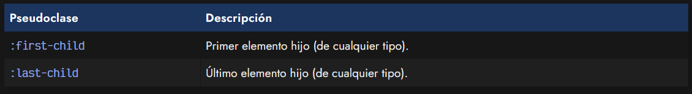

Para ello, volveremos a utilizar una estructura en forma de árbol para ver cómodamente la ubicación de cada uno de los elementos.

## La pseudoclase :first-child
Con la pseudoclase :first-child podemos seleccionar el primer elemento (o primeros elementos) de un grupo de elementos al mismo nivel. De esta forma, si indicamos .container :first-child buscará todos los primeros elementos que encuentre:

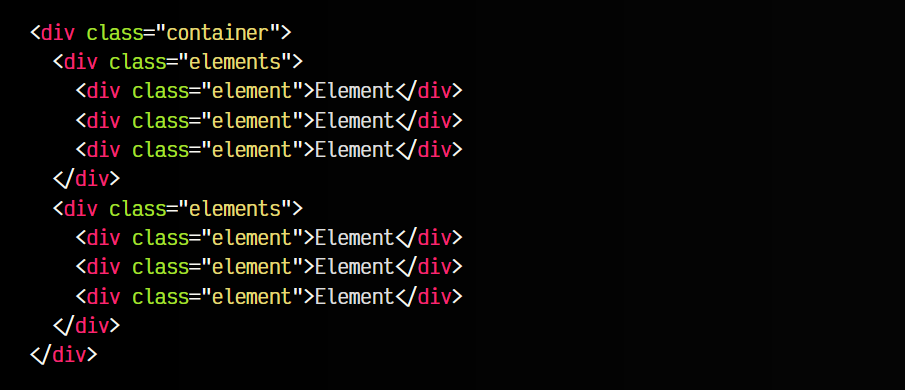

En este ejemplo, se seleccionarían 3 elementos:

   - El primer 
 con clase .elements.
   - El primer 
 con clase .element dentro del primer .elements.
   - El primer 
 con clase .element dentro del segundo .elements.

## La pseudoclase :last-child
De la misma forma, con la pseudoclase :last-child podemos seleccionar el último elemento (o últimos elementos). Funciona exactamente igual que :first-child pero haciendo referencia al último elemento en lugar del primero.

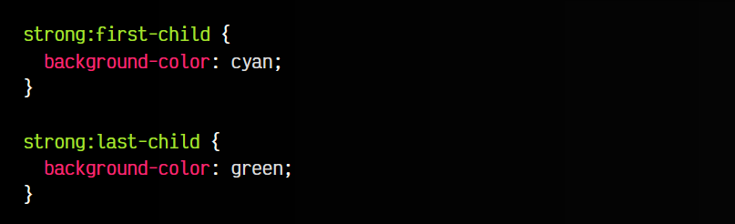

Veamos esto con un gráfico en forma de árbol que hará que el ejemplo sea más visual:

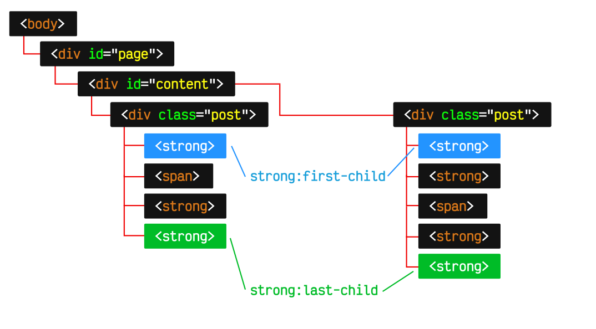

Observa que en este caso estamos seleccionando sólo los elementos "strong" porque así se lo hemos dicho en el selector del código CSS, donde prefijamos con strong justo antes de :first-child o :last-child. Por lo tanto, solo debe seleccionar el elemento y aplicarle los estilos si además de ser el primero (o último) es un elemento "strong".

## Hijos específicos
Sin embargo, con las pseudoclases anteriores sólo podemos seleccionar los primeros y últimos elementos, y podríamos necesitar un elemento específico, como el tercero o el quinto, por ejemplo. Para ello, podemos utilizar pseudoclases funcionales como :nth-child() o :nth-last-child().

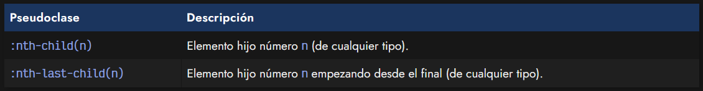

## La pseudoclase :nth-child()
La pseudoclase :nth-child(A) permite especificar el elemento hijo deseado, simplemente estableciendo su número en el parámetro A. No obstante, hay que tener en cuenta que el parámetro A no es sólo un número, sino que es posible escribir ciertas expresiones:

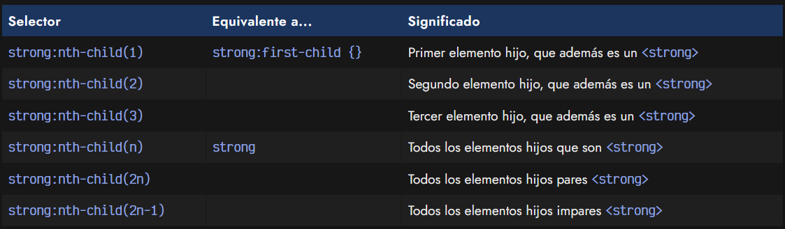

A continuación puedes comprobar los valores de la tabla anterior de un modo más visual y práctico, estableciendo en el campo de texto valores como n, n+2, 2n, 2n-1 (o similares) y observando los resultados.

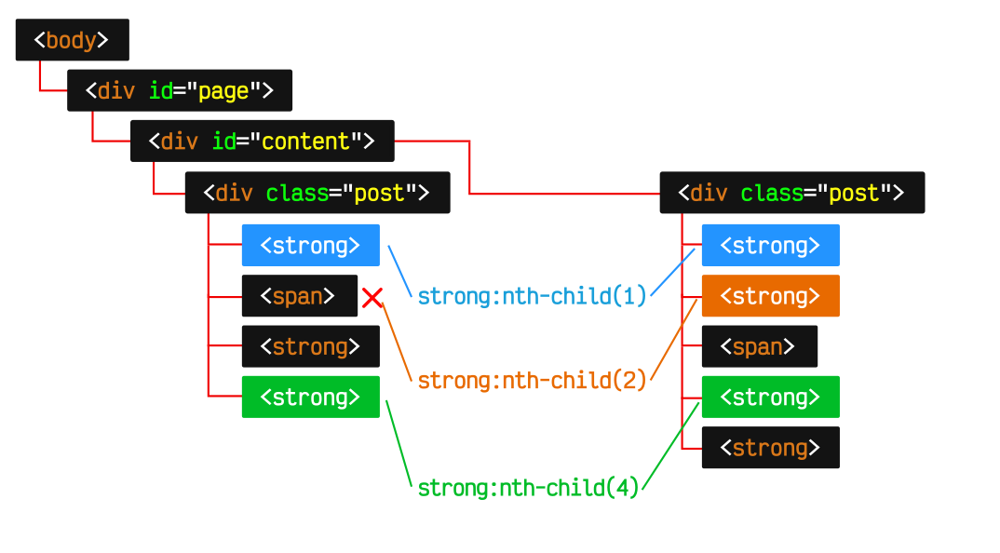

Como se aprecia en el ejemplo, en el caso :nth-child(2) se puede ver como el segundo elemento lo ocupa un elemento span, por lo que sólo se selecciona el elemento strong del segundo caso, donde si existe.

## La pseudoclase :nth-last-child()
La pseudoclase funcional :nth-last-child(A) funciona de forma muy similar a la anterior, permitiendo también indicarle un parámetro A donde específicar una expresión o número para indicar el hijo concreto.

La diferencia respecto a la anterior, es que comenzamos a contar desde el final, de modo que el elemento número 2, sería el segundo empezando a contar desde el final.

## La pseudoclase :nth-child(A of B)
Tanto la pseudoclase :nth-child() como la pseudoclase :nth-last-child() tienen una nueva sintaxis que permiten hacer búsquedas mucho más específicas. Para ello, en los paréntesis podemos indicar la sintaxis A of B, donde A es un número como en los ejemplos anteriores, pero B es un selector CSS adicional para delimitar más aún los elementos.

Veamos algún ejemplo:

html:
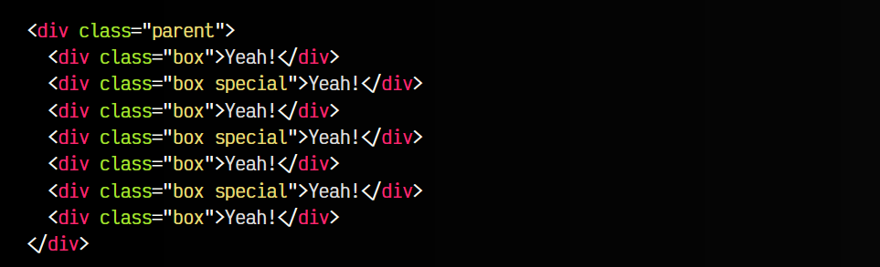

css:
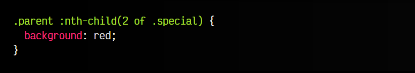

vista:
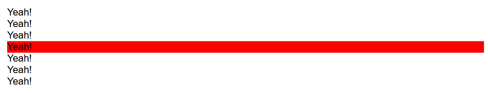

Observa que en el ejemplo anterior, estamos seleccionando con .parent :nth-child() los hijos del elemento .parent. De esos elementos, hacemos una nueva selección con 2 of .special, con la que nos quedamos con el segundo elemento de los elementos con clase .special.

## Hijos (del mismo tipo)
En los casos anteriores, seleccionamos elementos independientemente de que tipo de elemento sea. Simplemente, hacemos caso a la posición donde está ubicado. Y en algún caso, si no coincide la posición con el tipo de elemento especificado en el selector, simplemente no lo selecciona.

Una forma de actuar, quizás, más predecible para nosotros, es que queramos hacer referencia sólo a elementos del mismo tipo, ignorando el resto. Para ello, utilizaremos los selectores siguientes, análogos a los que ya hemos visto, pero haciendo referencia sólo a elementos del mismo tipo:

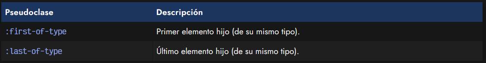

## La pseudoclase :first-of-type
Por ejemplo, la pseudoclase :first-of-type es la análoga a :first-child, sólo que tendrá en cuenta sólo elementos de su mismo tipo. Observa el siguiente ejemplo donde no sólo tenemos "div", sino que también tenemos un "p":

html:
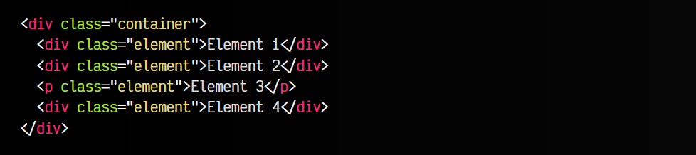

css:
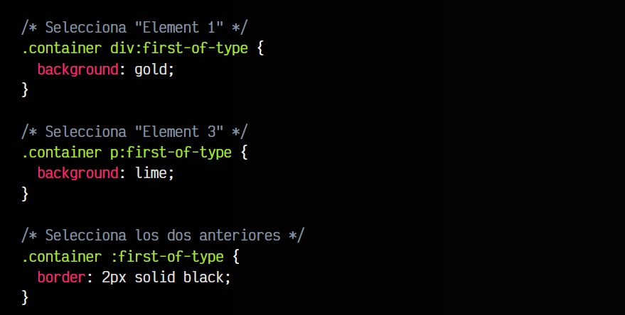

vista:
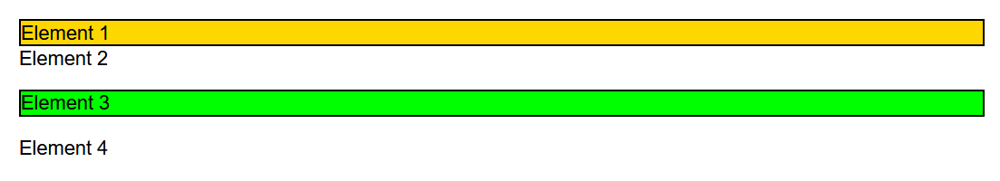

De esta forma, nos puede resultar mucho más sencillo trabajar con elementos de diferente tipo y darle estilo.

## La pseudoclase :last-of-type
De la misma forma, la pseudoclase :last-of-type es la análoga a :last-child, que selecciona el último elemento, pero igual que :first-of-type sólo teniendo en cuenta elementos del mismo tipo.

## Hijos específicos (del mismo tipo)
Ahora que estamos en la categoría en la que queremos seleccionar elementos del mismo tipo, también nos puede interesar seleccionar elementos específicos. Para ello, tenemos también dos pseudoclases análogas a las anteriores:

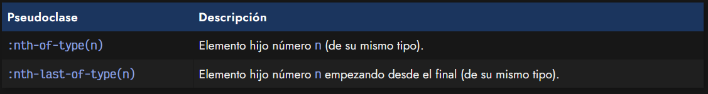

## La pseudoclase :nth-of-type()
La pseudoclase :nth-of-type(A) es la análoga a :nth-child(A). Se trata de una pseudoclase funcional que admite pasar parámetros, donde le podemos indicar un número (o cierta expresión) para ser mucho más específicos a la hora de seleccionar elementos del mismo tipo.

html:
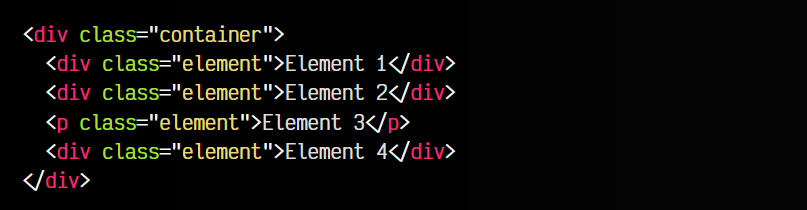

css:
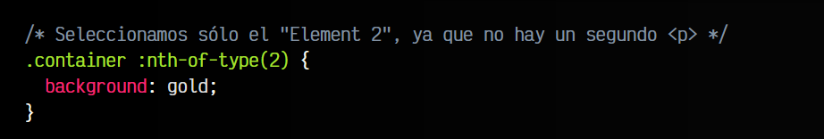

vista:
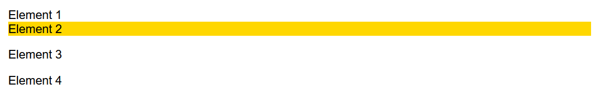

## La pseudoclase :nth-last-of-type()
La pseudoclase :nth-last-of-type(A) es la análoga a :nth-last-child(A). Veamos un nuevo ejemplo sobre el ejercicio anterior, utilizando ahora estas últimas pseudoclases que hemos visto:

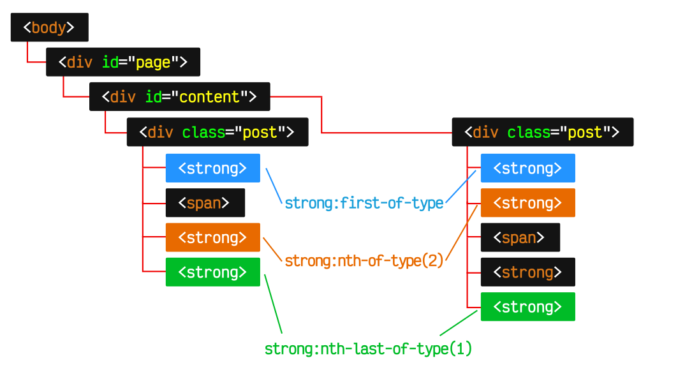

En este gráfico, se puede ver como strong:nth-of-type(2) selecciona el segundo elemento strong en ambos casos, a pesar de que en el primero ocupa la tercera posición. En este caso se selecciona porque es el segundo elemento de su mismo tipo ("strong").

Por otro lado, strong:nth-last-of-type(1) hace una selección de forma inversa, empezando por el último elemento, por lo que elige el último elemento.

## Elementos únicos o sin hijos
Existen también varias pseudoclases para la gestión de hijos únicos. Son las siguientes:

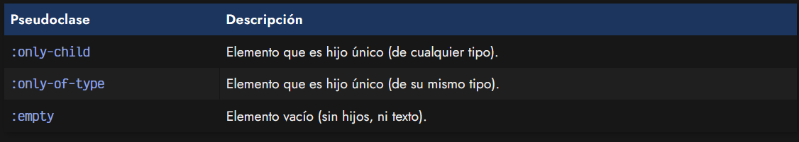

## La pseudoclase :only-child
La propiedad :only-child nos proporciona una forma de seleccionar los elementos que sean el único hijo de su elemento padre. Por lo tanto, si un contenedor tiene en su interior un sólo elemento hijo, podremos seleccionar y aplicar estilos.

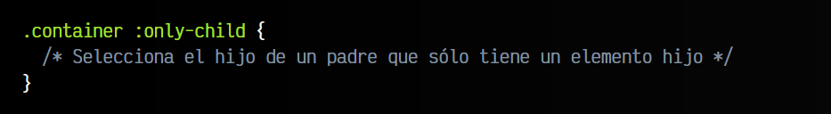

## La pseudoclase :only-of-type
Además, como ha ocurrido anteriormente, también existe la pseudoclase :only-of-type que es la análoga a la anterior, pero sólo para elementos del mismo tipo. En este caso, podríamos tener un contenedor que contiene varios elementos, pero todos son únicos en su tipo, por lo tanto podrían ser seleccionados.

html:
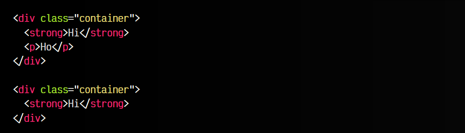

css:
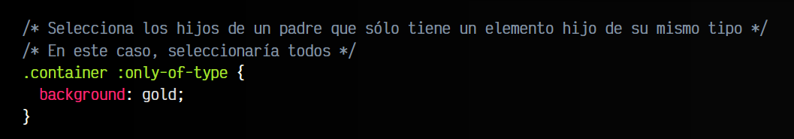

vista:
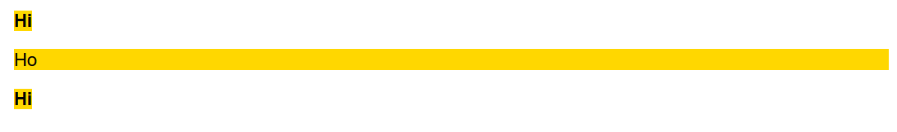

## La pseudoclase :empty
Por último, la pseudoclase :empty permite seleccionar los elementos que estén vacíos. Observa los siguientes ejemplos, que podríamos considerar que están vacíos, aunque con ciertos matices:

html:
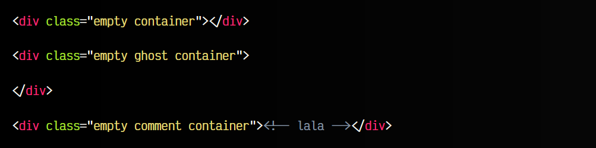

css:
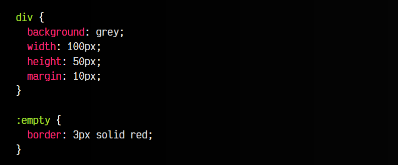

vista:
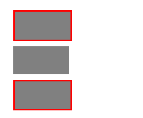

Ojo con esto, ya que el navegador no considerará vacío el elemento que contiene espacios en blanco (segundo ejemplo).

   - El primer elemento, efectivamente está vacío.
   - El segundo elemento .ghost, puede parecer vacío pero tiene espacios en blanco.
   - El tercer elemento .comment, está vacío sólo que contiene un comentario HTML.
