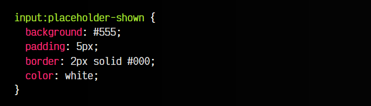
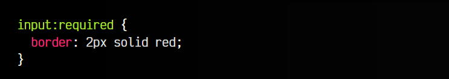

# 
Pseudoclases de formularios

Existe una serie de pseudoclases en CSS que pueden ser utilizadas para usar en formularios de una página web. Estas pseudoclases permiten seleccionar elementos para darle estilo dependiendo de temas relacionados con los formularios o los campos que están en el interior de un formulario.

Esencialmente, existen tres categorías de Pseudoclases:

   - De interacción en formularios: Seleccionar elementos cuando cambia el estado de un elemento.
   - De estado en formularios: Seleccionar elementos cuando se encuentran en un estado concreto.
   - De validación: Seleccionar elementos si cumplen o no un cierto criterio de validación.

Veamos cada una de ellas y las pseudoclases que las componen.

## Pseudoclases de interacción
Las siguientes pseudoclases están orientadas a un estado específico de ciertos campos de un formulario que el usuario puede modificar. Estos campos pueden ser los siguientes elementos:

   - Elementos de tipo radio <input type="radio">
   - Elementos de casilla de verificación <input type="checkbox">

Las pseudoclases que podemos utilizar son las siguientes:

## La pseudoclase :checked
La pseudoclase :checked permite seleccionar un elemento que ha sido marcado o seleccionado y entonces aplicarle estilo CSS. Por ejemplo, se podría utilizar el siguiente fragmento de código:

css:

html:

vista:

Este ejemplo está utilizando el combinador hermano adyacente + para darle formato al "span" que se encuentra a continuación de la casilla "input" seleccionada, ya sea de tipo radio o de tipo checkbox. De esta forma, los textos que acompañan al campo del formulario que hayan sido seleccionados, se mostrarán en verde.

Como detalle adicional, también pueden seleccionar los elementos de opción "option" de una lista seleccionable "select" que se encuentren seleccionados.

## La pseudoclase :indeterminate
La pseudoclase :indeterminate se utiliza para seleccionar elementos que tienen un estado indeterminado donde no se sabe exactamente su estado. Hay tres situaciones donde esto puede ocurrir:

   - Un "input" type="checkbox" donde mediante Javascript se marca la propiedad .indeterminate a true.
   - Varios "input" type="radio" con el mismo atributo name y sin definir el atributo checked en ninguno de ellos.
   - Un elemento "progress" donde no se define su valor y generalmente se muestra moviéndose de un lado a otro.

Un ejemplo en acción:

css:

html:

js:

vista:

En este caso, de forma similar al anterior, cambiamos el texto que está dentro de un elemento "span" a continuación de uno de los elementos anteriores de formulario en estado indeterminado.

## Pseudoclases de estado
Por norma general, los elementos de un formulario HTML están por defecto activados, aunque se pueden desactivar añadiendo el atributo disabled (es un atributo booleano, no lleva valor específico). Esto es una práctica muy utilizada para impedir al usuario escribir en cierta parte de un formulario porque, por ejemplo, no es aplicable.

Existen varias pseudoclases para detectar si un campo de un formulario está activado o desactivado, o cierta información relacionada con su estado:

Veamos cada uno de los casos.

## La pseudoclase :enabled
Utilizando la autoexplicativa pseudoclase :enabled, podemos seleccionar elementos que se encuentren activados (comportamiento por defecto):

css:

html:

vista:

En este caso restringimos a los elementos "input" que se encuentren desactivados.

## La pseudoclase :disabled
Sin embargo, lo más interesante de este tema viene al poder darle estilo a elementos desactivados con la pseudoclase :disabled, donde se seleccionan los elementos a los que se le ha añadido el atributo disabled:

css:

html:

vista:

Al margen de tener la funcionalidad desactivada, también podremos darle estilos visuales que lo informen.

## La pseudoclase :read-only
La pseudoclase :read-only selecciona aquellos elementos <input type="text"> imput de un formulario que están marcados con el atributo de sólo lectura readonly. La diferencia entre un campo con atributo disabled y un campo con atributo readonly es que la información del campo con readonly se enviará a través del formulario, mientras que la del campo con disabled no se enviará. Lo que tienen en común es que ambas están bloqueadas y no permiten modificar su valor, por lo que se suelen percibir como algo equivalente.

Importante: Ten en cuenta que :read-only aplicará los estilos a todos los elementos HTML que no puedan ser modificados por el usuario. Incluso un "div" o un "p" lo identificará como un elemento de solo lectura, siempre y cuando no lleven el atributo contenteditable.

## La pseudoclase :read-write
Por otro lado, la pseudoclase :read-write es muy útil para dar estilos a todos aquellos elementos que son editables por el usuario, sean campos de "texto"  o "textarea".

De esta forma, todos los elementos "input" que sean de lectura y escritura (editables) se seleccionarán y será posible aplicarles estilo. Recuerda que la pseudoclase read-write también da estilos a elementos HTML que contengan el atributo contenteditable, como por ejemplo un párrafo editable por el usuario con dicho atributo:

html:

css:

vista:

## La pseudoclase :placeholder-shown
Con la pseudoclase :placeholder-shown se nos permite seleccionar y dar estilo a los elementos que están actualmente mostrando un placeholder. Si no lo conoces, el término placeholder es un texto o imagen de muestra que se suele colocar para que el usuario conozca un ejemplo de la información que debe ir en esa zona.

En nuestro caso, se puede hacer con el atributo placeholder en elementos "input":

css:

html:

vista:

Recuerda que en los placeholder no se debe colocar texto para indicar que campo es (nick, email...), sino una sugerencia de lo que podrías escribir (Manz, manz@email.com...). Para el primer caso es más apropiado utilizar la etiqueta "label".

## La pseudoclase :default
Con la pseudoclase :default podemos seleccionar los elementos de un formulario que se consideran que tienen, de alguna forma, un valor por defecto. Es decir:

   - Elementos "input" type="checkbox" o "input" type="radio"> que tienen el atributo checked.
   - Elementos "selected" donde una de sus opciones tiene el atributo selected.
   - Elementos "button" o "input" type="submit"> que son el botón por defecto del "form".

Los elementos que coincidan con uno de estos casos, se podrían seleccionar con el siguiente código:

## Pseudoclases de validación
En HTML5 es posible dotar de capacidades de validación a los campos de un formulario, pudiendo interactuar con ellos desde Javascript o incluso desde CSS. Con estas validaciones podemos asegurarnos de que el usuario escribe en un campo de un formulario el valor esperado.

Existen algunas pseudoclases útiles para las validaciones, como por ejemplo las siguientes:

Veamos algunos detalles sobre cada una de ellas.

## La pseudoclase :required
En un formulario HTML es posible establecer un campo obligatorio que será necesario rellenar para enviarlo. Por ejemplo, el DNI de una persona que va a matricularse en un curso, o el nombre de usuario de alta en una plataforma web para identificarse. Campos que son absolutamente necesarios.

Por lo general, los campos de un formulario son siempre opcionales. Para hacer obligatorio un campo, tenemos que indicar en el elemento HTML el atributo required, al cuál será posible darle estilo mediante la pseudoclase :required:

css:

html:

vista:

De esta forma, todos los campos "input" obligatorios aparecerán con un borde rojo.

## La pseudoclase :optional
Por otra parte, los campos opcionales son todos aquellos que no tienen el atributo required. Pueden seleccionarse con la pseudoclase :optional:

css:

html:

vista:

## La pseudoclase :valid
Las validaciones en formularios HTML siempre han sido un proceso tedioso, al menos hasta la llegada de HTML5. Actualmente, desde HTML5 se brinda un excelente soporte de validaciones desde el lado del cliente sin necesidad de Javascript, pudiendo comprobar si los datos especificados son correctos o no antes de realizar las validaciones en el lado del servidor, y evitando la latencia de enviar la información al servidor y recibirla de vuelta.

Importante: Ten en cuenta que la validación de cliente es apropiada solo para reducir la latencia de envío/recepción al servidor, pero nunca como estrategia para evitar problemas de seguridad o similares, para la cuál SIEMPRE se debe tener validación en el servidor. Las validaciones utilizadas en frontend, es posible falsearlas o saltárselas.

Para validar la información del campo de formulario utilizamos el atributo pattern y un mecanismo para detectar coincidencias llamado [expresiones regulares](https://lenguajejs.com/javascript/regexp/expresiones-regulares/). Imaginemos un campo de entrada en el que queremos obtener la edad del usuario. Nuestra intención es que solo se puedan introducir números. Para ello hacemos uso de la expresión regular [0-9]+, que significa «una o más cifras del 0 al 9»:

Sin embargo, el atributo pattern permite expresiones regulares realmente complejas, como por ejemplo, una expresión regular para validar el formato de un DNI, ya sea en el formato nacional de España (12345678L) o en formato NIE (X1234567L), aceptando guiones si se indican. Además, una vez establecida la validación mediante el atributo pattern, ahora, mediante la pseudoclase :valid podemos aplicar un estilo cuando el texto escrito en el campo pase correctamente la validación:

html:

css:

vista:

## La pseudoclase :invalid
De forma opuesta, se pueden seleccionar elementos y aplicar ciertos estilos si no se cumple el patrón de validación, utilizando la pseudoclase :invalid:

## La pseudoclase :user-valid
La pseudoclase :user-valid es una versión particular de :valid, donde el elemento se selecciona si, además de comprobar que la validación es correcta y se cumple, el usuario ha interactuado con anterioridad con el campo en cuestión.

## La pseudoclase :user-invalid
De la misma forma, :user-invalid es una versión particular correspondiente a la pseudoclase :invalid. Mientras que :invalid permite seleccionar los elementos que no cumplen la restricción de la validación, :user-invalid permite seleccionar los elementos que no cumplen la validación pero que además el usuario ha interactuado anteriormente con ellos.

## La pseudoclase :in-range
Pero ten en cuenta que en una validación numérica, donde un usuario podría escribir 500 en el campo de edad, sería un resultado que no nos gustaría aceptar. En el patrón de validación del atributo pattern indicamos «una o más cifras del 0 al 9», pero no establecemos unos límites.

Lo ideal sería establecer un rango, algo que se suele hacer muy a menudo si tenemos campos numéricos de formulario mediante los atributos min y max:

Este campo permite al usuario especificar su edad, utilizando los atributos de validación min y max, que sólo permiten valores entre 18 y 100 años. De esta forma, si escribimos la pseudoclase :in-range podremos seleccionar los elementos que indican un valor y cumplen la validación:

## La pseudoclase :out-of-range
La pseudoclase :out-of-range, por otro lado, permite seleccionar y dar estilo a los elementos que tienen valores fuera del rango definido, y por lo tanto, no son válidos.

De la misma forma que antes, es posible aplicar estilos para los valores fuera de rango:

