# 
Pseudoelementos de resaltado

Existe una serie de pseudoelementos orientados a la selección o resaltado de texto en un documento HTML mostrado a través de un navegador. Veamos que pseudoelementos tenemos a nuestra disposición:

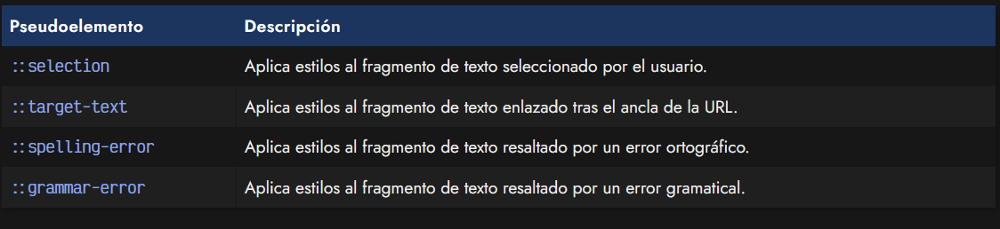

## El pseudoelemento ::selection
Cuando seleccionamos un fragmento de texto, el navegador suele aplicar un color de fondo que depende del sistema operativo, del tema, o similar. Al igual que ocurre con la propiedad accent-color, es posible que queramos aprovechar esto para definir un color que tengan sentido con los colores corporativos de la marca o web, por lo que podríamos cambiarlo haciendo uso del pseudoelemento ::selection:

css:
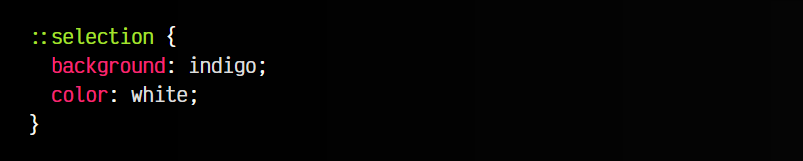

html:
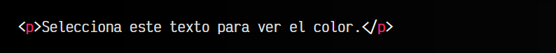

vista:
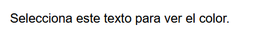
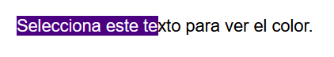

## El pseudoelemento ::target-text
En algunos casos, al crear un enlace a una página, tras el ancla de la URL definida con el carácter #, se puede añadir el fragmento de texto :~:text= seguido del texto, palabra o frase a buscar en la propia página. Al hacer esto, el navegador resaltará esa parte para que sea más sencillo encontrarla.

Esta página suele estar destacada con color de fondo amarillo sobre letras negras, pero podemos personalizarlo a través del pseudoelemento ::target-text:

css:
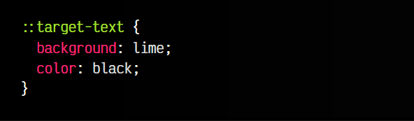

Ahora, en una URL terminada en #:~:text=ManzDev, todos los textos ManzDev aparecerían resaltados en el color seleccionado por ::target-text.

## El pseudoelemento ::spelling-error
El pseudoelemento ::spelling-error nos permite modificar los estilos que se aplican a como se muestra un error ortográfico en el navegador, que normalmente se visualiza con un subrayado ondulado rojo en la palabra o texto afectado.

css:
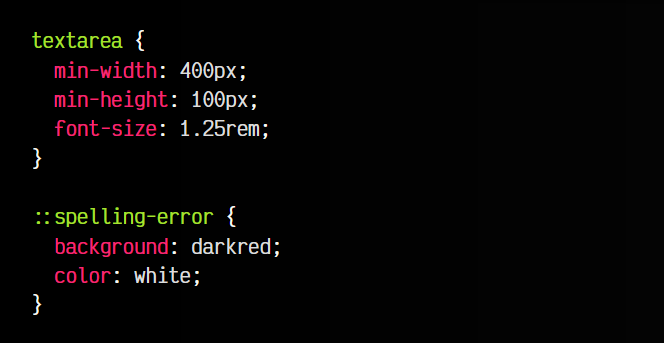

html:
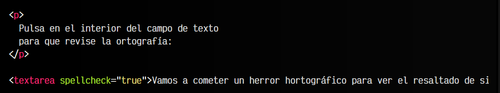

vista:
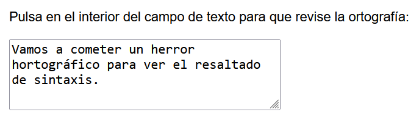
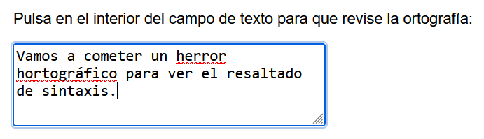

## El pseudoelemento ::grammar-error
Por su parte, el pseudoelemento ::grammar-error es exactamente igual al anterior, sólo que se encarga de señalar los errores gramaticales del texto, y no los ortográficos.

Nuevamente, hagamos un ejemplo, añadiendo esta pseudoclase sobre el ejemplo anterior:

css:
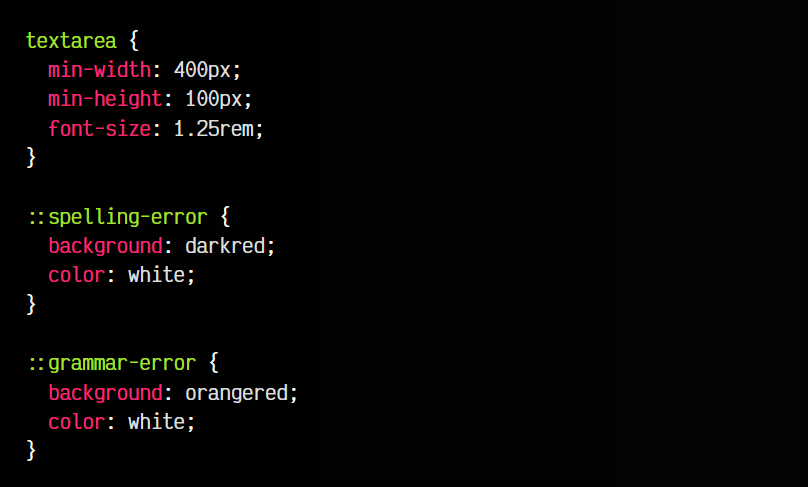

html:
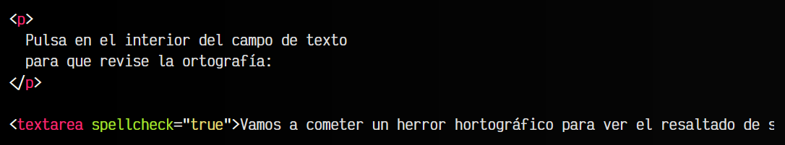

vista:
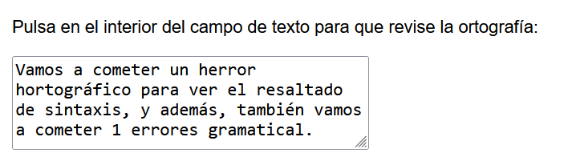
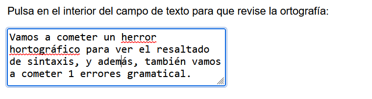

